# Arc

Lightweight product direction for spec-driven development — inspired by Linear's fast capture and clean triage, arc is the upstream companion to [temper](https://github.com/ronjanusz-liatrio/temper).

Arc manages the idea lifecycle from raw thought to spec-ready brief. It keeps product direction as plain markdown files in your repo (`VISION`, `CUSTOMER`, `ROADMAP`, `BACKLOG`) and feeds shaped ideas directly into the claude-workflow SDD pipeline. Where temper governs engineering maturity, arc governs what gets built and why.

## Idea Lifecycle


| Stage | Description |
|-------|-------------|
| **Capture** | Raw idea recorded quickly — title, one-line summary, rough priority |
| **Shape** | Idea refined into a structured brief: problem, proposed solution, success criteria, constraints |
| **Spec-Ready** | Brief approved and ready to hand off to `/cw-spec` |
| **Shipped** | Implemented and delivered via the SDD pipeline |

## What Arc Manages

Arc keeps product direction as markdown files tracked in your repository:

| Artifact | Description |
|----------|-------------|
| `VISION` | Product vision, strategic direction, and north star metrics |
| `CUSTOMER` | Personas, jobs-to-be-done, and success metrics |
| `ROADMAP` | Phased delivery plan with themes and milestones |
| `BACKLOG` | Triaged idea list with status, priority, and brief summaries |

These files live in your project repo alongside engineering docs — there is no separate product tool to sync.

## Two-Plugin Pipeline

Arc and temper cover the full project lifecycle: arc shapes what gets built, temper governs how it gets built.

```mermaid
%%{init: {'theme': 'base', 'themeVariables': {'primaryColor': '#11B5A4', 'primaryTextColor': '#FFFFFF', 'primaryBorderColor': '#0D8F82', 'secondaryColor': '#E8662F', 'secondaryTextColor': '#FFFFFF', 'secondaryBorderColor': '#C7502A', 'tertiaryColor': '#1B2A3D', 'tertiaryTextColor': '#FFFFFF', 'lineColor': '#1B2A3D', 'fontFamily': 'Inter, sans-serif'}}}%%
flowchart LR
    AA["/arc-align\nDiscover and\nimport content"]:::arc
    AC["/arc-capture\nQuick idea entry"]:::arc
    AS["/arc-shape\nRefine into\nspec-ready brief"]:::arc
    AW["/arc-wave\nOrganize into\ndelivery cycle"]:::arc
    AR["/arc-review\nAudit pipeline\nhealth"]:::arc

    CS["/cw-spec\nWrite spec and\nGherkin scenarios"]:::cw
    CP["/cw-plan\nTask board\nand sub-tasks"]:::cw
    CD["/cw-dispatch\nParallel coding\nworkers"]:::cw

    TI["/temper-incept\nBootstrap repo\nand set phase"]:::temper
    TP["/temper-progress\nGate evaluation\nand phase transition"]:::temper

    AA --> AC
    AC --> AS --> AW --> TI
    TI --> CS --> CP --> CD --> TP
    TP -->|"advance"| TI
    AW -->|"shaped brief"| CS
    AR -. "audit anytime" .-> AW
    AR -. "audit anytime" .-> CS

    classDef arc fill:#E8662F,stroke:#C7502A,color:#FFFFFF
    classDef cw fill:#11B5A4,stroke:#0D8F82,color:#FFFFFF
    classDef temper fill:#1B2A3D,stroke:#0F1D2B,color:#FFFFFF
```



| Skill | Role |
|-------|------|
| `/arc-align` | Discover scattered product-direction content and import into Arc-managed artifacts |
| `/arc-capture` | Record a raw idea quickly — title, one-liner, rough priority |
| `/arc-shape` | Refine an idea into a structured brief with problem, solution, and success criteria |
| `/arc-wave` | Group shaped ideas into a delivery cycle and hand off to temper + claude-workflow |
| `/arc-review` | Audit backlog health and wave alignment across all product artifacts |

## Skills

- **`/arc-align`** — Codebase discovery and migration. Scans the project for scattered product-direction content (roadmaps, backlogs, TODOs, vision statements, personas) and imports them into Arc-managed artifacts.
- **`/arc-capture`** — Fast idea entry. Appends a structured stub to `BACKLOG` with minimal friction.
- **`/arc-shape`** — Interactive refinement. Turns a captured idea into a spec-ready brief using parallel subagent analysis across four dimensions (problem clarity, customer fit, scope boundaries, feasibility).
- **`/arc-wave`** — Delivery cycle management. Groups spec-ready ideas into a wave, updates `ROADMAP`, injects `ARC:product-context` into project CLAUDE.md, and prepares the handoff for `/cw-spec`.
- **`/arc-review`** — Pipeline health audit. Checks backlog health, wave alignment, and cross-reference integrity across all product artifacts, then offers interactive fixes.

## Relationship to Temper and claude-workflow

Arc is **upstream** of both temper and claude-workflow:

```
/arc-align -> /arc-capture -> /arc-shape -> /arc-wave -> /temper-incept -> /cw-spec -> /cw-plan -> /cw-dispatch -> /temper-progress
                                                ^              ^                                                        |
                                                |              '-------------------- phase loop --------------------------'
                                            /arc-review (audit at any stage)
```

Arc requires [temper](https://github.com/ronjanusz-liatrio/temper) and [claude-workflow](https://github.com/ronjanusz-liatrio/claude-workflow). Install them first:

```bash
# Install claude-workflow
claude plugin marketplace add https://github.com/ronjanusz-liatrio/claude-workflow.git
claude plugin install claude-workflow@claude-workflow --scope user

# Install temper
claude plugin marketplace add https://github.com/ronjanusz-liatrio/temper.git
claude plugin install temper@temper --scope user
```

## Install

### From local filesystem (development)

```bash
claude plugin marketplace add /path/to/arc
claude plugin install arc@arc --scope project
```

### From Git (distribution)

```bash
claude plugin marketplace add https://github.com/ronjanusz-liatrio/arc.git
claude plugin install arc@arc --scope user
```

## Plugin Structure

```
arc/
  .claude-plugin/
    plugin.json                             # Plugin identity and version
    marketplace.json                        # Marketplace registration
  skills/
    README.md                               # Skill directory hub
    arc-align/
      SKILL.md                              # Codebase discovery and migration
      references/
        align-report-template.md            # Alignment report format
        detection-patterns.md               # File and keyword detection rules
        import-rules.md                     # Import classification and merge rules
    arc-capture/
      SKILL.md                              # Fast idea entry
    arc-shape/
      SKILL.md                              # Interactive refinement with parallel subagent analysis
      references/
        shaping-dimensions.md               # Four analysis dimensions and subagent prompts
        brief-validation.md                 # Readiness criteria for spec-ready status
    arc-wave/
      SKILL.md                              # Delivery cycle management
      references/
        wave-report-template.md             # Wave report format
        bootstrap-protocol.md               # ARC: namespace CLAUDE.md injection rules
    arc-review/
      SKILL.md                              # Pipeline health audit
      references/
        audit-dimensions.md                 # Health check definitions and thresholds
        review-report-template.md           # Report format
  templates/
    VISION.tmpl.md                          # Product vision (always-required)
    CUSTOMER.tmpl.md                        # Personas and JTBD (always-required)
    ROADMAP.tmpl.md                         # Phased delivery plan (product-leadership)
    BACKLOG.tmpl.md                         # Triaged idea list (product-leadership)
  references/
    README.md                               # Reference directory hub
    idea-lifecycle.md                       # Capture → Shape → Spec-Ready → Shipped model
    brief-format.md                         # Spec-ready brief specification and examples
    wave-planning.md                        # Wave organization, precedence, Temper phase compatibility
  README.md
  CLAUDE.md
  .gitignore
```

---

Copyright Liatrio Labs. All rights reserved.
