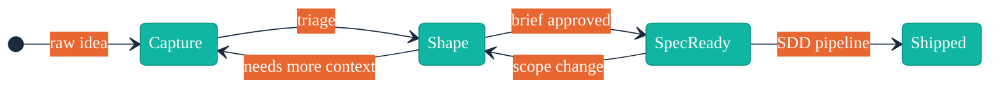

# Arc

Lightweight product direction for spec-driven development.

## Overview

<!--# BEGIN ARC:overview -->

Projects using the Temper + claude-workflow SDD pipeline lack a structured upstream process for product direction. Ideas enter `/cw-spec` as ad-hoc prompts without consistent problem framing, customer context, success criteria, or scope boundaries.

Arc fills this gap — it shapes what gets built before Temper governs how it gets built, feeding spec-ready briefs directly into the SDD pipeline. Arc manages the idea lifecycle from raw thought to spec-ready brief, keeping product direction as plain markdown files in your repo.

See [VISION.md](docs/VISION.md) for full product direction.

<!--# END ARC:overview -->

## Who This Is For

<!--# BEGIN ARC:audience -->

**Product Owner** — Captures ideas, refines briefs, audits pipeline health
> Capture ideas quickly without losing thoughts while context-switching

**Developer** — Reads product direction as markdown in the repo
> Product direction accessible without leaving the terminal

**Tech Lead** — Organizes delivery waves, verifies cross-references
> Sequence and scope engineering work appropriately

**Project Stakeholder** — Ensures pipeline respects project constraints
> Idea pipeline respects Temper phase constraints

See [CUSTOMER.md](docs/CUSTOMER.md) for detailed personas.

<!--# END ARC:audience -->

## Idea Lifecycle



| Stage | Description |
|-------|-------------|
| **Capture** | Raw idea recorded quickly — title, one-line summary, rough priority |
| **Shape** | Idea refined into a structured brief: problem, proposed solution, success criteria, constraints |
| **Spec-Ready** | Brief approved and ready to hand off to `/cw-spec` |
| **Shipped** | Implemented and delivered via the SDD pipeline |

## Skills

| Skill | Role |
|-------|------|
| `/arc-assess` | Discover scattered product-direction content and import into Arc-managed artifacts |
| `/arc-capture` | Record a raw idea quickly — title, one-liner, rough priority |
| `/arc-shape` | Refine an idea into a structured brief with problem, solution, and success criteria |
| `/arc-wave` | Group shaped ideas into a delivery cycle and hand off to temper + claude-workflow |
| `/arc-sync` | Keep project README and diagrams in sync with product direction artifacts |
| `/arc-audit` | Audit backlog health and wave alignment across all product artifacts |
| `/arc-help` | Quick reference guide — overview of all skills, artifacts, workflow, and installation |

## Features

<!--# BEGIN ARC:features -->

- **/arc-assess skill** — Codebase discovery and migration. Scans the project for scattered product-direction content and imports them into Arc-managed artifacts.
- **/arc-capture skill** — Fast idea entry. Appends a structured stub to BACKLOG with minimal friction.
- **/arc-shape skill** — Interactive refinement. Turns a captured idea into a spec-ready brief using parallel subagent analysis across four dimensions.
- **/arc-wave skill** — Delivery cycle management. Groups spec-ready ideas into a wave, updates ROADMAP, and prepares the handoff for /cw-spec.
- **/arc-sync skill** — README synchronization. Scaffolds a complete README from Arc artifacts or selectively updates ARC: managed sections.
- **/arc-audit skill** — Pipeline health audit. Checks backlog health, wave alignment, and cross-reference integrity across all product artifacts.
- **/arc-help skill** — Quick reference guide. Displays an overview of all Arc skills, artifacts, workflow order, and installation instructions.

See [BACKLOG.md](docs/BACKLOG.md) for the full product backlog.

<!--# END ARC:features -->

## Roadmap

<!--# BEGIN ARC:roadmap -->

Not yet defined — create [ROADMAP.md](docs/ROADMAP.md) to plan delivery waves.

<!--# END ARC:roadmap -->

## Two-Plugin Pipeline

Arc and temper cover the full project lifecycle: arc shapes what gets built, temper governs how it gets built.

```mermaid
%%{init: {'theme': 'base', 'themeVariables': {'primaryColor': '#11B5A4', 'primaryTextColor': '#FFFFFF', 'primaryBorderColor': '#0D8F82', 'secondaryColor': '#E8662F', 'secondaryTextColor': '#FFFFFF', 'secondaryBorderColor': '#C7502A', 'tertiaryColor': '#1B2A3D', 'tertiaryTextColor': '#FFFFFF', 'lineColor': '#1B2A3D', 'fontFamily': 'Inter, sans-serif'}}}%%
flowchart LR
    AA["/arc-assess\nDiscover and\nimport content"]:::arc
    AC["/arc-capture\nQuick idea entry"]:::arc
    AS["/arc-shape\nRefine into\nspec-ready brief"]:::arc
    AW["/arc-wave\nOrganize into\ndelivery cycle"]:::arc
    AREADME["/arc-sync\nSync README with\nproduct direction"]:::arc
    AR["/arc-audit\nAudit pipeline\nhealth"]:::arc

    CS["/cw-spec\nWrite spec and\nGherkin scenarios"]:::cw
    CP["/cw-plan\nTask board\nand sub-tasks"]:::cw
    CD["/cw-dispatch\nParallel coding\nworkers"]:::cw

    TI["/temper-assess\nBootstrap repo\nand set phase"]:::temper
    TP["/temper-audit\nGate evaluation\nand phase transition"]:::temper

    AA --> AC
    AC --> AS --> AW --> AREADME --> TI
    TI --> CS --> CP --> CD --> TP
    TP -->|"advance"| TI
    AW -->|"spec-ready brief"| CS
    AR -. "audit anytime" .-> AW

    classDef arc fill:#E8662F,stroke:#C7502A,color:#FFFFFF
    classDef cw fill:#11B5A4,stroke:#0D8F82,color:#FFFFFF
    classDef temper fill:#1B2A3D,stroke:#0F1D2B,color:#FFFFFF
```



Arc requires [temper](https://github.com/ronjanusz-liatrio/temper) and [claude-workflow](https://github.com/ronjanusz-liatrio/claude-workflow).

## Architecture

<!--# BEGIN TEMPER:architecture -->
<!-- Run /temper-assess to populate engineering sections -->
<!--# END TEMPER:architecture -->

## Getting Started

<!--# BEGIN TEMPER:getting-started -->
<!-- Run /temper-assess to populate engineering sections -->
<!--# END TEMPER:getting-started -->

## Testing

<!--# BEGIN TEMPER:testing -->
<!-- Run /temper-assess to populate engineering sections -->
<!--# END TEMPER:testing -->

## Contributing

<!--# BEGIN TEMPER:contributing -->
<!-- Run /temper-assess to populate engineering sections -->
<!--# END TEMPER:contributing -->

## Install

### From local filesystem (development)

```bash
claude plugin marketplace add /path/to/arc
claude plugin install arc@arc --scope project
```

### From Git (distribution)

```bash
claude plugin marketplace add https://github.com/ronjanusz-liatrio/arc.git
claude plugin install arc@arc --scope user
```

## Idea Lifecycle Status

<!--# BEGIN ARC:lifecycle-diagram -->


See [BACKLOG.md](docs/BACKLOG.md) for individual idea details.

<!--# END ARC:lifecycle-diagram -->

## License

Copyright Liatrio Labs. All rights reserved.
