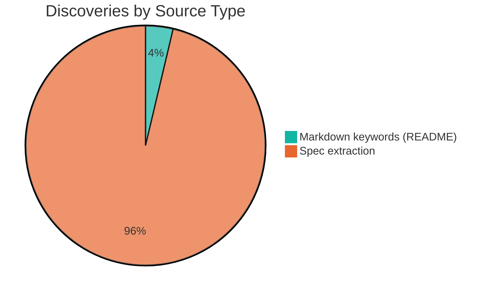

# Alignment Analysis

**Generated:** 2026-04-12T18:00:00Z

---

## Discovery Summary

**Total discoveries:** 27

### By Source Type

| Source Type | Count |
|-------------|-------|
| Markdown keywords | 1 |
| Markdown structural | 0 |
| Spec extraction | 26 |
| Code comments | 0 |

### By Target Artifact

| Target | Count |
|--------|-------|
| BACKLOG | 13 sections (expanding to ~63 individual stubs: 28 user stories + 35 non-goals) |
| VISION | 12 sections |
| CUSTOMER | 1 (4 primary personas extracted from cross-spec user stories) |

---

## Gap Analysis

| Artifact | Status | Detail |
|----------|--------|--------|
| VISION | Present | 12 discoveries across README.md and 7 spec Goals/Introduction sections — strong vision content exists but is scattered |
| CUSTOMER | Present | 4 primary personas (Product Owner, Tech Lead, Developer, Stakeholder) referenced consistently across 7 specs |
| ROADMAP | Absent | No phased planning content found. Note: arc-assess does not populate ROADMAP directly; use /arc-wave to create wave plans. |
| BACKLOG | 63 items | BACKLOG discoveries are distributed across 7 spec files — 28 user stories (shipped features) and 35 non-goals (deferred scope) |

---

## Discovery Distribution

---

## Theme Analysis

### Core Plugin Design

- **Discoveries:** 12 (VISION)
- **Sources:** README.md, 01-spec-arc-plugin, 02-spec-arc-plugin-enhancement, 03-spec-arc-align, 04-spec-arc-readme, 05-spec-arc-help, 06-spec-arc-align-enhance, 07-spec-capture-speedup
- **Wave potential:** No — these are foundational vision statements, not actionable items

| # | Source | Snippet |
|---|--------|---------|
| 1 | README.md:1-5 | Lightweight product direction for spec-driven development... |
| 2 | 01-spec-arc-plugin:3-5 | Arc manages the idea lifecycle from raw thought to spec-ready brief... |
| 3 | 01-spec-arc-plugin:7-13 | Fast idea capture, structured shaping, delivery cycle management... |

### Shipped Features (User Stories)

- **Discoveries:** 7 sections (28 individual stories)
- **Sources:** All 7 spec files
- **Wave potential:** No — all stories represent already-shipped work

| # | Source | Stories |
|---|--------|---------|
| 1 | 01-spec-arc-plugin:15-21 | 5 stories (capture, shape, wave, markdown direction, temper constraints) |
| 2 | 02-spec-arc-plugin-enhancement:14-19 | 4 stories (audit, cross-references, error-paths, interactive fixes) |
| 3 | 03-spec-arc-align:15-19 | 3 stories (consolidation, TODO migration, idempotent re-runs) |
| 4 | 04-spec-arc-readme:18-24 | 5 stories (README sync, onboarding, staleness, scaffolding, trust signals) |
| 5 | 05-spec-arc-help:15-19 | 3 stories (quick reference, workflow recall, install instructions) |
| 6 | 06-spec-arc-align-enhance:15-21 | 5 stories (spec extraction, TODO consolidation, analysis, research, artifact separation) |
| 7 | 07-spec-capture-speedup:15-19 | 3 stories (mid-workflow capture, inline confirmation, free-text) |

### Deferred Scope (Non-Goals)

- **Discoveries:** 6 sections (35 individual items)
- **Sources:** Specs 01, 02, 04, 05, 06, 07
- **Wave potential:** Yes — several non-goals represent cohesive future initiatives

| # | Theme | Items | Sources |
|---|-------|-------|---------|
| 1 | External integrations | 3 | Linear/Jira sync (spec 01), CI/CD pipeline (spec 02), cross-plugin pipeline extension (implied) |
| 2 | Advanced automation | 4 | Automated triage (spec 01), automated fix application (spec 02), batch capture (spec 07), auto wave assignment (spec 06) |
| 3 | Scale & extensibility | 4 | Multi-repo coordination (spec 01), custom labels (spec 01), managing subdirectory READMEs (spec 04), dynamic help content (spec 05) |
| 4 | Process maturity | 3 | Analytics/dashboards (spec 01), versioned help output (spec 05), interactive research configuration (spec 06) |

### Primary Personas

- **Discoveries:** 1 (cross-spec extraction)
- **Sources:** All 7 spec files
- **Wave potential:** No — these are persona definitions for CUSTOMER.md

| Persona | Appearance Count | Specs |
|---------|-----------------|-------|
| Product Owner | 5 | 01, 02, 03, 04, 06 |
| Developer | 4 | 01, 02, 04, 06 |
| Tech Lead / Team Lead | 3 | 01, 02, 03 |
| Project Stakeholder | 1 | 01 |

---

## Recommendations

1. **Import VISION content** — Consolidate the README.md vision statement and spec 01 goals into `docs/VISION.md` to give Arc its own product-direction foundation.
2. **Import CUSTOMER personas** — Extract the 4 primary personas (Product Owner, Developer, Tech Lead, Stakeholder) into `docs/CUSTOMER.md` with JTBD statements derived from user stories.
3. **Import non-goals as deferred BACKLOG items** — The 35 non-goals across 6 specs represent genuine future work candidates. Importing them as captured stubs with `(deferred)` prefix creates a living backlog for Arc itself.
4. **Consider skipping user story import** — The 28 user stories represent shipped features. Importing them as "captured" stubs may be misleading since they're already done. Instead, import the README skill descriptions as shipped BACKLOG entries (requires manual status update post-import).
5. **Run `/arc-wave` after import** — Organize the deferred items into delivery waves, especially the "External integrations" and "Advanced automation" themes.
6. **Run `/arc-sync` after VISION.md is populated** — Scaffold a product-direction-aware README with ARC: managed sections.

---

## Research Integration

**Project type:** claude-code-plugin

### Architecture Coverage

| Pattern | Discoveries Found | Status |
|---------|-------------------|--------|
| Plugin-based (SKILL.md) | 7 spec goals sections | Covered |
| File-based state machine | Spec 01 goals reference lifecycle model | Covered |
| Managed section injection | Spec 04 goals reference ARC: sections | Covered |
| Phase-graduated templates | Spec 01 goals reference template design | Covered |
| Parallel subagent analysis | Spec 01 user stories reference shape analysis | Covered |
| Trust-signal validation | Spec 04 goals reference trust signals | Covered |

### Dependency Alignment

| Dependency | Referenced in Discoveries | Status |
|------------|--------------------------|--------|
| temper | Spec 01 goals: "Temper integration" | Aligned |
| claude-workflow | Spec 01 goals: "Pipeline continuity" | Aligned |
| readme-author | Not directly in discoveries | Under-documented |

### Signal Validation

| Research Signal | Confirmed by Discovery | Notes |
|----------------|----------------------|-------|
| Vision in README.md:1-5 | Yes | Core vision statement confirmed |
| 4 primary personas across specs | Yes | Product Owner, Developer, Tech Lead, Stakeholder found |
| 22+ deferred non-goals | Yes | 35 individual non-goal items across 6 specs |
| Stale arc-align references | N/A | Bug — not a product-direction discovery |
