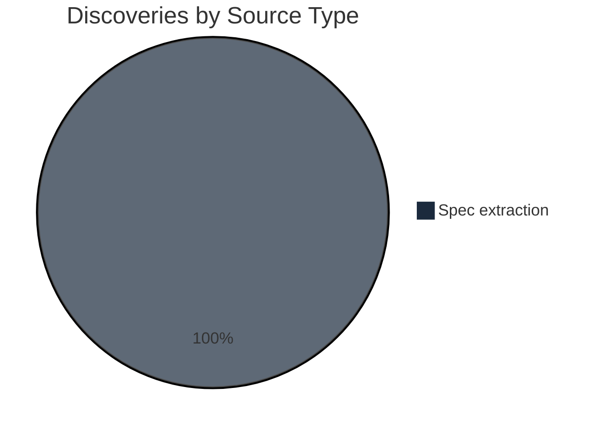

# Alignment Analysis

**Generated:** 2026-04-13T00:00:00Z

---

## Discovery Summary

**Total discoveries:** 31 (all from spec files not in the prior manifest)

### By Source Type

| Source Type | Count |
|-------------|-------|
| Markdown keywords | 0 |
| Markdown structural | 0 |
| Spec extraction | 31 |
| Code comments | 0 |

### By Target Artifact

| Target | Count |
|--------|-------|
| BACKLOG | 25 (9 user stories + 16 non-goals) |
| VISION | 3 (Goals blocks from 3 specs) |
| CUSTOMER | 3 (user-stories blocks from 3 specs) |

---

## Gap Analysis

| Artifact | Status | Detail |
|----------|--------|--------|
| VISION | Present | 3 new Goals blocks to append; existing VISION.md is comprehensive. |
| CUSTOMER | Present | 3 new persona-content blocks to append; adds Python/Rust/Next.js developer sub-personas. |
| ROADMAP | Absent | Still absent. arc-assess does not populate ROADMAP; use /arc-wave. |
| BACKLOG | 25 new items | All from specs already marked shipped. **Will recreate the shipped/captured duplication that spec 08 cleaned up.** |

---

## Discovery Distribution

---

## Theme Analysis

### Shipped-capability duplication risk

- **Discoveries:** 9 BACKLOG user stories
- **Sources:** specs 08, 09, 01-align-ignore-dirs
- **Wave potential:** No — these describe capabilities already in production. Importing as `captured` stubs would duplicate shipped work.

| # | Source | Snippet |
|---|--------|---------|
| 1 | docs/specs/08-spec-backlog-consistency/08-spec-backlog-consistency.md:17 | Each capability represented once in backlog |
| 2 | docs/specs/08-spec-backlog-consistency/08-spec-backlog-consistency.md:18 | Clean VISION.md without repeated content blocks |
| 3 | docs/specs/08-spec-backlog-consistency/08-spec-backlog-consistency.md:19 | README lifecycle counts and pipeline labels accurate |
| 4 | docs/specs/09-spec-command-walkthrough-diagrams/09-spec-command-walkthrough-diagrams.md:19 | Visual walkthrough at top of each SKILL.md |
| 5 | docs/specs/09-spec-command-walkthrough-diagrams/09-spec-command-walkthrough-diagrams.md:20 | CI-style local mermaid lint feedback |
| 6 | docs/specs/09-spec-command-walkthrough-diagrams/09-spec-command-walkthrough-diagrams.md:21 | Consistent brand across diagrams |
| 7 | docs/specs/01-spec-align-ignore-dirs/01-spec-align-ignore-dirs.md:15 | Auto-exclude Python build/cache directories |
| 8 | docs/specs/01-spec-align-ignore-dirs/01-spec-align-ignore-dirs.md:16 | Auto-exclude Rust/Java target directories |
| 9 | docs/specs/01-spec-align-ignore-dirs/01-spec-align-ignore-dirs.md:17 | Auto-exclude Next.js build artifacts |

### Deferred scope expansion

- **Discoveries:** 16 BACKLOG non-goals
- **Sources:** specs 08 (5), 09 (7), 01-align-ignore-dirs (4)
- **Wave potential:** No — these are explicit out-of-scope markers, imported for traceability.

### Vision/customer enrichment

- **Discoveries:** 3 VISION + 3 CUSTOMER blocks
- **Wave potential:** N/A — supporting artifacts, not deliverables.

---

## Recommendations

1. **Skip user-story imports** — the 9 new user stories describe already-shipped capabilities. Importing them as `captured` stubs will recreate the duplication that spec 08 fixed. Use "Review individually" and reject them, or merge into existing `### User Stories` subsections under shipped skills manually.
2. **Import the 16 non-goals and 3 VISION + 3 CUSTOMER blocks** — these add genuine traceability value with no duplication risk.
3. **Fix stale `arc-align` references** flagged by research in `skills/arc-assess/references/detection-patterns.md:752` and `skills/arc-assess/references/import-rules.md:543` (not part of this alignment run — capture as a separate P2 idea).
4. **Consider an arc-assess enhancement** — classify KW-19 user stories from specs with `status: shipped` as merge candidates for existing shipped skill entries, not new captured stubs. Avoid re-triggering spec-08's cleanup work.

---

## Research Integration

**Project type:** Claude Code plugin (pure markdown)

### Architecture Coverage

| Pattern | Discoveries Found | Status |
|---------|-------------------|--------|
| Plugin-based (SKILL.md) | 3 specs reference skill modifications | Covered |
| File-based state machine | 1 spec (08) targets BACKLOG lifecycle | Covered |
| Managed section injection | 0 | Blind spot — no new discoveries touch ARC:/TEMPER: markers |
| Phase-graduated templates | 0 | Blind spot |
| Parallel subagent analysis | 0 | Blind spot |
| Trust-signal validation | 0 | Blind spot |
| Mermaid lint infrastructure | 1 spec (09) introduces lint-mermaid.sh | Covered |

### Dependency Alignment

| Dependency | Referenced in Discoveries | Status |
|------------|--------------------------|--------|
| temper | No | Under-documented — no new specs cross-reference Temper |
| claude-workflow | No | Under-documented |
| readme-author | No | Under-documented |
| @mermaid-js/mermaid-cli | Yes (spec 09) | Aligned |

### Signal Validation

| Research Signal | Confirmed by Discovery | Notes |
|----------------|----------------------|-------|
| Goals in specs 08, 09, 01-align-ignore-dirs | Yes | All 3 VISION blocks extracted |
| User stories in specs 08, 09, 01-align-ignore-dirs | Yes | All 9 stories — but shipped-duplication caveat applies |
| Non-goals in specs 08, 09, 01-align-ignore-dirs | Yes | All 16 extracted |
| New P1-High captured ideas (/arc-ship, rewrite mode) | N/A | Already in BACKLOG, no import needed |
| Stale `arc-align` references in detection-patterns.md and import-rules.md | Not in scope | Classified as bug, not product-direction content |
