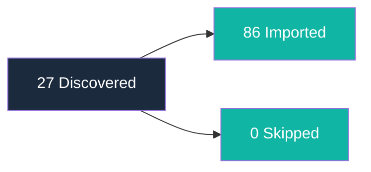

# Alignment Report

**Generated:** 2026-04-12T18:00:00Z

---

## Run Metadata

| Field | Value |
|-------|-------|
| Timestamp | 2026-04-12T18:00:00Z |
| Exclusion patterns | .git/, node_modules/, vendor/, dist/, build/, .venv/, __pycache__/, .mypy_cache/, .pytest_cache/, .ruff_cache/, .tox/, *.egg-info/, target/, .gradle/, .next/, .nuxt/, coverage/, docs/specs/*/proofs/, docs/specs/*/*.feature, docs/specs/*/questions-*.md, docs/BACKLOG.md, docs/ROADMAP.md, docs/VISION.md, docs/CUSTOMER.md, docs/skill/arc/*, .env, credentials.json, *.key |
| Total files scanned | 42 |
| Total discoveries | 27 (section-level) |
| New imports | 86 (12 VISION blocks + 70 BACKLOG stubs + 4 CUSTOMER personas) |
| Skipped (manifest) | 0 |
| Remaining unmanaged | 0 |
| Temper phase | Not available |

---

## Imported Items by Artifact

### BACKLOG

| Source Path | Imported Title | Detection Method |
|-------------|---------------|-----------------|
| docs/specs/01-spec-arc-plugin/01-spec-arc-plugin.md | Quick idea capture | keyword (KW-19) |
| docs/specs/01-spec-arc-plugin/01-spec-arc-plugin.md | Interactive idea refinement | keyword (KW-19) |
| docs/specs/01-spec-arc-plugin/01-spec-arc-plugin.md | Organize ideas into delivery waves | keyword (KW-19) |
| docs/specs/01-spec-arc-plugin/01-spec-arc-plugin.md | Product direction as markdown in repo | keyword (KW-19) |
| docs/specs/01-spec-arc-plugin/01-spec-arc-plugin.md | Idea pipeline respects Temper constraints | keyword (KW-19) |
| docs/specs/01-spec-arc-plugin/01-spec-arc-plugin.md | (deferred) Analytics or dashboards | keyword (KW-20) |
| docs/specs/01-spec-arc-plugin/01-spec-arc-plugin.md | (deferred) Multi-repo coordination | keyword (KW-20) |
| docs/specs/01-spec-arc-plugin/01-spec-arc-plugin.md | (deferred) Automated triage | keyword (KW-20) |
| docs/specs/01-spec-arc-plugin/01-spec-arc-plugin.md | (deferred) External tool integration | keyword (KW-20) |
| docs/specs/01-spec-arc-plugin/01-spec-arc-plugin.md | (deferred) Custom labels or properties | keyword (KW-20) |
| docs/specs/01-spec-arc-plugin/01-spec-arc-plugin.md | (deferred) Team or role assignment | keyword (KW-20) |
| docs/specs/01-spec-arc-plugin/01-spec-arc-plugin.md | (deferred) Executable code or tests | keyword (KW-20) |
| docs/specs/02-spec-arc-plugin-enhancement/02-spec-arc-plugin-enhancement.md | Audit backlog health | keyword (KW-19) |
| docs/specs/02-spec-arc-plugin-enhancement/02-spec-arc-plugin-enhancement.md | Cross-reference integrity between artifacts | keyword (KW-19) |
| docs/specs/02-spec-arc-plugin-enhancement/02-spec-arc-plugin-enhancement.md | Error-path scenario documentation | keyword (KW-19) |
| docs/specs/02-spec-arc-plugin-enhancement/02-spec-arc-plugin-enhancement.md | Interactive audit fix application | keyword (KW-19) |
| docs/specs/02-spec-arc-plugin-enhancement/02-spec-arc-plugin-enhancement.md | (deferred) CI/CD pipeline | keyword (KW-20) |
| docs/specs/02-spec-arc-plugin-enhancement/02-spec-arc-plugin-enhancement.md | (deferred) Proof execution for spec 01 | keyword (KW-20) |
| docs/specs/02-spec-arc-plugin-enhancement/02-spec-arc-plugin-enhancement.md | (deferred) Automated fix application | keyword (KW-20) |
| docs/specs/02-spec-arc-plugin-enhancement/02-spec-arc-plugin-enhancement.md | (deferred) VISION or CUSTOMER content editing | keyword (KW-20) |
| docs/specs/02-spec-arc-plugin-enhancement/02-spec-arc-plugin-enhancement.md | (deferred) New templates or reference docs | keyword (KW-20) |
| docs/specs/02-spec-arc-plugin-enhancement/02-spec-arc-plugin-enhancement.md | (deferred) Backward-incompatible changes | keyword (KW-20) |
| docs/specs/03-spec-arc-align/03-spec-arc-align.md | Consolidate scattered product direction | keyword (KW-19) |
| docs/specs/03-spec-arc-align/03-spec-arc-align.md | Migrate TODO items from READMEs | keyword (KW-19) |
| docs/specs/03-spec-arc-align/03-spec-arc-align.md | Idempotent re-run safety | keyword (KW-19) |
| docs/specs/04-spec-arc-readme/04-spec-arc-readme.md | README features reflect shipped items | keyword (KW-19) |
| docs/specs/04-spec-arc-readme/04-spec-arc-readme.md | README shows current wave and roadmap | keyword (KW-19) |
| docs/specs/04-spec-arc-readme/04-spec-arc-readme.md | Warn on stale README sections | keyword (KW-19) |
| docs/specs/04-spec-arc-readme/04-spec-arc-readme.md | Scaffold README from VISION docs | keyword (KW-19) |
| docs/specs/04-spec-arc-readme/04-spec-arc-readme.md | Structural trust validation for README | keyword (KW-19) |
| docs/specs/04-spec-arc-readme/04-spec-arc-readme.md | (deferred) Temper-managed README sections | keyword (KW-20) |
| docs/specs/04-spec-arc-readme/04-spec-arc-readme.md | (deferred) LICENSE, CONTRIBUTING, CHANGELOG files | keyword (KW-20) |
| docs/specs/04-spec-arc-readme/04-spec-arc-readme.md | (deferred) External link validation or badges | keyword (KW-20) |
| docs/specs/04-spec-arc-readme/04-spec-arc-readme.md | (deferred) Automatic invocation | keyword (KW-20) |
| docs/specs/04-spec-arc-readme/04-spec-arc-readme.md | (deferred) Managing subdirectory READMEs | keyword (KW-20) |
| docs/specs/04-spec-arc-readme/04-spec-arc-readme.md | (deferred) Full readme-author runtime integration | keyword (KW-20) |
| docs/specs/05-spec-arc-help/05-spec-arc-help.md | Quick reference for all Arc skills | keyword (KW-19) |
| docs/specs/05-spec-arc-help/05-spec-arc-help.md | Recall workflow order from terminal | keyword (KW-19) |
| docs/specs/05-spec-arc-help/05-spec-arc-help.md | Install instructions for Arc setup | keyword (KW-19) |
| docs/specs/05-spec-arc-help/05-spec-arc-help.md | (deferred) Dynamic help content | keyword (KW-20) |
| docs/specs/05-spec-arc-help/05-spec-arc-help.md | (deferred) Argument parsing or per-skill views | keyword (KW-20) |
| docs/specs/05-spec-arc-help/05-spec-arc-help.md | (deferred) Interactive menus or topic selection | keyword (KW-20) |
| docs/specs/05-spec-arc-help/05-spec-arc-help.md | (deferred) Versioned help output | keyword (KW-20) |
| docs/specs/05-spec-arc-help/05-spec-arc-help.md | (deferred) Modifying existing skills via help | keyword (KW-20) |
| docs/specs/06-spec-arc-align-enhance/06-spec-arc-align-enhance.md | Extract product direction from existing specs | keyword (KW-19) |
| docs/specs/06-spec-arc-align-enhance/06-spec-arc-align-enhance.md | Consolidate code TODOs into BACKLOG | keyword (KW-19) |
| docs/specs/06-spec-arc-align-enhance/06-spec-arc-align-enhance.md | Gap analysis before import | keyword (KW-19) |
| docs/specs/06-spec-arc-align-enhance/06-spec-arc-align-enhance.md | Deep exploration via cw-research | keyword (KW-19) |
| docs/specs/06-spec-arc-align-enhance/06-spec-arc-align-enhance.md | Separate Arc reports from product artifacts | keyword (KW-19) |
| docs/specs/06-spec-arc-align-enhance/06-spec-arc-align-enhance.md | (deferred) Automatic spec deduplication | keyword (KW-20) |
| docs/specs/06-spec-arc-align-enhance/06-spec-arc-align-enhance.md | (deferred) ROADMAP artifact population via assess | keyword (KW-20) |
| docs/specs/06-spec-arc-align-enhance/06-spec-arc-align-enhance.md | (deferred) Code refactoring suggestions | keyword (KW-20) |
| docs/specs/06-spec-arc-align-enhance/06-spec-arc-align-enhance.md | (deferred) Modifying existing specs | keyword (KW-20) |
| docs/specs/06-spec-arc-align-enhance/06-spec-arc-align-enhance.md | (deferred) Automatic wave assignment | keyword (KW-20) |
| docs/specs/06-spec-arc-align-enhance/06-spec-arc-align-enhance.md | (deferred) Interactive research configuration | keyword (KW-20) |
| docs/specs/07-spec-capture-speedup/07-spec-capture-speedup.md | Record idea in one prompt mid-workflow | keyword (KW-19) |
| docs/specs/07-spec-capture-speedup/07-spec-capture-speedup.md | Confirm and prioritize in single interaction | keyword (KW-19) |
| docs/specs/07-spec-capture-speedup/07-spec-capture-speedup.md | Free-text idea description then confirm | keyword (KW-19) |
| docs/specs/07-spec-capture-speedup/07-spec-capture-speedup.md | (deferred) Changing backlog data format | keyword (KW-20) |
| docs/specs/07-spec-capture-speedup/07-spec-capture-speedup.md | (deferred) Modifying other skills from capture | keyword (KW-20) |
| docs/specs/07-spec-capture-speedup/07-spec-capture-speedup.md | (deferred) Batch capture | keyword (KW-20) |
| docs/specs/07-spec-capture-speedup/07-spec-capture-speedup.md | (deferred) Changing priority levels | keyword (KW-20) |
| docs/specs/07-spec-capture-speedup/07-spec-capture-speedup.md | (deferred) Modifying BACKLOG template | keyword (KW-20) |
| README.md | /arc-assess skill | keyword (KW-1) |
| README.md | /arc-capture skill | keyword (KW-1) |
| README.md | /arc-shape skill | keyword (KW-1) |
| README.md | /arc-wave skill | keyword (KW-1) |
| README.md | /arc-sync skill | keyword (KW-1) |
| README.md | /arc-audit skill | keyword (KW-1) |
| README.md | /arc-help skill | keyword (KW-1) |

### VISION

| Source Path | Imported Title | Detection Method |
|-------------|---------------|-----------------|
| README.md | (vision content) | keyword (KW-16) |
| docs/specs/01-spec-arc-plugin/01-spec-arc-plugin.md | (vision content) — Introduction | keyword (KW-22) |
| docs/specs/01-spec-arc-plugin/01-spec-arc-plugin.md | (vision content) — Goals | keyword (KW-18) |
| docs/specs/02-spec-arc-plugin-enhancement/02-spec-arc-plugin-enhancement.md | (vision content) — Goals | keyword (KW-18) |
| docs/specs/03-spec-arc-align/03-spec-arc-align.md | (vision content) — Introduction | keyword (KW-22) |
| docs/specs/03-spec-arc-align/03-spec-arc-align.md | (vision content) — Goals | keyword (KW-18) |
| docs/specs/04-spec-arc-readme/04-spec-arc-readme.md | (vision content) — Introduction | keyword (KW-22) |
| docs/specs/04-spec-arc-readme/04-spec-arc-readme.md | (vision content) — Goals | keyword (KW-18) |
| docs/specs/05-spec-arc-help/05-spec-arc-help.md | (vision content) — Goals | keyword (KW-18) |
| docs/specs/06-spec-arc-align-enhance/06-spec-arc-align-enhance.md | (vision content) — Introduction | keyword (KW-22) |
| docs/specs/06-spec-arc-align-enhance/06-spec-arc-align-enhance.md | (vision content) — Goals | keyword (KW-18) |
| docs/specs/07-spec-capture-speedup/07-spec-capture-speedup.md | (vision content) — Goals | keyword (KW-18) |

### CUSTOMER

| Source Path | Imported Title | Detection Method |
|-------------|---------------|-----------------|
| Cross-spec extraction | Product Owner persona | keyword (KW-19, persona extraction) |
| Cross-spec extraction | Developer persona | keyword (KW-19, persona extraction) |
| Cross-spec extraction | Tech Lead persona | keyword (KW-19, persona extraction) |
| Cross-spec extraction | Project Stakeholder persona | keyword (KW-19, persona extraction) |

---

## Skipped Items

No items skipped — this is the first alignment run.

---

## Excluded from Scanning

### Hardcoded Exclusions (always applied)

| Pattern | Category |
|---------|----------|
| .git/ | Directory |
| node_modules/ | Directory |
| vendor/ | Directory |
| dist/ | Directory |
| build/ | Directory |
| .venv/ | Directory |
| __pycache__/ | Directory |
| .mypy_cache/ | Directory |
| .pytest_cache/ | Directory |
| .ruff_cache/ | Directory |
| .tox/ | Directory |
| *.egg-info/ | Directory |
| target/ | Directory |
| .gradle/ | Directory |
| .next/ | Directory |
| .nuxt/ | Directory |
| coverage/ | Directory |
| docs/specs/*/proofs/ | Directory |
| docs/specs/*/*.feature | Directory |
| docs/specs/*/questions-*.md | Directory |
| docs/BACKLOG.md | Arc-managed file |
| docs/ROADMAP.md | Arc-managed file |
| docs/VISION.md | Arc-managed file |
| docs/CUSTOMER.md | Arc-managed file |
| docs/skill/arc/wave-report.md | Arc-managed file |
| docs/skill/arc/review-report.md | Arc-managed file |
| docs/skill/arc/shape-report.md | Arc-managed file |
| docs/skill/arc/align-manifest.md | Arc-managed file |
| docs/skill/arc/align-report.md | Arc-managed file |
| .env | Secret-bearing file |
| credentials.json | Secret-bearing file |
| *.key | Secret-bearing file |

### User-Configured Exclusions

No additional exclusions were configured for this run.

---

## Remaining Unmanaged Content

No remaining unmanaged content detected. All product-direction content has been imported or was previously captured.

---

## Discovery Flow

---

## Cross-References

- `docs/skill/arc/align-manifest.md` — Full import history with source→artifact mappings
- `docs/skill/arc/align-analysis.md` — Structured analysis with gap analysis and recommendations
- `docs/BACKLOG.md` — Imported captured stubs (BACKLOG targets)
- `docs/VISION.md` — Imported vision/mission content (VISION targets)
- `docs/CUSTOMER.md` — Imported persona/audience content (CUSTOMER targets)
- `skills/arc-assess/references/detection-patterns.md` — Detection pattern definitions
- `skills/arc-assess/references/import-rules.md` — Classification and import rules
