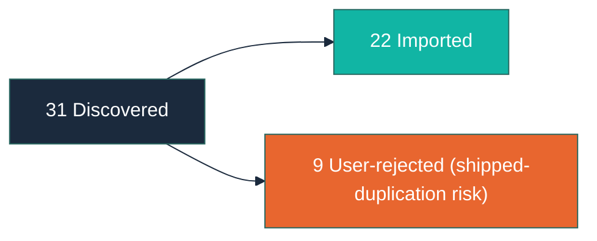

# Alignment Report

**Generated:** 2026-04-13T00:00:00Z

---

## Run Metadata

| Field | Value |
|-------|-------|
| Timestamp | 2026-04-13T00:00:00Z |
| Exclusion patterns | Hardcoded defaults only (no custom patterns; arc repo has no large dep dirs) |
| Total files scanned | 3 spec files targeted via research (08, 09, 01-align-ignore-dirs) |
| Total discoveries | 31 |
| New imports | 22 |
| Skipped (manifest) | 0 (all prior discoveries remain covered; no new overlap) |
| Remaining unmanaged | 9 (user-story stubs from shipped specs — deliberately skipped per user decision) |
| Temper phase | Not available (no Temper artifacts in this project) |

---

## Imported Items by Artifact

### BACKLOG

| Source Path | Imported Title | Detection Method |
|-------------|---------------|-----------------|
| docs/specs/08-spec-backlog-consistency/08-spec-backlog-consistency.md | (deferred) Triaging remaining captured priorities | keyword (KW-20) |
| docs/specs/08-spec-backlog-consistency/08-spec-backlog-consistency.md | (deferred) Creating ROADMAP.md | keyword (KW-20) |
| docs/specs/08-spec-backlog-consistency/08-spec-backlog-consistency.md | (deferred) Modifying CUSTOMER.md | keyword (KW-20) |
| docs/specs/08-spec-backlog-consistency/08-spec-backlog-consistency.md | (deferred) Running arc-sync to refresh README | keyword (KW-20) |
| docs/specs/08-spec-backlog-consistency/08-spec-backlog-consistency.md | (deferred) Resolving VISION README Linear messaging | keyword (KW-20) |
| docs/specs/09-spec-command-walkthrough-diagrams/09-spec-command-walkthrough-diagrams.md | (deferred) Walkthroughs for sync audit assess help | keyword (KW-20) |
| docs/specs/09-spec-command-walkthrough-diagrams/09-spec-command-walkthrough-diagrams.md | (deferred) Replacing textual Process steps with diagrams | keyword (KW-20) |
| docs/specs/09-spec-command-walkthrough-diagrams/09-spec-command-walkthrough-diagrams.md | (deferred) Depicting error paths or retry loops | keyword (KW-20) |
| docs/specs/09-spec-command-walkthrough-diagrams/09-spec-command-walkthrough-diagrams.md | (deferred) Committed PNG or SVG diagram files | keyword (KW-20) |
| docs/specs/09-spec-command-walkthrough-diagrams/09-spec-command-walkthrough-diagrams.md | (deferred) CI integration for mermaid lint | keyword (KW-20) |
| docs/specs/09-spec-command-walkthrough-diagrams/09-spec-command-walkthrough-diagrams.md | (deferred) Modifying README lifecycle or pipeline diagrams | keyword (KW-20) |
| docs/specs/09-spec-command-walkthrough-diagrams/09-spec-command-walkthrough-diagrams.md | (deferred) Introducing a Node package.json | keyword (KW-20) |
| docs/specs/01-spec-align-ignore-dirs/01-spec-align-ignore-dirs.md | (deferred) Adding IDE or editor directories | keyword (KW-20) |
| docs/specs/01-spec-align-ignore-dirs/01-spec-align-ignore-dirs.md | (deferred) Adding infra-tool directories | keyword (KW-20) |
| docs/specs/01-spec-align-ignore-dirs/01-spec-align-ignore-dirs.md | (deferred) Changing the 100-file heuristic | keyword (KW-20) |
| docs/specs/01-spec-align-ignore-dirs/01-spec-align-ignore-dirs.md | (deferred) Updating detection-patterns or import-rules references | keyword (KW-20) |

### VISION

| Source Path | Imported Title | Detection Method |
|-------------|---------------|-----------------|
| docs/specs/08-spec-backlog-consistency/08-spec-backlog-consistency.md | (vision content) | keyword (KW-18) |
| docs/specs/09-spec-command-walkthrough-diagrams/09-spec-command-walkthrough-diagrams.md | (vision content) | keyword (KW-18) |
| docs/specs/01-spec-align-ignore-dirs/01-spec-align-ignore-dirs.md | (vision content) | keyword (KW-18) |

### CUSTOMER

| Source Path | Imported Title | Detection Method |
|-------------|---------------|-----------------|
| docs/specs/08-spec-backlog-consistency/08-spec-backlog-consistency.md | (persona content) | keyword (KW-19) |
| docs/specs/09-spec-command-walkthrough-diagrams/09-spec-command-walkthrough-diagrams.md | (persona content) | keyword (KW-19) |
| docs/specs/01-spec-align-ignore-dirs/01-spec-align-ignore-dirs.md | (persona content) | keyword (KW-19) |

---

## Skipped Items

No items skipped due to manifest — no new discoveries overlapped existing manifest entries.

---

## Excluded from Scanning

### Hardcoded Exclusions (always applied)

| Pattern | Category |
|---------|----------|
| .git/ | Directory |
| node_modules/ | Directory |
| vendor/ | Directory |
| dist/ | Directory |
| build/ | Directory |
| .venv/ | Directory |
| __pycache__/ | Directory |
| .mypy_cache/ | Directory |
| .pytest_cache/ | Directory |
| .ruff_cache/ | Directory |
| .tox/ | Directory |
| *.egg-info/ | Directory |
| target/ | Directory |
| .gradle/ | Directory |
| .next/ | Directory |
| .nuxt/ | Directory |
| coverage/ | Directory |
| docs/specs/*/proofs/ | Directory |
| docs/specs/*/*.feature | Directory |
| docs/specs/*/questions-*.md | Directory |
| docs/BACKLOG.md | Arc-managed file |
| docs/ROADMAP.md | Arc-managed file |
| docs/VISION.md | Arc-managed file |
| docs/CUSTOMER.md | Arc-managed file |
| docs/skill/arc/wave-report.md | Arc-managed file |
| docs/skill/arc/review-report.md | Arc-managed file |
| docs/skill/arc/shape-report.md | Arc-managed file |
| docs/skill/arc/align-manifest.md | Arc-managed file |
| docs/skill/arc/align-report.md | Arc-managed file |
| .env | Secret-bearing file |
| credentials.json | Secret-bearing file |
| *.key | Secret-bearing file |

### User-Configured Exclusions

No additional exclusions were configured for this run.

---

## Remaining Unmanaged Content

Nine user-story stubs from shipped specs (08, 09, 01-align-ignore-dirs) were deliberately skipped to avoid recreating the duplicate-representation problem that spec 08 cleaned up. These describe already-shipped capabilities.

| Source Path | Lines | Detection Signal | Snippet |
|-------------|-------|-----------------|---------|
| docs/specs/08-spec-backlog-consistency/08-spec-backlog-consistency.md | 17 | keyword (KW-19 user story) | As a product owner reading the backlog, I want each capability represented once |
| docs/specs/08-spec-backlog-consistency/08-spec-backlog-consistency.md | 18 | keyword (KW-19 user story) | As a developer reviewing VISION.md, I want a clean document without repeated content blocks |
| docs/specs/08-spec-backlog-consistency/08-spec-backlog-consistency.md | 19 | keyword (KW-19 user story) | As a reader of the README, I want the lifecycle diagram counts and pipeline labels to be accurate |
| docs/specs/09-spec-command-walkthrough-diagrams/09-spec-command-walkthrough-diagrams.md | 19 | keyword (KW-19 user story) | As a new Arc user, I want to see a visual walkthrough at the top of each skill's SKILL.md |
| docs/specs/09-spec-command-walkthrough-diagrams/09-spec-command-walkthrough-diagrams.md | 20 | keyword (KW-19 user story) | As a developer reviewing a SKILL.md change, I want CI-style local feedback that my mermaid fences parse |
| docs/specs/09-spec-command-walkthrough-diagrams/09-spec-command-walkthrough-diagrams.md | 21 | keyword (KW-19 user story) | As a product owner browsing the repo on GitHub, I want every diagram to render consistently |
| docs/specs/01-spec-align-ignore-dirs/01-spec-align-ignore-dirs.md | 15 | keyword (KW-19 user story) | As a Python developer, I want .venv, __pycache__, and tool caches excluded automatically |
| docs/specs/01-spec-align-ignore-dirs/01-spec-align-ignore-dirs.md | 16 | keyword (KW-19 user story) | As a Rust or Java developer, I want target/ excluded by default |
| docs/specs/01-spec-align-ignore-dirs/01-spec-align-ignore-dirs.md | 17 | keyword (KW-19 user story) | As a Next.js developer, I want .next/ excluded automatically |

**Recommendation:** When the `/arc-ship` skill lands, or on a follow-up consolidation pass, merge these user stories into the corresponding shipped skill entries (`### User Stories` subsections) rather than importing them as new captured stubs.

---

## Discovery Flow

---

## Cross-References

- `docs/skill/arc/align-manifest.md` — Full import history with source→artifact mappings
- `docs/skill/arc/align-analysis.md` — Gap analysis and theme findings for this run
- `docs/BACKLOG.md` — Imported captured stubs (16 deferred BACKLOG targets)
- `docs/VISION.md` — 3 new Goals blocks appended
- `docs/CUSTOMER.md` — 3 new persona blocks appended (Reader, New Arc User, Multi-Language Developer Sub-Personas)
- `docs/specs/research-align/research-align.md` — Research report backing this run
