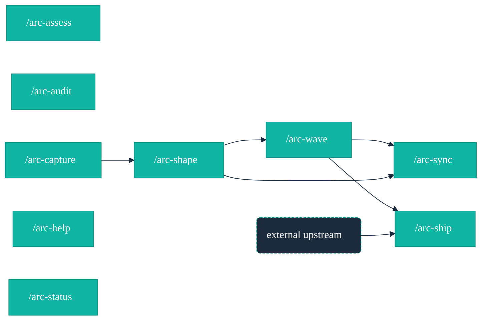

```mermaid
%%{init: {'theme': 'base', 'themeVariables': {'primaryColor': '#11B5A4', 'primaryTextColor': '#FFFFFF', 'primaryBorderColor': '#0D8F82', 'secondaryColor': '#E8662F', 'secondaryTextColor': '#FFFFFF', 'secondaryBorderColor': '#C7502A', 'tertiaryColor': '#1B2A3D', 'tertiaryTextColor': '#FFFFFF', 'lineColor': '#1B2A3D', 'fontFamily': 'Inter, sans-serif'}}}%%
flowchart LR
    ass["/arc-assess"]
    aud["/arc-audit"]
    cap["/arc-capture"]
    hlp["/arc-help"]
    shp["/arc-shape"]
    shi["/arc-ship"]
    sta["/arc-status"]
    syn["/arc-sync"]
    wav["/arc-wave"]
    cap --> shp
    wav --> shi
    wav --> syn
    shp --> syn
    shp --> wav
    ext("external upstream"):::ext
    ext --> shi
    classDef ext fill:#1B2A3D,stroke:#0D8F82,color:#FFFFFF,stroke-dasharray:4 2
```
