# Idea Lifecycle

The idea lifecycle defines how raw thoughts progress from initial capture through shaping, approval, and delivery. Each stage has explicit entry criteria, exit criteria, and allowed transitions.

## Lifecycle Diagram

```mermaid
%%{init: {'theme': 'base', 'themeVariables': {'primaryColor': '#11B5A4', 'primaryTextColor': '#FFFFFF', 'primaryBorderColor': '#0D8F82', 'secondaryColor': '#E8662F', 'secondaryTextColor': '#FFFFFF', 'secondaryBorderColor': '#C7502A', 'tertiaryColor': '#1B2A3D', 'tertiaryTextColor': '#FFFFFF', 'lineColor': '#1B2A3D', 'fontFamily': 'Inter, sans-serif'}}}%%
stateDiagram-v2
    direction LR

    [*] --> Capture : raw idea
    Capture --> Shape : triage
    Shape --> SpecReady : brief approved
    SpecReady --> Shipped : SDD pipeline + /arc-ship

    Shape --> Capture : needs more context
    SpecReady --> Shape : scope change

    classDef capture fill:#1B2A3D,stroke:#0F1D2B,color:#FFFFFF
    classDef shape fill:#E8662F,stroke:#C7502A,color:#FFFFFF
    classDef ready fill:#11B5A4,stroke:#0D8F82,color:#FFFFFF
    classDef shipped fill:#0D8F82,stroke:#0A6B63,color:#FFFFFF
```

> **Note:** Shipped ideas are archived to `docs/skill/arc/waves/` and removed from BACKLOG.md. The wave archive is the durable record of shipped ideas.

## Stages

### Capture

**Description:** A raw idea recorded quickly with minimal structure. The goal is speed — get the thought down before it's lost.

**Entry Criteria:**
- A new idea exists (user invokes `/arc-capture`)

**Data Fields:**
- Title (required)
- One-line summary (required)
- Priority: P0-Critical, P1-High, P2-Medium, P3-Low (required)
- Status: `captured`
- Timestamp (auto-generated)

**Exit Criteria:**
- Idea is recorded in `docs/BACKLOG.md` as a `## {Title}` section with status `captured`

**Allowed Transitions:**
- → **Shape** (triage: user selects idea for refinement via `/arc-shape`)

---

### Shape

**Description:** An idea under active refinement. The user works through problem framing, customer fit, scope boundaries, and feasibility with guidance from parallel subagent analysis.

**Entry Criteria:**
- Idea exists in BACKLOG with status `captured`
- User invokes `/arc-shape` and selects the idea

**Data Fields (added during shaping):**
- Problem statement (1-3 sentences: who, what pain, impact)
- Proposed solution (1-2 sentences: approach, capability unlocked)
- Success criteria (≥3 measurable outcomes)
- Constraints (time, technical, team, scope)
- Assumptions (what must be true)
- Open questions (clarifications needed)

**Exit Criteria:**
- All brief fields are populated
- Brief passes validation against `references/brief-format.md`
- Status updated to `shaped`

**Allowed Transitions:**
- → **Spec-Ready** (brief approved: user confirms the shaped brief is ready)
- → **Capture** (needs more context: shaping reveals the idea needs rethinking — status reverts to `captured`, brief fields cleared)

---

### Spec-Ready

**Description:** A fully shaped brief approved for handoff to the SDD pipeline. The idea is locked — no further changes without explicitly reverting to Shape.

**Entry Criteria:**
- Idea has status `shaped` with all brief fields populated
- User or `/arc-wave` marks the idea as spec-ready with a wave assignment

**Data Fields (added at spec-ready):**
- Wave assignment (ROADMAP wave reference)
- All prior fields locked

**Exit Criteria:**
- Brief handed off to `/cw-spec` for spec generation
- SDD pipeline completes (spec → plan → dispatch → validate)

**Allowed Transitions:**
- → **Shipped** (SDD pipeline: implementation complete and validated)
- → **Shape** (scope change: requirements shifted — status reverts to `shaped` for re-shaping, wave assignment cleared)

---

### Shipped

**Description:** The idea has been implemented and delivered through the SDD pipeline. This is a terminal state. Upon shipping, the idea is removed from `docs/BACKLOG.md` and its full detail is archived to `docs/skill/arc/waves/NN-wave-name.md` (see [wave-archive.md](wave-archive.md)).

**Entry Criteria:**
- SDD pipeline completed: `/cw-spec` → `/cw-plan` → `/cw-dispatch` → `/cw-validate`
- Implementation passes validation gates
- User invokes `/arc-ship` which verifies cw-validate report and transitions status

**Data Fields (recorded in wave archive, not BACKLOG):**
- **Spec:** added by `/arc-ship` (path to the spec that implemented this idea)
- **Shipped:** added by `/arc-ship` (ISO 8601 timestamp at transition time)

**Exit Criteria:**
- None — terminal state

**Allowed Transitions:**
- None (terminal)

## Backward Transitions

| Transition | Trigger | Effect |
|-----------|---------|--------|
| Shape → Capture | "Needs more context" — shaping reveals the idea is too vague or the problem isn't well understood | Status reverts to `captured`, brief fields cleared, idea returns to triage queue |
| Spec-Ready → Shape | "Scope change" — requirements shifted after approval, before or during SDD pipeline | Status reverts to `shaped`, wave assignment cleared, brief fields unlocked for revision |

## Cross-References

- [brief-format.md](brief-format.md) — Structure of the spec-ready brief produced during Shape
- [wave-planning.md](wave-planning.md) — How spec-ready ideas are grouped into delivery waves
- [wave-archive.md](wave-archive.md) — Schema and lifecycle of the wave archive where shipped ideas are stored
