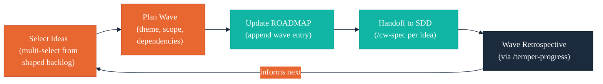

# Wave Planning

A wave is a themed delivery cycle that groups spec-ready ideas for implementation through the SDD pipeline. This document describes how to organize waves: capacity constraints, precedence rules, theme grouping, and Temper phase compatibility.

## What is a Wave?

A wave is a batch of spec-ready ideas selected for concurrent delivery. Unlike sprints (which are time-boxed engineering cycles), waves are **product-themed** — they group ideas by strategic intent rather than arbitrary time boundaries.

Each wave produces:
- Updates to `docs/ROADMAP.md` with wave details
- Status updates in `docs/BACKLOG.md` (shaped → spec-ready)
- An `ARC:product-context` managed section in the project CLAUDE.md
- A wave report (`docs/wave-report.md`) with handoff instructions for `/cw-spec`

## Capacity Constraints

Wave size should match team bandwidth and project maturity. Overscoping a wave leads to incomplete delivery; underscoping wastes coordination overhead.

### Sizing Guidelines

| Project Phase | Recommended Wave Size | Rationale |
|--------------|----------------------|-----------|
| Spike | 1 idea | Validating core concept — scope is narrow |
| PoC | 1-2 ideas | Proving feasibility — scope must stay tight |
| Vertical Slice | 2-3 ideas | Building a thin end-to-end path — room for adjacent features |
| Foundation | 3-5 ideas | Established patterns — team can absorb more concurrent work |
| MVP | 3-5 ideas | Shipping to users — balance feature breadth with quality |
| Growth | 3-5 ideas | Scaling — may include performance and reliability alongside features |
| Maturity | 2-4 ideas | Optimization — smaller, more targeted improvements |

### Hard Gate Failures

When Temper's management report (`docs/management-report.md`) shows hard gate failures:
- **Always** include at least one stabilization idea in the wave (address the gate failure)
- **Reduce** feature scope by 1-2 ideas to create capacity for stabilization
- **Flag** the gate failure in the wave report as a constraint

## Precedence Rules

When multiple spec-ready ideas compete for wave inclusion, use these rules to prioritize:

### 1. Dependencies First

Ideas that unblock other ideas take precedence. Check:
- Does idea A's output feed into idea B's input?
- Does idea A establish a pattern or infrastructure that idea B requires?
- Are there shared artifacts (templates, references) that one idea creates and another consumes?

### 2. Priority Ordering

Within the same dependency tier, respect the priority assigned during capture:

| Priority | Meaning | Wave Precedence |
|----------|---------|-----------------|
| P0-Critical | Blocking other work or addressing a hard gate failure | Must include |
| P1-High | Core to the wave theme, significant user impact | Include if capacity allows |
| P2-Medium | Valuable but not urgent | Include if capacity allows after P0/P1 |
| P3-Low | Nice-to-have, exploratory | Defer to next wave unless wave is underscoped |

### 3. Risk-First Sequencing

Within the same priority tier, prefer ideas with higher uncertainty or technical risk. Discovering problems early is cheaper than discovering them late.

### 4. Theme Coherence

Prefer ideas that reinforce the wave's theme. A focused wave is easier to communicate, review, and deliver than a grab-bag of unrelated features.

## Theme Grouping

Every wave should have a clear theme — a one-line statement of what this delivery cycle achieves.

**Good themes:**
- "Plugin Foundation" — reference docs, templates, and first skill
- "Interactive Refinement" — shaping workflow and subagent analysis
- "Delivery Pipeline" — wave planning, ROADMAP integration, and handoff

**Weak themes:**
- "Miscellaneous improvements" — no strategic coherence
- "Sprint 4" — time-based, not product-based

### Grouping Strategy

1. Identify the primary strategic goal for this cycle
2. Select spec-ready ideas that directly serve that goal
3. Add supporting ideas that unblock or enable the primary ones
4. Fill remaining capacity with adjacent ideas that don't dilute the theme

## Temper Phase Compatibility

`/arc-wave` reads `docs/management-report.md` (if present) to understand the project's current Temper phase and gate status. This context constrains what waves can reasonably plan.

### Phase → Wave Mapping

| Temper Phase | Wave Scope | Template Artifacts | Notes |
|-------------|------------|-------------------|-------|
| Spike | 1 idea, proof-of-concept scope | VISION (stub), CUSTOMER (notes) | Keep scope minimal — project is validating its reason to exist |
| PoC | 1-2 ideas, feasibility-oriented | VISION (draft), CUSTOMER (draft) | Ideas should test assumptions, not build features |
| Vertical Slice | 2-3 ideas, end-to-end scope | + ROADMAP (stub) | First wave with a real ROADMAP entry |
| Foundation | 3-5 ideas, pattern-setting scope | + BACKLOG (stub) | Full artifact suite available; ideas can reference all templates |
| MVP | 3-5 ideas, user-facing scope | All artifacts at draft+ | Ideas should deliver user value, not just infrastructure |
| Growth | 3-5 ideas, scaling-oriented | All artifacts maintained | Include performance, reliability, and observability ideas |
| Maturity | 2-4 ideas, optimization-oriented | All artifacts maintained | Smaller, targeted improvements; emphasis on polish and efficiency |

### When Management Report is Absent

If `docs/management-report.md` does not exist (Temper hasn't been run, or is not installed):
- Proceed without phase constraints
- Default to Foundation-level wave sizing (3-5 ideas)
- Note in the wave report that Temper phase was not available

## Wave Lifecycle

## Cross-References

- [idea-lifecycle.md](idea-lifecycle.md) — Ideas must be at `shaped` status before wave inclusion
- [brief-format.md](brief-format.md) — The brief format that wave handoff passes to `/cw-spec`
