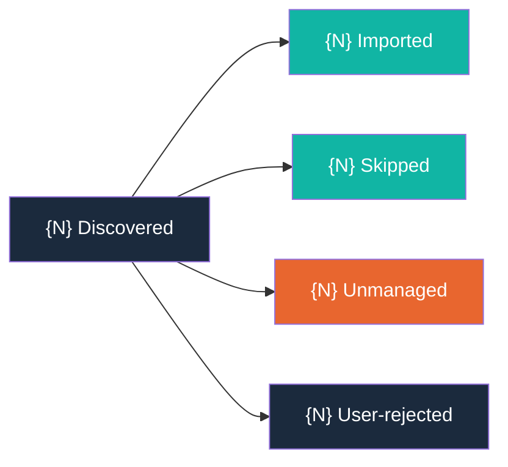

# /arc-align — Codebase Discovery and Migration

## Context Marker

Always begin your response with: **ARC-ALIGN**

## Overview

You scan a project for product-direction content scattered outside Arc's managed artifacts -- roadmap entries, backlog items, TODO lists, feature plans, vision statements, and persona descriptions -- then automatically import them into `docs/BACKLOG.md`, `docs/VISION.md`, and `docs/CUSTOMER.md`. The goal is to consolidate all product-direction content under Arc's governance so that `/arc-shape`, `/arc-wave`, and `/arc-review` operate on a complete picture.

## Critical Constraints

- **NEVER** import content without user confirmation via AskUserQuestion
- **NEVER** delete source files or sections before a successful import
- **NEVER** scan or import files that contain secrets (`.env`, `credentials.json`, `*.key`)
- **NEVER** modify existing Arc-managed artifact content -- only append imported stubs
- **ALWAYS** begin your response with `**ARC-ALIGN**`
- **ALWAYS** generate `docs/skill/arc/align-report.md` after every run
- **ALWAYS** update `docs/skill/arc/align-manifest.md` after every import
- **ALWAYS** skip source locations already recorded in the manifest (idempotent re-runs)
- **ALWAYS** be inclusive at import time -- when in doubt, import as a captured stub rather than skip

## Process

### Step 0: Research Phase (Optional)

Before scanning, optionally run a deep codebase research pass to discover architecture patterns, conventions, dependencies, and existing product-direction content. Research findings are passed to the analysis phase to enrich discovery summaries and gap analysis.

```
AskUserQuestion({
  questions: [{
    question: "Would you like to run a research pass before scanning? A deep scan improves discovery accuracy by surfacing architecture context and dependency patterns.",
    header: "Research Phase",
    options: [
      { label: "Run deep scan (Recommended)", description: "Invoke cw-research to analyze architecture, conventions, dependencies, and product-direction content before scanning" },
      { label: "Quick scan only", description: "Skip research and proceed directly to codebase scanning with existing behavior" },
      { label: "Use existing report", description: "Load a previously generated research report from docs/specs/research-align/research-align.md" }
    ],
    multiSelect: false
  }]
})
```

**If "Run deep scan (Recommended)" is selected:**

Invoke cw-research as a subagent focused on product-direction discovery:

```
Agent({
  subagent_type: "general-purpose",
  prompt: "Run /cw-research on this codebase focused on product-direction discovery. Analyze: (1) architecture and module structure, (2) conventions and naming patterns, (3) dependencies and integrations, (4) any existing product-direction content such as roadmap entries, backlog items, vision statements, personas, and TODOs. Save the research report to docs/specs/research-align/research-align.md."
})
```

After the agent completes, read the saved report from `docs/specs/research-align/research-align.md` and store findings in a `research_findings` variable, then extract structured context (see **Context Extraction** below).

**If "Use existing report" is selected:**

Read the existing report:

```
Read({ file_path: "docs/specs/research-align/research-align.md" })
```

Store the report contents in `research_findings`, then extract structured context (see **Context Extraction** below). If the file does not exist, inform the user and fall back to "Quick scan only" behavior.

**If "Quick scan only" is selected:**

Set `research_findings` to `null` and `research_context` to `null`. Proceed directly to Step 1.

**Context Extraction (deep scan and existing report paths):**

After `research_findings` is populated, extract a structured `research_context` object from the report text. This object is passed forward to the analysis phase (Step 2.5) to enrich discovery summaries and gap analysis.

Extract the following fields from `research_findings`:

| Field | Description | How to Extract |
|-------|-------------|----------------|
| `project_type` | The detected project type or category (e.g., `"cli-tool"`, `"web-service"`, `"library"`, `"monorepo"`) | Look for architecture or type declarations in the report's architecture/module structure section. Default to `"unknown"` if not found. |
| `architecture_patterns` | List of architectural patterns identified (e.g., `["plugin-based", "event-driven"]`) | Extract from any architecture, conventions, or module structure sections. Empty list if not found. |
| `key_dependencies` | List of notable dependencies or integrations mentioned (e.g., `["claude-code", "anthropic-sdk"]`) | Extract from any dependencies or integrations sections. Empty list if not found. |
| `product_direction_signals` | List of product-direction signals the research surfaced (e.g., `["backlog items in README.md", "TODO list in docs/plan.md"]`) | Extract from any product-direction content sections. Empty list if not found. |

Set `research_context` to the extracted object:

```
research_context = {
  project_type: "...",             // string, e.g. "cli-tool" or "unknown"
  architecture_patterns: [...],    // string[], e.g. ["plugin-based"]
  key_dependencies: [...],         // string[], e.g. ["claude-code"]
  product_direction_signals: [...] // string[], e.g. ["backlog items in README.md"]
}
```

If `research_findings` cannot be parsed (empty or unstructured), set each list field to an empty array and `project_type` to `"unknown"`.

`research_context` is consumed by Step 2.5 (Analysis Phase) to contextualize the discovery summary and identify content gaps relative to the detected project type.

### Step 1: Configure Exclusions

Apply hardcoded exclusion defaults, scan for large directories, then let the user refine.

**1a. Hardcoded exclusions (always applied, not user-deselectable):**

These paths are silently excluded from scanning. They never appear in the user-facing multi-select because they must always be excluded:

| Category | Paths |
|----------|-------|
| Directories | `.git/`, `node_modules/`, `vendor/`, `dist/`, `build/`, `.venv/`, `__pycache__/`, `.mypy_cache/`, `.pytest_cache/`, `.ruff_cache/`, `.tox/`, `*.egg-info/`, `target/`, `.gradle/`, `.next/`, `.nuxt/`, `coverage/`, `docs/specs/*/proofs/`, `docs/specs/*/*.feature`, `docs/specs/*/questions-*.md` |
| Arc-managed files | `docs/BACKLOG.md`, `docs/ROADMAP.md`, `docs/VISION.md`, `docs/CUSTOMER.md`, `docs/skill/arc/wave-report.md`, `docs/skill/arc/review-report.md`, `docs/skill/arc/shape-report.md`, `docs/skill/arc/align-manifest.md`, `docs/skill/arc/align-report.md` |
| Secret-bearing files | `.env`, `credentials.json`, `*.key` |

**1b. Directory pre-scan:**

Run a quick Glob scan to identify top-level and second-level directories with unusually large file counts (>500 files). These directories are likely dependency or generated-content folders that would slow the scan.

For each candidate directory, use `Glob({ pattern: "{dir}/**/*" })` and count the returned files. If the count exceeds 500, add the directory to the recommended-exclusion list with the file count.

Only scan directories not already in the hardcoded exclusion list.

**1c. Present exclusion confirmation:**

Present the recommended directory exclusions (from 1b) to the user for review. Hardcoded exclusions from 1a are NOT included in this list -- they are always applied silently.

```
AskUserQuestion({
  questions: [{
    question: "These directories will be excluded from scanning. Deselect any you want scanned, or add custom patterns.",
    header: "Exclusions",
    options: [
      { label: "{large_dir_1}/", description: "{N} files detected — recommended for exclusion" },
      { label: "{large_dir_2}/", description: "{N} files detected — recommended for exclusion" },
      { label: "Add custom patterns", description: "Provide additional glob patterns to exclude" }
    ],
    multiSelect: true
  }]
})
```

If no large directories are found, skip the multi-select and instead ask only:

```
AskUserQuestion({
  questions: [{
    question: "No large directories detected. Would you like to add custom exclusion patterns?",
    header: "Exclusions",
    options: [
      { label: "No, continue", description: "Proceed with default exclusions only" },
      { label: "Add custom patterns", description: "Provide additional glob patterns to exclude" }
    ],
    multiSelect: false
  }]
})
```

**1d. Custom pattern prompt (if selected):**

If the user selects "Add custom patterns," prompt for the patterns:

```
AskUserQuestion({
  questions: [{
    question: "Enter glob patterns to exclude (one per line, e.g., 'test/', '*.generated.md'):",
    header: "Custom Exclusions",
    options: [
      { label: "Provide patterns", description: "Type your exclusion patterns in the text field" }
    ],
    multiSelect: false
  }]
})
```

**1e. Merge exclusion set:**

Build the final exclusion set by combining:
1. All hardcoded exclusions from 1a (always included)
2. Large directories the user left selected in 1c
3. Any custom patterns from 1d

Directories the user deselected in 1c are removed from the exclusion set and will be scanned.

Use this merged exclusion set for all subsequent scanning in Steps 2-8.

### Step 2: Discover Product-Direction Content

Scan all non-excluded files using three detection strategies in sequence. Read `skills/arc-align/references/detection-patterns.md` for the full pattern reference.

**Detection ordering rationale:** Keyword matching runs first because it uses Grep and completes quickly across the entire non-excluded file set. Structural matching runs second on files not already flagged by keyword matching, since it requires line-by-line parsing with Read and is slower. A file matched by keyword scan is not re-scanned for structural patterns. Code comment scanning runs third, targeting source code files (not markdown) for actionable markers (TODO, FIXME, HACK, XXX) that represent work items to import as BACKLOG stubs.

**2a. Keyword matching (Grep-based, fast):**

Run one Grep call per keyword against all non-excluded files. Use case-insensitive matching. For each keyword, build Grep glob exclusions from the merged exclusion set (Step 1e).

**Keywords to scan (22 total):**

| # | Search Term | Typical Target |
|---|-------------|----------------|
| KW-1 | `roadmap` | BACKLOG |
| KW-2 | `backlog` | BACKLOG |
| KW-3 | `todo` | BACKLOG |
| KW-4 | `planned` | BACKLOG |
| KW-5 | `upcoming` | BACKLOG |
| KW-6 | `feature list` | BACKLOG |
| KW-7 | `future work` | BACKLOG |
| KW-8 | `next steps` | BACKLOG |
| KW-9 | `milestone` | BACKLOG |
| KW-10 | `sprint` | BACKLOG |
| KW-11 | `epic` | BACKLOG |
| KW-12 | `user story` | BACKLOG |
| KW-13 | `persona` | CUSTOMER |
| KW-14 | `target audience` | CUSTOMER |
| KW-15 | `mission` | VISION |
| KW-16 | `vision` | VISION |
| KW-17 | `north star` | VISION |
| KW-18 | `## Goals` | VISION |
| KW-19 | `## User Stories` | BACKLOG |
| KW-20 | `## Non-Goals` | BACKLOG |
| KW-21 | `## Open Questions` | BACKLOG |
| KW-22 | `## Introduction` / `## Overview` | VISION (conditional) |

**Procedure for each keyword:**

1. Run Grep with `output_mode: "content"`, `-i: true`, and context lines (`-C: 3`) to capture surrounding content:

   ```
   Grep({
     pattern: "{keyword}",
     "-i": true,
     output_mode: "content",
     "-C": 3,
     "-n": true,
     glob: "*.{md,txt,rst,adoc}"
   })
   ```

   For multi-word keywords (`feature list`, `future work`, `next steps`, `user story`, `target audience`, `north star`), use the exact phrase as the pattern. For spec-heading keywords (KW-18 through KW-22), use the heading pattern as the search term (e.g., `## Goals`). For KW-22, run two separate Grep calls — one for `## Introduction` and one for `## Overview` — and union the results; classify as VISION only if the matched section contains `mission`, `direction`, `purpose`, or `vision` language, otherwise skip.

2. Filter results against the exclusion set -- discard any matches in excluded paths.

3. For each match, record a **keyword discovery entry**:
   - **Source file path:** The file containing the match (relative to repo root)
   - **Line range:** The matched line number plus context lines (e.g., if match is on line 15 with `-C: 3`, record lines 12-18). Expand to section boundaries (next heading or blank-line block) for more complete extraction.
   - **Matched content snippet:** The matched line plus context lines returned by Grep (truncate to 200 characters for the discovery list display)
   - **Detection method:** `keyword`
   - **Matched keyword:** The specific keyword that triggered the match (e.g., `roadmap`)

4. Deduplicate: If the same file is matched by multiple keywords, merge the entries into a single discovery per section. Use heading boundaries (`##` or `###`) to determine section scope -- if two keyword matches fall within the same heading section, combine them into one discovery covering the full section.

5. Track all files that received at least one keyword match in a `keyword_matched_files` set. These files are excluded from the structural scan in Step 2b.

**2b. Structural matching (Read-based, line-by-line):**

After keyword scanning completes, identify files to structurally scan:

1. Use Glob to list all text-format files: `Glob({ pattern: "**/*.{md,txt,rst,adoc}" })`
2. Remove files in the exclusion set (Step 1e)
3. Remove files already in the `keyword_matched_files` set (Step 2a)
4. The remaining files are the structural scan candidates

For each candidate file, Read the full file content and parse line-by-line for four structural patterns:

**ST-1: Markdown Task Lists**

Detect lines matching `- [ ]` or `- [x]` (markdown checkbox syntax).

- Scan for lines matching `^\s*- \[([ x])\] .+` (markdown checkbox syntax)
- Flag sections with 2 or more consecutive task list items as product-direction content
- Record each task list item as a separate discovery (one stub per checkbox item for maximum granularity)
- **Line range:** The single line containing the task list item
- **Content snippet:** The task item text (stripped of checkbox syntax)
- **Detection method:** `structural`

**ST-2: Numbered Feature Lists**

Detect sequential numbered items starting from 1.

- Scan for runs of 3+ consecutive lines matching `^\d+\.\s+.+` where the numbers increment sequentially (1, 2, 3, ...)
- Non-sequential numbering (e.g., 1, 3, 5) or fewer than 3 items are not flagged
- **Line range:** First numbered item through last in the sequential run
- **Content snippet:** All items in the run (truncate to 200 characters)
- **Detection method:** `structural`

**ST-3: Heading Patterns**

Detect level-2 headings indicating product-direction sections (case-insensitive):

- `## Roadmap`
- `## TODO`
- `## Planned Features`
- `## Backlog`

When a matching heading is found:
- **Line range:** From the heading line to the line before the next heading of the same or higher level (`##` or `#`), or end of file
- **Content snippet:** The heading plus the first 200 characters of the section body
- **Detection method:** `structural`

**ST-4: Kanban-Style Markers**

Detect level-3 headings matching (case-insensitive):

- `### To Do`
- `### In Progress`
- `### Done`

Detection requires at least 2 of these 3 headings present in the same file to confirm kanban structure.

When confirmed:
- **Line range:** From the first kanban heading through the content under the last kanban heading (to the next non-kanban heading of the same or higher level, or end of file)
- **Content snippet:** All kanban headings and the first 200 characters of their combined content
- **Detection method:** `structural`

**Structural scan output:**

Collect all structural discoveries into the same list as keyword discoveries. Each entry follows the same format: source file path, line range, content snippet, detection method, and matched pattern identifier (ST-1 through ST-4).

**2c. Code comment scanning (Grep-based):**

After keyword and structural matching complete, scan source code files for actionable comment markers. Read `skills/arc-align/references/detection-patterns.md` for the CC-1 through CC-4 pattern definitions.

**Scanned file extensions (18 total):**

`.py`, `.ts`, `.tsx`, `.js`, `.jsx`, `.go`, `.rs`, `.java`, `.kt`, `.rb`, `.sh`, `.bash`, `.zsh`, `.swift`, `.c`, `.cpp`, `.h`, `.hpp`, `.cs`

**Comment markers to scan (4 total):**

| # | Marker | Meaning | Priority |
|---|--------|---------|----------|
| CC-1 | `TODO` | Actionable work items | P2-Medium |
| CC-2 | `FIXME` | Known bugs | P1-High |
| CC-3 | `HACK` | Temporary workarounds | P1-High |
| CC-4 | `XXX` | Areas needing attention | P2-Medium |

**Procedure for each marker:**

1. Run Grep with case-insensitive matching against all non-excluded source code files:

   ```
   Grep({
     pattern: "{marker}",
     "-i": true,
     output_mode: "content",
     "-n": true,
     glob: "*.{py,ts,tsx,js,jsx,go,rs,java,kt,rb,sh,bash,zsh,swift,c,cpp,h,hpp,cs}"
   })
   ```

2. Filter results against the exclusion set (Step 1e) — discard matches in `node_modules/`, `vendor/`, `dist/`, `build/`, `.venv/`, `__pycache__/`, `.mypy_cache/`, `.pytest_cache/`, `.ruff_cache/`, `.tox/`, `*.egg-info/`, `target/`, `.gradle/`, `.next/`, `.nuxt/`, `coverage/`, and any other excluded paths.

3. For each match, extract the comment text following the marker:
   a. Strip the marker keyword (`TODO`, `FIXME`, `HACK`, `XXX`) and any following colon
   b. Strip common comment prefixes: `//`, `#`, `/*`, `*`, `--`, `"""`, `'''`
   c. Trim leading and trailing whitespace

4. Record a **code comment discovery entry**:
   - **Source file path:** The file containing the match (relative to repo root)
   - **Line number:** The exact line of the comment marker
   - **Matched content snippet:** The extracted comment text (after stripping), truncated to 200 characters
   - **Detection method:** `code`
   - **Matched pattern:** The specific marker (CC-1 through CC-4)
   - **Tag:** `[code]` prefix in the discovery list display

5. Classify all code comment discoveries as **BACKLOG** targets.

6. Assign priorities per the marker mapping:
   - FIXME → P1-High
   - HACK → P1-High
   - TODO → P2-Medium
   - XXX → P2-Medium

   These priority overrides replace the default P2-Medium used for keyword and structural discoveries.

7. Add the `<!-- aligned-from-code: {file}:{line} -->` traceability marker to each discovery entry. This marker is used in addition to the standard `<!-- aligned-from: ... -->` comment when the stub is generated in Step 5. See `skills/arc-align/references/import-rules.md` for the full marker format.

8. **Deduplication:** If the same comment text (after marker stripping and case normalization) appears in multiple source files, import exactly one stub. Note additional locations in the summary line:
   - **Single location:** `Code comment from src/handlers/user.py:18`
   - **Multiple locations:** `Code comment from src/handlers/user.py:18 (also: src/handlers/admin.py:22, src/handlers/org.py:31)`

   The `aligned-from-code` marker references the first occurrence. Additional locations are listed in the summary only. The manifest (Step 7) records each location as a separate row, all pointing to the same imported stub title.

**Code comment scan output:**

Collect all code comment discoveries into the same discovery list as keyword and structural discoveries. Each entry follows the same format with the addition of the `[code]` tag prefix and the `aligned-from-code` traceability marker.

**2d. Classify discoveries:**

For each discovery (from 2a, 2b, and 2c), classify into exactly one of three artifact targets. Read `skills/arc-align/references/import-rules.md` for the full classification rules.

**Classification table:**

| Target | Content Type | Classification Signals |
|--------|-------------|----------------------|
| `BACKLOG` | Actionable items: TODOs, features, bugs, ideas, task lists, roadmap items, code comments | KW-1 through KW-12, KW-19 (`## User Stories`), KW-20 (`## Non-Goals`), KW-21 (`## Open Questions`), ST-1 through ST-4, CC-1 through CC-4 |
| `VISION` | Mission/vision/north-star/goal content | KW-15 (`mission`), KW-16 (`vision`), KW-17 (`north star`), KW-18 (`## Goals`), KW-22 (`## Introduction`/`## Overview`, conditional) |
| `CUSTOMER` | Persona/audience/JTBD content | KW-13 (`persona`), KW-14 (`target audience`), persona roles extracted from KW-19 user stories (spec sources only) |

**Classification procedure:**

For each discovery, apply the following decision rules in order:

1. **Pattern-based assignment:** If the discovery was triggered by a single keyword or structural pattern, assign the target directly from the classification table above.

2. **Spec-specific classification (KW-18 through KW-22):** When a discovery originates from a spec directory (path matches `docs/specs/*/`), apply the spec-specific rules from `skills/arc-align/references/import-rules.md` (Spec-Specific Classification section) instead of general classification rules:

   | Spec Section | Target | Special Handling |
   |-------------|--------|-----------------|
   | `## Goals` (KW-18) | VISION | Goals describe product aims — always VISION |
   | `## User Stories` (KW-19) | BACKLOG | Each "As a..." story = one captured stub; also extract recurring persona roles as CUSTOMER entries |
   | `## Non-Goals` (KW-20) | BACKLOG | Prepend `(deferred) ` to title; override priority to P3-Low |
   | `## Open Questions` (KW-21) | BACKLOG | Prepend `(open question) ` to title; use default P2-Medium |
   | `## Introduction`/`## Overview` (KW-22) | VISION (conditional) | Only if section contains `mission`, `direction`, `purpose`, or `vision` language; otherwise skip |
   | Persona roles in user stories | CUSTOMER | Extract when same role appears in 2+ stories; create dedicated CUSTOMER stub |

3. **Merged-section handling:** If a discovery was merged from multiple keyword matches in the same heading section (per the deduplication rule in Step 2a), use the majority pattern target. If patterns map to different targets (e.g., a section matched by both `roadmap` and `vision`), split the discovery:
   - Read the full section content
   - Identify sub-sections or distinct content blocks within the merged section
   - Create separate discoveries for each block, each with its own target classification

4. **Ambiguity resolution:** When content does not map cleanly to a single target, apply these rules from `import-rules.md`:

   | Ambiguity | Resolution |
   |-----------|-----------|
   | Roadmap with vision framing | Classify individual items as BACKLOG; classify the framing paragraph as VISION if it stands alone |
   | Feature list with persona context | Classify the features as BACKLOG; classify the persona description as CUSTOMER |
   | General "about" content | If it describes what the product does and why, classify as VISION |
   | Mixed file with multiple content types | Split into separate discoveries, each with its own classification |

5. **Inclusivity principle:** When in doubt about whether content is product-direction content, import it as a BACKLOG stub rather than skip it. The user can review and delete false positives from the BACKLOG after import.

**2e. Check manifest for prior imports:**

Read `docs/skill/arc/align-manifest.md` (if present) to enforce idempotent re-runs. Previously imported source locations are skipped automatically.

**Manifest parsing procedure:**

1. Read `docs/skill/arc/align-manifest.md` using the Read tool. If the file does not exist, skip this step — all discoveries are treated as new.

2. Parse the markdown table body (skip the header row and separator row). For each data row, extract `Source Path` and `Line Range` columns.

3. Build a manifest key set: for each row, construct the key `{source_path}:{line_range}` (e.g., `README.md:50-70`, `TODO.md:1-5`). Store the full row data (including `Timestamp` and `Imported Title`) for use in the skipped-items list.

4. For each discovery in the current discovery list, construct its key as `{source_file_path}:{line_range}` and check against the manifest key set:
   - **Match found:** Remove the discovery from the import list. Add it to the skipped-items list with the original import timestamp from the manifest. This item will appear in the alignment report (Step 8) under "Skipped items."
   - **No match:** Keep the discovery in the import list — it is a new discovery.

**Edge cases (per `import-rules.md`):**

| Scenario | Behavior |
|----------|----------|
| Source file was renamed since last import | The new path does not match the manifest entry — treated as a new discovery. The user can manually mark it as a duplicate after review. |
| Source file content shifted (different line range) | Different line range means different manifest key — treated as a new discovery. The user reviews for duplicates in the alignment report. |
| Manifest file was deleted | All source locations are treated as new — full re-import occurs (with user confirmation via the standard import flow in Step 3). |
| Manifest file is empty (header only) | No keys to match — all discoveries are treated as new. |

**2f. Build discovery list:**

Assemble the final discovery list from all discoveries that passed the manifest check (Step 2e). Each entry contains:

| Field | Description |
|-------|-------------|
| Source file path | Relative path from repo root |
| Line range | Start line through end line (e.g., `20-35`) |
| Matched content snippet | First 200 characters of the matched section |
| Detection method | `keyword`, `structural`, or `code` |
| Pattern identifier | The specific keyword (KW-1 through KW-22), structural pattern (ST-1 through ST-4), or code comment marker (CC-1 through CC-4) that triggered the match |
| Target artifact | `BACKLOG`, `VISION`, or `CUSTOMER` (from Step 2d) |

Sort the discovery list by source file path, then by line range (ascending). This ordering groups discoveries from the same file together for easier user review in Step 3.

**Discovery list display format:**

Present the discovery list to the user as a numbered markdown table before the import confirmation prompt:

```markdown
| # | Source | Lines | Target | Method | Snippet |
|---|--------|-------|--------|--------|---------|
| 1 | README.md | 50-70 | BACKLOG | keyword (roadmap) | ## Roadmap - Q3: Launch dark mode... |
| 2 | TODO.md | 1-15 | BACKLOG | structural (ST-1) | - [ ] Refactor auth module... |
| 3 | ABOUT.md | 10-20 | VISION | keyword (mission) | ## Our Mission - To make product... |
```

If items were skipped due to manifest deduplication, display them separately:

```markdown
**Skipped (already imported):**

| Source | Lines | Original Import |
|--------|-------|-----------------|
| TODO.md | 1-10 | 2026-04-01T10:00:00Z |
```

### Step 2.5: Analysis Phase

After discovery completes and before the import confirmation prompt, synthesize findings into a structured analysis artifact at `docs/skill/arc/align-analysis.md`. This artifact is overwritten on every run (not appended to) and reflects the current discovery state. The analysis helps the user understand what was found, what is missing, and what to do next.

**Ensure the output directory exists:**

```
Bash({ command: "mkdir -p docs/skill/arc" })
```

**Generate `docs/skill/arc/align-analysis.md` with the following sections:**

**2.5a. Discovery Summary:**

Count all discoveries from Step 2 (before manifest dedup filtering) and break them down along two dimensions:

**By source type:**

| Source Type | Description | Counted From |
|-------------|-------------|--------------|
| Markdown keywords | Keyword pattern matches (KW-1 through KW-22) | Step 2a discoveries with `detection_method: "keyword"` |
| Markdown structural | Structural pattern matches (ST-1 through ST-4) | Step 2b discoveries with `detection_method: "structural"` |
| Spec extraction | Discoveries from `docs/specs/` files | Step 2a/2b discoveries where source file path starts with `docs/specs/` |
| Code comments | Comment marker matches (CC-1 through CC-4) | Step 2c discoveries with `detection_method: "code"` |

**By target artifact:**

| Target | Count |
|--------|-------|
| BACKLOG | {count of discoveries classified as BACKLOG} |
| VISION | {count of discoveries classified as VISION} |
| CUSTOMER | {count of discoveries classified as CUSTOMER} |

Write the Discovery Summary section as:

```markdown
## Discovery Summary

**Total discoveries:** {total_count}

### By Source Type

| Source Type | Count |
|-------------|-------|
| Markdown keywords | {count} |
| Markdown structural | {count} |
| Spec extraction | {count} |
| Code comments | {count} |

### By Target Artifact

| Target | Count |
|--------|-------|
| BACKLOG | {count} |
| VISION | {count} |
| CUSTOMER | {count} |
```

**2.5b. Gap Analysis:**

Assess presence or absence of content across Arc's four artifact types. For each artifact type, examine the discovery list to determine whether relevant content exists.

| Artifact | Assessment Criteria | Gap Signal |
|----------|-------------------|------------|
| VISION | Any discoveries classified as VISION (KW-15, KW-16, KW-17, KW-18, KW-22 conditional) | If zero VISION discoveries: flag as gap — "No mission, vision, or north-star content found in the repository." |
| CUSTOMER | Any discoveries classified as CUSTOMER (KW-13, KW-14) | If zero CUSTOMER discoveries: flag as gap — "No persona or audience definitions found in the repository." |
| ROADMAP | Any discoveries matching phased planning content (KW-1 `roadmap`, KW-9 `milestone`, KW-10 `sprint`) | If zero phased planning discoveries: flag as absent — "No phased planning content found. Note: arc-align does not populate ROADMAP directly; use /arc-wave to create wave plans." |
| BACKLOG | All discoveries classified as BACKLOG | Report count and distribution. If discoveries are concentrated in one directory (>60% from a single directory), note the concentration: "BACKLOG discoveries are concentrated in {dir}/ ({count}/{total})." If scattered across many directories, note: "BACKLOG discoveries are distributed across {N} directories." |

Write the Gap Analysis section as:

```markdown
## Gap Analysis

| Artifact | Status | Detail |
|----------|--------|--------|
| VISION | {Present / Gap} | {detail text} |
| CUSTOMER | {Present / Gap} | {detail text} |
| ROADMAP | {Present / Absent} | {detail text} |
| BACKLOG | {N items} | {distribution detail} |
```

**2.5c. Theme Analysis:**

Group related discoveries by topic similarity to help the user see patterns and potential wave groupings.

**Grouping procedure:**

1. Collect all discovery content snippets and their source file paths
2. Identify clusters of discoveries that share a common topic — use file path proximity (same directory), keyword overlap in content snippets, and matching pattern identifiers as grouping signals
3. For each identified theme:
   - Assign a descriptive label (e.g., "Authentication", "API endpoints", "Documentation gaps")
   - List the discoveries belonging to the theme (source path and snippet)
   - Suggest whether the theme could form a wave grouping

**Theme detection heuristics:**

| Signal | Weight | Example |
|--------|--------|---------|
| Same directory | High | 5 TODOs in `src/auth/` suggest an "Authentication" theme |
| Shared keywords in snippets | Medium | Multiple discoveries mentioning "API" or "endpoint" |
| Same detection pattern | Low | Multiple ST-1 (task list) discoveries may share a theme if from the same file |

Write the Theme Analysis section as:

```markdown
## Theme Analysis

### {Theme Label}

- **Discoveries:** {count}
- **Sources:** {comma-separated list of source file paths}
- **Wave potential:** {Yes — cohesive enough for a single wave / No — too scattered}

| # | Source | Snippet |
|---|--------|---------|
| 1 | {source_path}:{line_range} | {truncated snippet} |
| 2 | ... | ... |
```

If no clear themes emerge (fewer than 2 discoveries or all discoveries are unrelated), write:

```markdown
## Theme Analysis

No clear themes detected — discoveries are too few or too scattered to group meaningfully.
```

**2.5d. Recommendations:**

Generate an ordered list of suggested next actions based on the gap analysis, theme analysis, and discovery distribution. Each recommendation is a concrete action the user can take.

**Recommendation generation rules (apply in order, include all that match):**

| Condition | Recommendation |
|-----------|---------------|
| VISION gap detected | "Create a VISION artifact — run `/arc-shape` with a focus on mission and north-star definition." |
| CUSTOMER gap detected | "Create a CUSTOMER artifact — run `/arc-shape` with a focus on persona and audience definition." |
| ROADMAP absent | "Consider creating a ROADMAP — run `/arc-wave` to define wave-based delivery plans." |
| Theme with 3+ discoveries | "Shape the **{theme label}** theme as a single initiative — {count} related discoveries suggest a cohesive work stream." |
| BACKLOG concentration >60% in one directory | "Prioritize **{dir}/** — {count} of {total} BACKLOG items originate from this area." |
| Total discoveries > 20 | "Run `/arc-wave` after import to organize the {count} BACKLOG items into delivery waves." |
| Zero discoveries | "No product-direction content found — consider running `/arc-capture` to begin capturing ideas manually." |

Write the Recommendations section as:

```markdown
## Recommendations

1. {First recommendation}
2. {Second recommendation}
3. {Third recommendation}
...
```

**2.5e. Research Integration (conditional):**

This section is only generated when `research_context` is not `null` (i.e., the user selected "Run deep scan" or "Use existing report" in Step 0).

When `research_context` is available, cross-reference the research findings with the discovery results:

1. **Architecture coverage:** For each pattern in `research_context.architecture_patterns`, check whether any discoveries reference that architectural area. Flag patterns with no corresponding discoveries as potential blind spots.

2. **Dependency alignment:** For each entry in `research_context.key_dependencies`, check whether any discoveries mention that dependency. Dependencies with no corresponding discoveries may indicate under-documented integration points.

3. **Signal validation:** Compare `research_context.product_direction_signals` against the actual discovery list. Note which signals were confirmed by discoveries and which were not found.

4. **Project type context:** Use `research_context.project_type` to contextualize recommendations (e.g., a `"cli-tool"` project type may benefit from different recommendations than a `"web-service"`).

Write the Research Integration section as:

```markdown
## Research Integration

**Project type:** {research_context.project_type}

### Architecture Coverage

| Pattern | Discoveries Found | Status |
|---------|-------------------|--------|
| {pattern} | {count or "None"} | {Covered / Blind spot} |

### Dependency Alignment

| Dependency | Referenced in Discoveries | Status |
|------------|--------------------------|--------|
| {dependency} | {Yes / No} | {Aligned / Under-documented} |

### Signal Validation

| Research Signal | Confirmed by Discovery | Notes |
|----------------|----------------------|-------|
| {signal} | {Yes / No} | {details} |
```

When `research_context` is `null`, omit the Research Integration section entirely — do not write an empty section or placeholder.

**2.5f. Discovery Distribution Diagram:**

Generate a Mermaid pie chart showing the distribution of discoveries by source type. Use Liatrio brand colors: `#11B5A4` (teal) for Markdown keywords, `#E8662F` (orange) for Markdown structural, `#1B2A3D` (dark blue) for Spec extraction, and `#7EC8C8` (light teal) for Code comments.

Build the diagram from the source-type counts computed in step 2.5a. Include the following as a section in the analysis artifact:

**Section heading:** `## Discovery Distribution`

**Diagram template:**

```
%%{init: {'theme': 'base', 'themeVariables': {'pie1': '#11B5A4', 'pie2': '#E8662F', 'pie3': '#1B2A3D', 'pie4': '#7EC8C8'}}}%%
pie title Discoveries by Source Type
    "Markdown keywords" : {markdown_keywords_count}
    "Markdown structural" : {markdown_structural_count}
    "Spec extraction" : {spec_extraction_count}
    "Code comments" : {code_comments_count}
```

Wrap the diagram template in a `mermaid` code fence when writing to the artifact file.

Omit any slice with a count of zero — the Mermaid `pie` chart requires non-zero values to render correctly. If all four counts are zero, omit the diagram section entirely.

**2.5g. Write the analysis artifact:**

Assemble all sections into `docs/skill/arc/align-analysis.md` using Write. The artifact structure is:

```markdown
# Alignment Analysis

**Generated:** {ISO 8601 timestamp}

---

{Discovery Summary from 2.5a}

---

{Gap Analysis from 2.5b}

---

{Discovery Distribution from 2.5f}

---

{Theme Analysis from 2.5c}

---

{Recommendations from 2.5d}

---

{Research Integration from 2.5e, if available}
```

The artifact is overwritten on every run. It reflects the current discovery state, not a cumulative history.

**2.5h. Inline Chat Summary:**

After writing the analysis artifact, present a condensed summary directly in the chat. This summary is displayed in the conversation — it is not written to any file. Keep the summary under 20 lines.

The summary format is:

```
## Alignment Analysis — Quick Summary

**Total discoveries:** {total_count}  ({backlog_count} BACKLOG · {vision_count} VISION · {customer_count} CUSTOMER)

**Gaps detected:**
{For each gap from 2.5b: one bullet per artifact with Gap or Absent status. If none: "No gaps detected."}

**Top recommendations:**
1. {First recommendation from 2.5d}
2. {Second recommendation from 2.5d}
3. {Third recommendation from 2.5d}

Full analysis: `docs/skill/arc/align-analysis.md`
```

If fewer than three recommendations were generated in 2.5d, include only the recommendations that exist. Do not pad with placeholders.

### Step 3: Confirm Import

Present the discovery list to the user for review before importing.

```
AskUserQuestion({
  questions: [{
    question: "Found {N} items to import. Review the list and confirm.",
    header: "Import",
    options: [
      { label: "Import all", description: "Import all {N} discovered items into Arc artifacts" },
      { label: "Review individually", description: "Confirm each item one by one" },
      { label: "Skip", description: "Skip import — generate report only" }
    ],
    multiSelect: false
  }]
})
```

If the user selects "Review individually," present each discovery one at a time with accept/reject options:

```
AskUserQuestion({
  questions: [{
    question: "[{index}/{total}] Import this item?\n\nSource: {source_path}:{line_range}\nTarget: {target_artifact}\nMethod: {detection_method} ({pattern_id})\nSnippet: {content_snippet}",
    header: "Review Item",
    options: [
      { label: "Accept", description: "Import this item into {target_artifact}" },
      { label: "Reject", description: "Skip this item — do not import" },
      { label: "Accept all remaining", description: "Import this and all remaining items without further review" },
      { label: "Reject all remaining", description: "Skip this and all remaining items" }
    ],
    multiSelect: false
  }]
})
```

Track user decisions:
- **Accept:** Keep the discovery in the import list
- **Reject:** Remove the discovery from the import list; add it to the alignment report as a user-rejected item
- **Accept all remaining:** Mark all remaining discoveries as accepted and stop prompting
- **Reject all remaining:** Mark all remaining discoveries as rejected and stop prompting

After individual review, display a confirmation summary showing the accepted count and rejected count before proceeding to Step 4.

### Step 4: Bootstrap Artifacts

Before importing, ensure each target artifact exists. Only bootstrap artifacts that have at least one confirmed discovery targeting them. Check existence using Read; if the file does not exist, create it from the corresponding template.

**4a. BACKLOG.md:**

If `docs/BACKLOG.md` does not exist and there are BACKLOG-targeted discoveries:

1. Read `templates/BACKLOG.tmpl.md` for the Foundation phase format
2. Create the `docs/` directory if it does not exist
3. Create the `docs/skill/arc/` directory if it does not exist: `Bash({ command: "mkdir -p docs/skill/arc" })`
4. Create `docs/BACKLOG.md` with the following structure (matching `/arc-capture` Step 2 bootstrap logic):

```markdown
# BACKLOG

A triaged list of product ideas. Each idea progresses through the idea lifecycle
(Capture, Shape, Spec-Ready, Shipped) and is stored as a `## {Title}` section below.

| Priority | Label | When to Use |
|----------|-------|-------------|
| P0 | Critical | Blocks current wave or causes user-visible failure |
| P1 | High | Important for current or next wave; significant user impact |
| P2 | Medium | Valuable but not urgent; can wait 1-2 waves |
| P3 | Low | Nice to have; consider if capacity allows |

| Title | Status | Priority | Wave |
|-------|--------|----------|------|
```

The file starts with the heading, an overview paragraph, the priority definitions table from the Foundation section of the template, and an empty summary table header. Imported stubs are appended after the summary table in Step 5a.

**4b. VISION.md:**

If `docs/VISION.md` does not exist and there are VISION-targeted discoveries:

1. Read `templates/VISION.tmpl.md` for the Spike phase format (the minimal stub)
2. Create `docs/VISION.md` with the following structure:

```markdown
# VISION

## Vision Summary

{Leave blank — to be populated by /arc-shape or manual editing.}
```

The file starts with a heading and the minimal Spike-phase stub. Imported vision content is appended under a `## Imported Content` section in Step 5b.

**4c. CUSTOMER.md:**

If `docs/CUSTOMER.md` does not exist and there are CUSTOMER-targeted discoveries:

1. Read `templates/CUSTOMER.tmpl.md` for the Spike phase format (the minimal notes stub)
2. Create `docs/CUSTOMER.md` with the following structure:

```markdown
# CUSTOMER

## Initial Audience Notes

{Leave blank — to be populated by /arc-shape or manual editing.}
```

The file starts with a heading and the minimal Spike-phase stub. Imported persona content is appended under a `## Imported Content` section in Step 5c.

**4d. Ensure docs/skill/arc/ directory and migrate legacy artifacts:**

Always ensure the `docs/skill/arc/` directory exists before any artifact writes:

```
Bash({ command: "mkdir -p docs/skill/arc" })
```

Then check for legacy artifacts at the old paths and migrate them to the new paths:

| Old Path | New Path |
|----------|----------|
| `docs/align-manifest.md` | `docs/skill/arc/align-manifest.md` |
| `docs/align-report.md` | `docs/skill/arc/align-report.md` |

**Migration procedure for each legacy artifact:**

1. Attempt to Read the old path (e.g., `docs/align-manifest.md`)
2. If the file exists:
   a. Write its content to the new path (e.g., `docs/skill/arc/align-manifest.md`)
   b. Inform the user: "Migrated `{old_path}` to `{new_path}`. The old file can now be safely deleted."
3. If the file does not exist, skip silently — nothing to migrate.

**Note:** The migration does not delete the old file. The user is responsible for removing it after confirming the migration is correct. Subsequent runs will read from and write to the new path only.

### Step 5: Import Discoveries

Import confirmed items into the appropriate Arc artifacts. Read `skills/arc-align/references/import-rules.md` for the full classification rules, stub generation logic, and field derivation details.

**5a. BACKLOG imports:**

For each BACKLOG-targeted discovery, create one captured stub and one summary table row. Process discoveries in the order they appear in the confirmed discovery list (sorted by source file path, then line range).

**5a-i. Derive the title:**

Apply the first matching rule from this precedence list:

| Source Content | Derivation Rule | Example |
|---------------|-----------------|---------|
| Heading present | Use the heading text, stripped of markdown syntax (`#`, `**`, links) | `## Add dark mode` -> "Add dark mode" |
| Task list item | Use the task text, stripped of checkbox syntax (`- [ ]`, `- [x]`) | `- [ ] Fix auth bug` -> "Fix auth bug" |
| Numbered list item | Use the item text, stripped of number prefix | `3. Webhook support` -> "Webhook support" |
| User story format | Extract the goal clause from "As a {persona}, I want {goal}" | "As a dev, I want real-time logs" -> "Real-time logs" |
| No clear title | Use the first meaningful line (non-blank, non-comment), truncated to 60 characters | First line of the section |

If the derived title exceeds 80 characters, truncate at the last word boundary before 80 characters.

**5a-ii. Extract the one-line summary:**

| Source Content | Extraction Rule |
|---------------|-----------------|
| Paragraph follows heading | Use the first sentence of the paragraph |
| Task list item with no paragraph | Use the task text itself as the summary |
| Multi-line content | Use the first non-heading, non-blank line, truncated to 120 characters |
| No extractable content | Use "Imported from {source_path}" |

**5a-iii. Generate the anchor:**

Convert the title to a markdown anchor: lowercase, replace spaces with hyphens, strip all non-alphanumeric characters except hyphens.

Example: "Add Dark Mode Support" -> `#add-dark-mode-support`

**5a-iv. Append captured stub section:**

Append one `## {Title}` section per discovery at the end of `docs/BACKLOG.md`.

**Standard stub format (non-spec sources):**

```markdown
## {Title}

- **Status:** captured
- **Priority:** P2-Medium
- **Captured:** {ISO 8601 timestamp}
<!-- aligned-from: {source_path}:{line_range} -->

{One-line summary}
```

**Spec-sourced stub format (source path matches `docs/specs/*/`):**

```markdown
## {Title}

- **Status:** captured
- **Priority:** {priority}
- **Captured:** {ISO 8601 timestamp}
<!-- aligned-from: {source_path}:{line_range} -->
<!-- aligned-from-spec: {spec_name} -->

{One-line summary}
```

Field values:
- **Status:** Always `captured`
- **Priority:** `P2-Medium` for standard imports; `P3-Low` for non-goals (KW-20); `P2-Medium` for open questions (KW-21). User adjusts after import.
- **Captured:** Current UTC time in ISO 8601 format (`YYYY-MM-DDTHH:MM:SSZ`)
- **aligned-from:** `{source_path}:{line_range}` where source_path is relative to repo root and line_range is the start-end lines (e.g., `docs/specs/03-spec-arc-align/03-spec-arc-align.md:45-50`)
- **aligned-from-spec:** Present only when the source path is inside a `docs/specs/` directory. Derived by extracting the immediate parent directory name of the source file (e.g., source `docs/specs/03-spec-arc-align/03-spec-arc-align.md` → `spec_name` = `03-spec-arc-align`). See `skills/arc-align/references/import-rules.md` (Aligned-From-Spec Marker section) for full derivation rules.

**5a-v. Update the BACKLOG summary table:**

For each imported stub, add a new row to the summary table immediately before the first `## ` section heading in `docs/BACKLOG.md`. Each row follows this format:

```markdown
| [{Title}](#{anchor}) | captured | P2-Medium | -- |
```

If multiple stubs are imported, add all rows in a single Edit operation to avoid repeated file writes. Rows are added in the same order as the stubs were appended.

**Inclusivity principle:** When in doubt about whether a discovery is genuine product-direction content, import it as a captured stub rather than skip it. The user can review and delete false positives from the BACKLOG. It is better to over-import than to miss genuine content.

**5b. VISION imports:**

Append discovered vision/mission/north-star content to `docs/VISION.md` under a `## Imported Content` section. Process VISION discoveries in the order they appear in the confirmed discovery list.

**5b-i. Locate or create the `## Imported Content` section:**

1. Read `docs/VISION.md` using the Read tool
2. Search for an existing `## Imported Content` heading:
   - **Found:** Identify the end of the section (the line before the next `## ` heading, or end of file). New content will be appended at this position.
   - **Not found:** The section does not exist yet. It will be created at the end of the file.

**5b-ii. Append each VISION discovery:**

For each VISION-targeted discovery, append a content block with source attribution:

```markdown
## Imported Content

<!-- aligned-from: {source_path}:{line_range} -->
{imported content, preserving original formatting}
```

If appending to an existing `## Imported Content` section, do not repeat the `## Imported Content` heading. Append only the attribution comment and content block, separated by a blank line from the previous import:

```markdown

<!-- aligned-from: {second_source_path}:{line_range} -->
{second imported content block}
```

Each import gets its own `<!-- aligned-from: ... -->` comment immediately above the content block. Preserve the original formatting of the source content exactly -- headings, lists, emphasis, and whitespace are kept intact.

If multiple VISION discoveries exist, append all blocks in a single Edit operation to minimize file writes.

**5c. CUSTOMER imports:**

Append discovered persona/audience/JTBD content to `docs/CUSTOMER.md` under a `## Imported Content` section. The procedure mirrors VISION imports exactly.

**5c-i. Locate or create the `## Imported Content` section:**

1. Read `docs/CUSTOMER.md` using the Read tool
2. Search for an existing `## Imported Content` heading:
   - **Found:** Identify the end of the section (the line before the next `## ` heading, or end of file). New content will be appended at this position.
   - **Not found:** The section does not exist yet. It will be created at the end of the file.

**5c-ii. Append each CUSTOMER discovery:**

For each CUSTOMER-targeted discovery, append a content block with source attribution:

```markdown
## Imported Content

<!-- aligned-from: {source_path}:{line_range} -->
{imported persona content, preserving original formatting}
```

If appending to an existing `## Imported Content` section, do not repeat the heading -- append only the attribution comment and content block, separated by a blank line from the previous import.

Each import gets its own `<!-- aligned-from: ... -->` comment immediately above the content block. Preserve the original formatting of the source content exactly.

If multiple CUSTOMER discoveries exist, append all blocks in a single Edit operation.

### Step 6: Clean Up Sources

After all imports succeed, remove the original content to eliminate drift between Arc-managed and unmanaged content. Process each source file that contributed at least one import. **Deletion is performed only after all imports from a file succeed -- if any import from a file fails, the file is left intact.**

#### Section Boundary Detection

Before removing content, determine the section boundaries using these rules (applied in precedence order):

| Boundary Type | Detection Rule | Example |
|---------------|---------------|---------|
| **Heading-delimited** | A section starts at a `##` or `###` heading and ends at the line before the next heading of the same or higher level (`#`, `##`), or at end of file | `## Roadmap` through the line before `## Contributing` |
| **Blank-line-delimited** | If no heading structure exists, a section is a block of consecutive non-blank lines separated by one or more blank lines from surrounding content | A paragraph block between blank lines |
| **Task list block** | Consecutive task list items (`- [ ]` / `- [x]`) form a single block, regardless of heading structure | A run of 5 checkbox items with no blank lines between them |

When the imported line range falls within a heading-delimited section, expand the removal range to cover the full section (from the heading line through the last line before the next same-or-higher-level heading). This prevents orphaned content fragments.

**6a. Full-file deletion:**

Delete the source file when **all** of its content was classified as product-direction and imported.

**Criteria for entire-file deletion:**

1. Every non-blank, non-frontmatter, non-comment line in the file was part of an imported discovery
2. No non-product-direction sections remain after removing all imported ranges
3. Common entire-file candidates: `TODO.md`, `PERSONAS.md`, `FEATURES.md`, standalone roadmap files

**Procedure:**

1. Collect all imported line ranges for the file
2. Read the full file content
3. Determine whether any meaningful content (non-blank, non-frontmatter) exists outside the imported ranges
4. If no meaningful content remains: delete the file using the Bash tool (`rm {file_path}`)
5. If meaningful content remains: proceed to 6b for partial removal

**6b. Partial-section removal:**

When a file contains both product-direction and non-product content, remove only the imported sections while preserving surrounding content.

**Procedure:**

1. For each imported discovery from this file, identify the exact line range using the section boundary detection rules above
2. Sort all removal ranges by start line (descending) so that removals from the bottom of the file are processed first -- this prevents line number shifts from invalidating subsequent ranges
3. For each removal range (processed bottom-up):
   a. Remove all lines in the range using the Edit tool (replace the section text with an empty string)
   b. Collapse any resulting double-blank-line sequences to a single blank line
4. After all removals, read the file again and verify:
   a. The remaining file is valid markdown (headings still nested correctly, no orphaned list continuations)
   b. No double-blank-line sequences remain
   c. The file still has meaningful content
5. If the file is now empty or contains only whitespace/frontmatter after all removals: delete the file entirely (fall back to 6a behavior)

**Preservation guarantee:** Content outside the identified section boundaries is never modified. The surrounding text, headings, and structure remain intact.

### Step 7: Update Manifest

Update `docs/skill/arc/align-manifest.md` with a row per import to enable idempotent re-runs and provide an audit trail.

**7a. Create or read the manifest:**

1. Check if `docs/skill/arc/align-manifest.md` exists using Read
2. If the file does not exist, create it with the table header:

```markdown
# Align Manifest

| Source Path | Line Range | Target Artifact | Imported Title | Timestamp |
|-------------|-----------|-----------------|----------------|-----------|
```

3. If the file exists, read it to identify the last line of the table (the position for appending new rows)

**7b. Append import rows:**

For each successfully imported discovery, append one row to the manifest table:

```markdown
| {source_path} | {line_range} | {target} | {title} | {ISO 8601} |
```

**Column values:**

| Column | Value |
|--------|-------|
| Source Path | Relative path from repo root to the original file (e.g., `README.md`, `docs/TODO.md`) |
| Line Range | Line numbers of the imported content (single line: `5`, range: `10-25`) |
| Target Artifact | One of `BACKLOG`, `VISION`, or `CUSTOMER` |
| Imported Title | For BACKLOG imports: the derived stub title from Step 5a-i. For VISION imports: `(vision content)`. For CUSTOMER imports: `(persona content)`. |
| Timestamp | Current UTC time in ISO 8601 format (`YYYY-MM-DDTHH:MM:SSZ`) |

**7c. Write all rows in a single operation:**

Append all new rows in a single Edit operation to minimize file writes. Rows are added in the same order as the confirmed discovery list (sorted by source file path, then line range).

**Manifest integrity rules:**

- Never modify or remove existing manifest rows -- only append
- Each row represents one import event; if the same content is split into multiple discoveries, each gets its own row
- The manifest is the source of truth for the idempotent re-run check in Step 2e

### Step 8: Generate Report

Create `docs/skill/arc/align-report.md` after every run. Read `skills/arc-align/references/align-report-template.md` for the full template. The report captures everything that happened during the run so the user can audit the results without re-running.

**8a. Run metadata section:**

Write the report header and run metadata. All fields are derived from data collected during Steps 1-7.

```markdown
# Alignment Report

**Generated:** {ISO 8601 timestamp}

---

## Run Metadata

| Field | Value |
|-------|-------|
| Timestamp | {ISO 8601 timestamp} |
| Exclusion patterns | {comma-separated list of all exclusion patterns from Step 1e} |
| Total files scanned | {count of files examined during Steps 2a, 2b, and 2c} |
| Total discoveries | {count of all discoveries before manifest dedup} |
| New imports | {count of items imported in this run} |
| Skipped (manifest) | {count of items skipped due to prior manifest entries} |
| Remaining unmanaged | {count of items rejected by user during individual review (Step 3)} |
```

**8b. Imported items by artifact section:**

Group all successfully imported items by their target artifact (BACKLOG, VISION, CUSTOMER). Each group uses a markdown table showing source path, imported title, and detection method. Only include groups that have at least one imported item.

```markdown
---

## Imported Items by Artifact

### BACKLOG

| Source Path | Imported Title | Detection Method |
|-------------|---------------|-----------------|
| {source_path} | {title from Step 5a-i} | {keyword (KW-N) or structural (ST-N)} |

### VISION

| Source Path | Imported Title | Detection Method |
|-------------|---------------|-----------------|
| {source_path} | (vision content) | {keyword (KW-N)} |

### CUSTOMER

| Source Path | Imported Title | Detection Method |
|-------------|---------------|-----------------|
| {source_path} | (persona content) | {keyword (KW-N)} |
```

If no items were imported for a given artifact, omit that artifact's subsection entirely rather than showing an empty table.

**8c. Skipped items section:**

List all items that were detected during scanning but skipped because their source location already appeared in `docs/skill/arc/align-manifest.md` from a prior run. These items were removed from the import list during Step 2e.

```markdown
---

## Skipped Items

| Source Path | Line Range | Original Import Date |
|-------------|-----------|---------------------|
| {source_path} | {line_range} | {timestamp from manifest} |
```

If no items were skipped, display:

```markdown
---

## Skipped Items

No items skipped — this is the first alignment run or no prior imports match current discoveries.
```

**8d. Unmatched exclusions section:**

List all files and directories that were excluded from scanning during Step 1. This lets the user see what was not checked and decide whether to adjust exclusions on the next run.

Separate hardcoded exclusions (from Step 1a) and user-configured exclusions (from Steps 1c/1d) so the user can distinguish between non-negotiable and optional exclusions.

```markdown
---

## Excluded from Scanning

### Hardcoded Exclusions (always applied)

| Pattern | Category |
|---------|----------|
| .git/ | Directory |
| node_modules/ | Directory |
| vendor/ | Directory |
| dist/ | Directory |
| build/ | Directory |
| .venv/ | Directory |
| __pycache__/ | Directory |
| .mypy_cache/ | Directory |
| .pytest_cache/ | Directory |
| .ruff_cache/ | Directory |
| .tox/ | Directory |
| *.egg-info/ | Directory |
| target/ | Directory |
| .gradle/ | Directory |
| .next/ | Directory |
| .nuxt/ | Directory |
| coverage/ | Directory |
| docs/specs/*/proofs/ | Directory |
| docs/specs/*/*.feature | Directory |
| docs/specs/*/questions-*.md | Directory |
| docs/BACKLOG.md | Arc-managed file |
| docs/ROADMAP.md | Arc-managed file |
| docs/VISION.md | Arc-managed file |
| docs/CUSTOMER.md | Arc-managed file |
| docs/skill/arc/wave-report.md | Arc-managed file |
| docs/skill/arc/review-report.md | Arc-managed file |
| docs/skill/arc/shape-report.md | Arc-managed file |
| docs/skill/arc/align-manifest.md | Arc-managed file |
| docs/skill/arc/align-report.md | Arc-managed file |
| .env | Secret-bearing file |
| credentials.json | Secret-bearing file |
| *.key | Secret-bearing file |

### User-Configured Exclusions

| Pattern | Reason |
|---------|--------|
| {large_dir}/ | {N} files detected — recommended for exclusion |
| {custom_pattern} | User-added custom pattern |
```

If no user-configured exclusions were added, display:

```markdown
### User-Configured Exclusions

No additional exclusions were configured for this run.
```

**8e. Remaining unmanaged content section:**

List content that was detected as product-direction content but was not imported because the user explicitly rejected it during individual review in Step 3. Per the inclusivity principle, all discoveries are imported by default — items only appear here if the user selected "Review individually" and rejected specific items. If the user selected "Import all" (the default), this section will be empty.

```markdown
---

## Remaining Unmanaged Content

| Source Path | Lines | Detection Signal | Snippet |
|-------------|-------|-----------------|---------|
| {source_path} | {line_range} | {weak signal description} | {first 200 chars of content} |
```

If no unmanaged content remains, display:

```markdown
---

## Remaining Unmanaged Content

No remaining unmanaged content detected. All product-direction content has been imported or was previously captured.
```

**8f. Discovery flow diagram (optional):**

If the run processed a non-trivial number of discoveries (3 or more), include a Mermaid sankey or flowchart showing how discoveries flowed through the pipeline. Use Liatrio brand colors.

````markdown
---

## Discovery Flow


````

Only include the diagram if Mermaid rendering is supported (markdown context). Omit it if the diagram would have zero items in all branches except "Imported."

**8g. Cross-references footer:**

End the report with pointers to related files:

```markdown
---

## Cross-References

- `docs/skill/arc/align-manifest.md` — Full import history with source→artifact mappings
- `docs/BACKLOG.md` — Imported captured stubs (BACKLOG targets)
- `docs/VISION.md` — Imported vision/mission content (VISION targets)
- `docs/CUSTOMER.md` — Imported persona/audience content (CUSTOMER targets)
- `skills/arc-align/references/detection-patterns.md` — Detection pattern definitions
- `skills/arc-align/references/import-rules.md` — Classification and import rules
```

### Step 9: Present Summary

After the report is written, present the run summary inline to the user as a markdown table. This follows the same pattern as `/arc-review` Step 5/6 -- show findings inline, then offer next steps via AskUserQuestion.

**9a. Per-artifact import counts:**

Show one row per artifact that received at least one import, plus aggregate totals:

```markdown
| Metric | Count |
|--------|-------|
| Files scanned | {N} |
| **Imported to BACKLOG** | **{N}** |
| **Imported to VISION** | **{N}** |
| **Imported to CUSTOMER** | **{N}** |
| Items skipped (already in manifest) | {N} |
| Items left behind (user-rejected) | {N} |
| Files deleted | {N} |
| Sections trimmed | {N} |
```

Omit artifact rows with zero imports (e.g., if no VISION content was imported, omit the VISION row). Always include the skipped, left-behind, files-deleted, and sections-trimmed rows even when their count is zero -- this confirms completeness.

**9b. Highlight key outcomes:**

Below the table, add a one-sentence summary per non-zero category:

- Imports: "Imported {N} items into {artifact list} from {M} source files."
- Skipped: "{N} items skipped -- already captured in a prior alignment run."
- Left behind: "{N} items rejected during individual review -- listed in `docs/skill/arc/align-report.md` under Remaining Unmanaged Content."
- Cleanup: "Deleted {N} files and trimmed {N} sections to eliminate drift."

Omit sentences for categories with zero counts.

### Step 10: Offer Next Steps

Immediately after the inline summary, offer the user a choice of next actions via AskUserQuestion. This mirrors the `/arc-review` Step 6 pattern of presenting findings inline followed by an interactive prompt.

```
AskUserQuestion({
  questions: [{
    question: "Alignment complete. What would you like to do next?",
    header: "Next Steps",
    options: [
      { label: "Shape imported ideas", description: "Run /arc-shape on newly captured stubs to refine them into shaped briefs" },
      { label: "Review pipeline health", description: "Run /arc-review to audit the consolidated backlog and check cross-reference integrity" },
      { label: "Run again", description: "Re-run /arc-align to check for additional content after manual changes" },
      { label: "Done", description: "Finish the alignment session" }
    ],
    multiSelect: false
  }]
})
```

**Handle selection:**
- **Shape imported ideas:** Inform the user to run `/arc-shape` to refine the newly captured stubs into shaped briefs
- **Review pipeline health:** Inform the user to run `/arc-review` to audit the consolidated backlog
- **Run again:** Loop back to Step 1 (full re-scan with manifest deduplication)
- **Done:** Summarize total items imported across all artifacts, files cleaned, and exit

## References

- `skills/arc-align/references/detection-patterns.md` -- All keyword, structural, and code comment detection patterns with examples
- `skills/arc-align/references/import-rules.md` -- Artifact classification rules, stub generation logic, and cleanup behavior
- `skills/arc-align/references/align-report-template.md` -- Full template and field descriptions for the alignment report
- `references/idea-lifecycle.md` -- Capture stage definition, entry/exit criteria
- `references/brief-format.md` -- Brief format for shaped ideas
- `templates/BACKLOG.tmpl.md` -- Template for creating BACKLOG.md if absent
- `templates/VISION.tmpl.md` -- Template for creating VISION.md if absent
- `templates/CUSTOMER.tmpl.md` -- Template for creating CUSTOMER.md if absent
