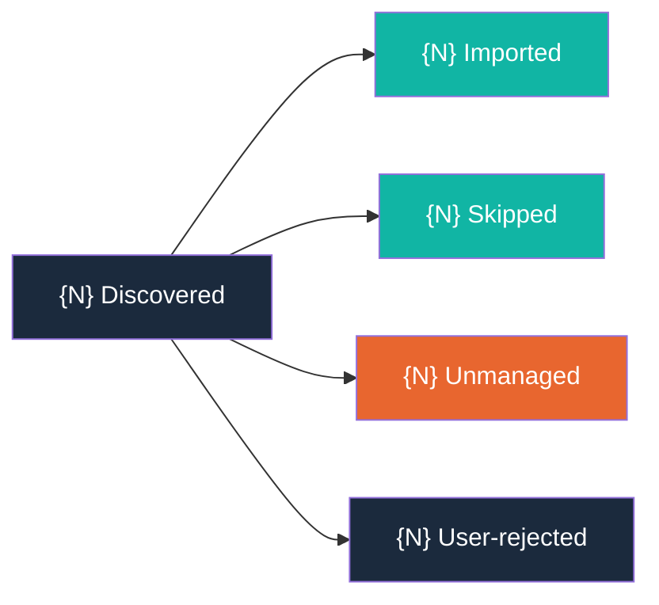

# Alignment Report Template

Format for `docs/skill/arc/align-report.md`, generated by `/arc-assess` after scanning the codebase for scattered product-direction content and importing discoveries into Arc-managed artifacts.

## Template

```markdown
# Alignment Report

**Generated:** {ISO 8601 timestamp}

---

## Run Metadata

| Field | Value |
|-------|-------|
| Timestamp | {ISO 8601 timestamp} |
| Exclusion patterns | {comma-separated list of all exclusion patterns from Step 1e} |
| Total files scanned | {count of files examined during keyword and structural scanning} |
| Total discoveries | {count of all discoveries before manifest deduplication} |
| New imports | {count of items imported in this run} |
| Skipped (manifest) | {count of items skipped due to prior manifest entries} |
| Remaining unmanaged | {count of items rejected by user during individual review (Step 3)} |

---

## Imported Items by Artifact

### BACKLOG

| Source Path | Imported Title | Detection Method |
|-------------|---------------|-----------------|
| {source_path} | {derived title from Step 5a-i} | {keyword (KW-N) or structural (ST-N)} |

### VISION

| Source Path | Imported Title | Detection Method |
|-------------|---------------|-----------------|
| {source_path} | (vision content) | {keyword (KW-N)} |

### CUSTOMER

| Source Path | Imported Title | Detection Method |
|-------------|---------------|-----------------|
| {source_path} | (persona content) | {keyword (KW-N)} |

---

## Merge Candidates

| Source Path | Lines | Target Wave Archive | Target Skill Heading | Provenance |
|-------------|-------|---------------------|---------------------|------------|
| {source_path} | {line_range} | {wave-archive-file} | {skill-heading} | `<!-- aligned-from: {source_path}:{line_range} aligned-from-spec: {spec-dir-basename} -->` |
| {source_path} | {line_range} | {wave-archive-file} | {chosen-skill-heading} | `<!-- aligned-from: {source_path}:{line_range} aligned-from-spec: {chosen-spec-dir-basename} -->` |
    - candidate: {unselected-spec-dir-basename} ({wave-archive-file} → {skill-heading})
    - candidate: {unselected-spec-dir-basename} ({wave-archive-file} → {skill-heading})

---

## Skipped Items

| Source Path | Line Range | Original Import Date |
|-------------|-----------|---------------------|
| {source_path} | {line_range} | {timestamp from align-manifest.md} |

---

## Excluded from Scanning

### Hardcoded Exclusions (always applied)

| Pattern | Category |
|---------|----------|
| .git/ | Directory |
| node_modules/ | Directory |
| vendor/ | Directory |
| dist/ | Directory |
| build/ | Directory |
| .venv/ | Directory |
| __pycache__/ | Directory |
| .mypy_cache/ | Directory |
| .pytest_cache/ | Directory |
| .ruff_cache/ | Directory |
| .tox/ | Directory |
| *.egg-info/ | Directory |
| target/ | Directory |
| .gradle/ | Directory |
| .next/ | Directory |
| .nuxt/ | Directory |
| coverage/ | Directory |
| docs/specs/*/proofs/ | Directory |
| docs/specs/*/*.feature | Directory |
| docs/specs/*/questions-*.md | Directory |
| docs/BACKLOG.md | Arc-managed file |
| docs/ROADMAP.md | Arc-managed file |
| docs/VISION.md | Arc-managed file |
| docs/CUSTOMER.md | Arc-managed file |
| docs/skill/arc/wave-report.md | Arc-managed file |
| docs/skill/arc/review-report.md | Arc-managed file |
| docs/skill/arc/shape-report.md | Arc-managed file |
| docs/skill/arc/align-manifest.md | Arc-managed file |
| docs/skill/arc/align-report.md | Arc-managed file |
| .env | Secret-bearing file |
| credentials.json | Secret-bearing file |
| *.key | Secret-bearing file |

### User-Configured Exclusions

| Pattern | Reason |
|---------|--------|
| {large_dir}/ | {N} files detected — recommended for exclusion |
| {custom_pattern} | User-added custom pattern |

---

## Remaining Unmanaged Content

| Source Path | Lines | Detection Signal | Snippet |
|-------------|-------|-----------------|---------|
| {source_path} | {line_range} | {weak signal description} | {first 200 chars of matched content} |

---

## Discovery Flow



---

## Cross-References

- `docs/skill/arc/align-manifest.md` — Full import history with source→artifact mappings
- `docs/BACKLOG.md` — Imported captured stubs (BACKLOG targets)
- `docs/VISION.md` — Imported vision/mission content (VISION targets)
- `docs/CUSTOMER.md` — Imported persona/audience content (CUSTOMER targets)
- `skills/arc-assess/references/detection-patterns.md` — Detection pattern definitions
- `skills/arc-assess/references/import-rules.md` — Classification and import rules
```

## Field Descriptions

### Run Metadata

The metadata section provides a snapshot of the run configuration and results. All values are computed during the run and written at report generation time (Step 8a).

| Field | Source | Description |
|-------|--------|-------------|
| Timestamp | Step 8 execution time | ISO 8601 timestamp of report generation |
| Exclusion patterns | Step 1e merged set | All hardcoded, recommended, and user-added exclusion patterns |
| Total files scanned | Steps 2a + 2b | Count of unique files examined by keyword and structural scanners |
| Total discoveries | Step 2e discovery list | Count of all discoveries before manifest deduplication removes prior imports |
| New imports | Step 5 import results | Count of items successfully imported into Arc artifacts |
| Skipped (manifest) | Step 2d manifest check | Count of discoveries whose source location matched an existing manifest entry |
| Remaining unmanaged | Step 2c classification | Count of weak-signal items that were not imported |

### Imported Items by Artifact

Three subsections, one per artifact target. Each subsection is only included if at least one item was imported into that artifact during the run. Omit empty subsections.

**BACKLOG subsection columns:**

| Column | Description |
|--------|-------------|
| Source Path | Relative path from repo root to the original file |
| Imported Title | The title derived in Step 5a-i (heading text, task text, or first meaningful line) |
| Detection Method | The pattern that triggered the discovery: `keyword (KW-N)` or `structural (ST-N)` |

**VISION and CUSTOMER subsection columns:**

Same column structure. The "Imported Title" column shows `(vision content)` or `(persona content)` since these imports are content blocks rather than titled stubs.

### Merge Candidates

KW-19 (`## User Stories`) matches whose source spec directory basename appears in the shipped-spec index built at the start of the run from `docs/skill/arc/waves/*.md` are classified as `shipped-spec` merge candidates and routed here instead of becoming captured BACKLOG stubs. Rows are written to `align-report.md` only — no `align-manifest.md` rows are created for merge-candidate classifications. Persona extraction (CUSTOMER.md side) continues to run on these sources unchanged; only the captured-stub creation is suppressed.

**Position in report:** Top-level section placed between "Imported Items by Artifact" and "Skipped Items".

**Omission rule:** When no KW-19 source resolves to any entry in the shipped-spec index, the entire section is omitted — no header is written and no empty table is rendered. The "no candidates" case produces a report whose "Imported Items by Artifact" section is immediately followed by "Skipped Items".

**Column schema:**

| Column | Description |
|--------|-------------|
| Source Path | Relative path from repo root to the file containing the KW-19 user story |
| Lines | Line range of the matched `## User Stories` block (e.g., `120-135`) |
| Target Wave Archive | Path to the wave archive file (e.g., `docs/skill/arc/waves/wave-01.md`) carrying the shipped skill entry |
| Target Skill Heading | The `### {Title}` H3 subsection heading inside the wave archive where the user story should merge |
| Provenance | The literal HTML-comment string `<!-- aligned-from: {source_path}:{line_range} aligned-from-spec: {spec-dir-basename} -->` — same format used by BACKLOG aligned-from headers, no new format invented |

**Single-match routing:** When the source spec directory basename matches **exactly one** shipped-spec index entry, `/arc-assess` auto-routes the candidate to that target without prompting and emits a single row whose Target Wave Archive and Target Skill Heading reflect that match.

**Multi-match routing and nested-bullet rendering:** When the source spec directory basename matches **two or more** shipped-spec index entries, `/arc-assess` presents an `AskUserQuestion` prompt naming the source path + line range and listing each matching spec as an option (label = spec directory basename, description = wave archive file + skill heading), plus `Skip this source` as the last option. The chosen target is written to the row's Target Wave Archive / Target Skill Heading / Provenance columns. Each unselected candidate is rendered as a nested sub-bullet directly beneath the row with the format:

```
- candidate: {spec-dir-basename} ({wave-archive-file} → {skill-heading})
```

This preserves the audit trail of the disambiguation decision in-report — the reader can see which alternatives were considered and which was chosen.

**Skip annotation:** When the user selects `Skip this source` at a multi-match prompt, the row is written with a `(skipped by user)` annotation in the Target Skill Heading column, no candidate is auto-routed, and the unselected candidates are still rendered as nested sub-bullets so the audit trail is preserved.

**Worked example:**

```markdown
## Merge Candidates

| Source Path | Lines | Target Wave Archive | Target Skill Heading | Provenance |
|-------------|-------|---------------------|---------------------|------------|
| docs/specs/08-spec-foo/08-spec-foo.md | 120-135 | docs/skill/arc/waves/wave-01.md | 08-spec-foo | `<!-- aligned-from: docs/specs/08-spec-foo/08-spec-foo.md:120-135 aligned-from-spec: 08-spec-foo -->` |
| docs/specs/09-spec-bar/09-spec-bar.md | 88-102 | docs/skill/arc/waves/wave-02.md | 09-spec-bar | `<!-- aligned-from: docs/specs/09-spec-bar/09-spec-bar.md:88-102 aligned-from-spec: 09-spec-bar -->` |
    - candidate: 09-spec-bar-alt (docs/skill/arc/waves/wave-03.md → 09-spec-bar-alt)
```

The first row above is a single-match case: `08-spec-foo` resolved to exactly one shipped-spec index entry and auto-routed without prompting. The second row is a multi-match case: `09-spec-bar` matched two shipped-spec index entries, the user selected the `09-spec-bar` candidate at the `AskUserQuestion` prompt, and the unselected `09-spec-bar-alt` candidate is rendered as a nested sub-bullet beneath the chosen row so the audit trail is preserved in-report.

### Skipped Items

Items that the scanner detected but skipped because their `{source_path}:{line_range}` key already appeared in `docs/skill/arc/align-manifest.md`. This section helps users understand what was intentionally not re-imported.

| Column | Description |
|--------|-------------|
| Source Path | Relative path to the file containing the previously imported content |
| Line Range | Line numbers of the matched content (e.g., `50-70`) |
| Original Import Date | The timestamp from the manifest row, showing when this content was first imported |

If no items were skipped, display a message: "No items skipped — this is the first alignment run or no prior imports match current discoveries."

### Excluded from Scanning

Two subsections separate hardcoded from user-configured exclusions. The hardcoded list is static and always the same. The user-configured list varies per run based on directory pre-scan results and custom patterns.

**Hardcoded exclusion categories:**

| Category | Description |
|----------|-------------|
| Directory | Directories that are always excluded (dependency folders, build output, specs) |
| Arc-managed file | Files managed by Arc skills that should never be scanned for import |
| Secret-bearing file | Files that may contain credentials or sensitive data |

**User-configured exclusion columns:**

| Column | Description |
|--------|-------------|
| Pattern | The glob pattern or directory path |
| Reason | Why it was excluded: file count threshold, or "User-added custom pattern" |

### Remaining Unmanaged Content

Content that the scanner flagged as potentially product-direction but did not import. This includes:

- Items the user explicitly rejected during individual review (Step 3)

Per the inclusivity principle, all discoveries are imported by default. Items only appear in this section if the user selected "Review individually" in Step 3 and rejected specific items. If the user selected "Import all," this section will be empty.

| Column | Description |
|--------|-------------|
| Source Path | Relative path to the file containing the unmanaged content |
| Lines | Line range of the detected content |
| Detection Signal | Description of the weak signal (e.g., "keyword (vision) in code comment", "structural (ST-1) with only 2 items") |
| Snippet | First 200 characters of the matched content for manual review |

If no unmanaged content remains, display a message: "No remaining unmanaged content detected. All product-direction content has been imported or was previously captured."

### Discovery Flow Diagram

A Mermaid flowchart visualizing how discoveries were routed during the run. Only included when 3 or more total discoveries were processed. Uses Liatrio brand colors:

| Color | Hex | Usage |
|-------|-----|-------|
| Primary (teal) | `#11B5A4` | Successful outcomes: Imported, Skipped |
| Secondary (orange) | `#E8662F` | Attention-needed outcomes: Unmanaged |
| Tertiary (dark blue) | `#1B2A3D` | Neutral: Total Discovered, User-rejected |

### Cross-References

Links to the related files so the user can navigate from the report to the underlying data. These are always included regardless of run results.

---

## Cross-References

- `skills/arc-assess/references/detection-patterns.md` — Pattern definitions used during scanning
- `skills/arc-assess/references/import-rules.md` — Classification rules and stub generation logic
- `skills/arc-audit/references/review-report-template.md` — Sibling report template for `/arc-audit` audits
- `skills/arc-assess/SKILL.md` — Step 8 references this template for report generation
