# /arc-capture — Fast Idea Capture

## Context Marker

Always begin your response with: **ARC-CAPTURE**

## Overview

You capture raw product ideas quickly and append them to `docs/BACKLOG.md`. The goal is speed — get the thought down before it's lost. No shaping, no analysis, no refinement. That comes later with `/arc-shape`.

## Walkthrough

```mermaid
%%{init: {'theme': 'base', 'themeVariables': {'primaryColor': '#11B5A4', 'primaryTextColor': '#FFFFFF', 'primaryBorderColor': '#0D8F82', 'secondaryColor': '#E8662F', 'secondaryTextColor': '#FFFFFF', 'secondaryBorderColor': '#C7502A', 'tertiaryColor': '#1B2A3D', 'tertiaryTextColor': '#FFFFFF', 'lineColor': '#1B2A3D', 'fontFamily': 'Inter, sans-serif'}}}%%
flowchart LR
    S(["Start"]) --> A["Invoke with inline idea"]
    A --> B["Parse title + summary"]
    B --> C["Ask confirmation + priority"]
    C -->|Looks good| E["Ensure BACKLOG exists"]
    C -->|Adjust| D["Re-parse input"]
    D --> C
    E --> F["Update summary table"]
    F --> G["Append idea section"]
    G --> H["Confirm capture"]
    H --> Z(["End"])

    classDef user fill:#1B2A3D,stroke:#0F1D2B,color:#FFFFFF
    classDef action fill:#11B5A4,stroke:#0D8F82,color:#FFFFFF
    classDef filewrite fill:#E8662F,stroke:#C7502A,color:#FFFFFF

    class A user
    class B,C,D,H action
    class E,F,G filewrite
```



## Critical Constraints

- **NEVER** refine or analyze the idea — capture only
- **NEVER** modify existing BACKLOG entries — append only
- **NEVER** skip the AskUserQuestion flow — always gather confirmation and priority interactively
- **NEVER** write to `docs/BACKLOG.md` until both confirmation and priority are collected — no default priority
- **ALWAYS** begin your response with `**ARC-CAPTURE**`
- **ALWAYS** use ISO 8601 timestamps

## Process

### Step 1: Gather Idea Details

Use AskUserQuestion to collect confirmation and priority together. The goal is minimal prompts — 1 for inline ideas, 2 for free-text.

**Context enrichment:** Before prompting, scan the current conversation for relevant context (e.g., if the user is mid-shaping or discussing a feature area). If context is available, include it as a "Context" line in the idea section written to the backlog.

#### Path A: Inline idea provided

When the user provides an idea in their invocation (e.g., `/arc-capture add dark mode support`):

1. Parse the user's message into a **title** (short descriptive name) and a **one-line summary** using your judgment.
2. Present a single AskUserQuestion with **two questions** — confirmation and priority:

```
AskUserQuestion({
  questions: [
    {
      question: "Here's what I parsed from your idea. Confirm or adjust?",
      header: "Confirm",
      options: [
        { label: "Looks good", description: "Title: {parsed title} | Summary: {parsed summary}" },
        { label: "Adjust", description: "Let me re-describe the idea" }
      ],
      multiSelect: false
    },
    {
      question: "What priority level?",
      header: "Priority",
      options: [
        { label: "P0-Critical", description: "Blocks current work or causes user-visible failure" },
        { label: "P1-High", description: "Important for current or next wave; significant impact" },
        { label: "P2-Medium", description: "Valuable but not urgent; can wait 1-2 waves" },
        { label: "P3-Low", description: "Nice to have; consider if capacity allows" }
      ],
      multiSelect: false
    }
  ]
})
```

3. **If user selects "Looks good":** Use the parsed title, summary, and selected priority. Proceed to Step 2.
4. **If user selects "Adjust" or provides free-text via "Other":** Re-parse the corrected text into a new title and summary, then re-present the same two-question prompt (max 1 retry). If the user selects "Adjust" a second time, capture the idea as-is with the latest parsed title and summary and selected priority.

#### Path B: No inline idea provided

When the user invokes `/arc-capture` with no idea text:

1. Present a single free-text AskUserQuestion:

```
AskUserQuestion({
  questions: [
    {
      question: "Describe your idea in a sentence or two.",
      header: "Idea",
      options: [
        { label: "Describe", description: "Type your idea in the text field" }
      ],
      multiSelect: false
    }
  ]
})
```

2. Parse the response into a **title** and **one-line summary**.
3. Present the same two-question confirmation + priority prompt as Path A above.
4. Handle "Adjust" / "Other" the same way as Path A (max 1 retry).

### Step 2: Ensure BACKLOG Exists

Check for `docs/BACKLOG.md`:

1. **Read** `docs/BACKLOG.md`
2. **If it exists:** Proceed to Step 3
3. **If it does not exist:**
   - Read `templates/BACKLOG.tmpl.md` for the Foundation phase format
   - Create `docs/BACKLOG.md` with:
     - A heading: `# BACKLOG`
     - A brief overview paragraph
     - Priority definitions table (from the template's Foundation section)
     - An empty summary table header:
       ```markdown
       | Title | Status | Priority | Wave |
       |-------|--------|----------|------|
       ```
   - Create `docs/` directory if needed

### Step 3: Append Idea to BACKLOG

#### 3a. Update Summary Table

Add a new row to the summary table at the top of `docs/BACKLOG.md`:

```markdown
| [{Title}](#{anchor}) | captured | {Priority} | -- |
```

Where `{anchor}` is the title converted to a markdown anchor (lowercase, hyphens for spaces, strip special characters).

#### 3b. Append Idea Section

Append a new section at the end of `docs/BACKLOG.md`:

```markdown
## {Title}

- **Status:** captured
- **Priority:** {Priority}
- **Captured:** {ISO 8601 timestamp}

{One-line summary}
```

### Step 4: Confirm Capture

Present a brief inline confirmation:

```
Captured "{Title}" (priority: {Priority}) to docs/BACKLOG.md.
```

## References

- `references/idea-lifecycle.md` — Capture stage definition, entry/exit criteria
- `references/brief-format.md` — Format the idea will eventually be shaped into
- `templates/BACKLOG.tmpl.md` — Template for creating BACKLOG.md if absent
