# /arc-readme — README Lifecycle Management

## Context Marker

Always begin your response with: **ARC-README**

## Overview

You keep `README.md` in sync with Arc product-direction artifacts (VISION.md, CUSTOMER.md, BACKLOG.md, ROADMAP.md). The skill operates in two modes:

- **Scaffold mode** — generates a full README from scratch for projects that don't have one, establishing `ARC:` managed section markers for future updates
- **Update mode** — selectively refreshes `ARC:` managed sections in an existing README, syncing features, roadmap, audience, and diagrams with current artifact state

Managed sections use the marker format `<!--# BEGIN ARC:{section-name} -->` / `<!--# END ARC:{section-name} -->`. Content outside managed sections is never touched.

## Critical Constraints

- **NEVER** modify content outside `ARC:` managed sections in an existing README
- **NEVER** modify `TEMPER:` or `MM:` managed sections
- **NEVER** expose internal priority metadata (P0/P1/P2/P3) in the README
- **NEVER** write to README.md without user approval via AskUserQuestion
- **NEVER** run without a substantive VISION.md (>200 non-whitespace characters)
- **ALWAYS** begin your response with `**ARC-README**`
- **ALWAYS** run trust-signal validation against the output before presenting for approval
- **ALWAYS** guarantee all evaluable trust signals pass on scaffold output
- **ALWAYS** use "Not yet defined" placeholders only when the source artifact is absent

## Process

### Step 1: Read Context

Read the following files (graceful no-op if absent, except VISION.md):

1. `docs/VISION.md` — **Required.** Extract Vision Summary, Problem Statement, and value proposition.
2. `docs/CUSTOMER.md` — Persona names and roles for the audience section.
3. `docs/BACKLOG.md` — Shipped items for features, status counts for the lifecycle diagram.
4. `docs/ROADMAP.md` — Wave names, themes, and status for the roadmap section.

Read `skills/arc-readme/references/trust-signals.md` for the trust-signal framework definitions.
Read `skills/arc-readme/references/readme-mapping.md` for the artifact-to-section mapping rules.
Read `skills/arc-readme/references/readme-quality-rules.md` for quality gates.

**VISION.md gate check:**

Count non-whitespace characters in `docs/VISION.md`:
- If the file does not exist, warn and exit: "Run `/arc-capture` or create VISION.md first."
- If the file has fewer than 200 non-whitespace characters, warn and exit: "VISION.md has insufficient content ({count} non-whitespace characters, minimum 200). Add a Problem Statement and Vision Summary before running `/arc-readme`."

### Step 2: Detect Mode

Determine the operating mode based on README.md state:

| Condition | Mode |
|-----------|------|
| No `README.md` at project root | **Scaffold** — proceed to Step 3 |
| `README.md` exists with `<!--# BEGIN ARC:` markers | **Update** — reserved for future implementation |
| `README.md` exists without `ARC:` markers | **Injection** — offer to inject managed sections |

**If scaffold mode:** Proceed to Step 3.

**If update mode:** Inform the user that update mode is not yet available and exit: "Update mode is coming in a future release. Your README already has ARC: managed sections — no action needed."

**If injection mode:** Ask the user whether they want to inject `ARC:` managed sections into their existing README:

```
AskUserQuestion({
  questions: [{
    question: "Your README.md exists but has no ARC: managed sections. Would you like to inject them?",
    header: "README Mode",
    options: [
      { label: "Inject sections", description: "Add ARC: managed sections to your existing README — existing content is preserved" },
      { label: "Cancel", description: "Leave README.md unchanged" }
    ],
    multiSelect: false
  }]
})
```

If the user selects "Cancel," exit gracefully. If "Inject sections," proceed to Step 3 using scaffold logic but preserve existing non-managed content.

### Step 3: Scaffold README

Generate a complete README.md with managed and non-managed sections. Follow the structure below exactly.

Read `skills/arc-readme/references/readme-mapping.md` for the artifact-to-section extraction rules. Apply the quality gates from `skills/arc-readme/references/readme-quality-rules.md` throughout.

#### 3a. Title and Description

Extract from `docs/VISION.md`:
- **Title:** Use the project name from the VISION.md `# {Project Name}` heading, or the first sentence of the Vision Summary section.
- **One-line description:** Use the first sentence of the Vision Summary.

Output format:
```markdown
# {Project Name}

{One-line description from Vision Summary}
```

#### 3b. ARC:overview Section

Extract from `docs/VISION.md`:
- Read the Problem Statement section (content under `## Problem Statement` or `## Problem`)
- Read the Value Proposition section (content under `## Value Proposition` or `## Value Prop`)
- Combine into a concise overview (2-5 sentences)

Include a traceability link to satisfy TS-7.

Output format:
```markdown
## Overview

<!--# BEGIN ARC:overview -->

{Problem statement and value proposition — 2-5 sentences derived from VISION.md}

See [VISION.md](docs/VISION.md) for the full product vision.

<!--# END ARC:overview -->
```

**Constraint:** Content must include at least one sentence from the VISION.md Problem Statement verbatim (case-insensitive match) to satisfy TS-1.

#### 3c. ARC:audience Section

Extract from `docs/CUSTOMER.md` (if present):
- Read all `## {Persona Name}` headings and their role/description
- List each persona with their role

If `docs/CUSTOMER.md` is absent:
- Use placeholder text: "Not yet defined — run `/arc-capture` to define target personas."

Output format (with CUSTOMER.md):
```markdown
## Who This Is For

<!--# BEGIN ARC:audience -->

{Persona list derived from CUSTOMER.md — one line per persona with name and role}

See [CUSTOMER.md](docs/CUSTOMER.md) for detailed persona profiles.

<!--# END ARC:audience -->
```

Output format (without CUSTOMER.md):
```markdown
## Who This Is For

<!--# BEGIN ARC:audience -->

Not yet defined — run `/arc-capture` to define target personas.

<!--# END ARC:audience -->
```

**Constraint:** When CUSTOMER.md exists, at least one persona name from a `##` heading must appear in the section content to satisfy TS-2.

#### 3d. ARC:features Section

Extract from `docs/BACKLOG.md` (if present):
- Find all idea entries with `Status: shipped`
- Extract each shipped idea's `## {Title}` heading
- List as bullet points (title only — no priority metadata)

If `docs/BACKLOG.md` is absent or has no shipped items:
- Use: "No features shipped yet."

Output format (with shipped items):
```markdown
## Features

<!--# BEGIN ARC:features -->

{Bullet list of shipped idea titles from BACKLOG.md}

<!--# END ARC:features -->
```

Output format (no shipped items):
```markdown
## Features

<!--# BEGIN ARC:features -->

No features shipped yet.

<!--# END ARC:features -->
```

**Constraint:** When shipped items exist, each bullet must contain the shipped idea title as a substring (case-insensitive) to satisfy TS-3 and TS-6.

#### 3e. ARC:roadmap Section

Extract from `docs/ROADMAP.md` (if present):
- Read all wave section headings (`## {Wave Name}` or `### {Wave Name}`)
- Extract wave name, theme, and status (active/planned/completed)
- Present as a table

If `docs/ROADMAP.md` is absent:
- Use placeholder text: "Not yet defined — run `/arc-wave` to plan delivery waves."

Output format (with ROADMAP.md):
```markdown
## Roadmap

<!--# BEGIN ARC:roadmap -->

| Wave | Theme | Status |
|------|-------|--------|
| {Wave Name} | {Theme} | {Status} |

See [ROADMAP.md](docs/ROADMAP.md) for wave details.

<!--# END ARC:roadmap -->
```

Output format (without ROADMAP.md):
```markdown
## Roadmap

<!--# BEGIN ARC:roadmap -->

Not yet defined — run `/arc-wave` to plan delivery waves.

<!--# END ARC:roadmap -->
```

**Constraint:** When ROADMAP.md exists, at least one wave name from a `##` or `###` heading must appear in the section to satisfy TS-4.

#### 3f. ARC:lifecycle-diagram Section

Generate a mermaid state diagram showing the idea lifecycle with live status counts from `docs/BACKLOG.md`.

**Status counting:**
1. Read `docs/BACKLOG.md` and count ideas by status:
   - `captured` — ideas with `Status: captured`
   - `shaped` — ideas with `Status: shaped`
   - `spec-ready` — ideas with `Status: spec-ready`
   - `shipped` — ideas with `Status: shipped`
2. If `docs/BACKLOG.md` is absent, use 0 for all counts.

**Mermaid diagram format:**

Use Liatrio brand colors and the same theme initialization as `references/idea-lifecycle.md`:

```markdown
## Idea Lifecycle

```mermaid
%%{init: {'theme': 'base', 'themeVariables': {'primaryColor': '#11B5A4', 'primaryTextColor': '#FFFFFF', 'primaryBorderColor': '#0D8F82', 'secondaryColor': '#E8662F', 'secondaryTextColor': '#FFFFFF', 'secondaryBorderColor': '#C7502A', 'tertiaryColor': '#1B2A3D', 'tertiaryTextColor': '#FFFFFF', 'lineColor': '#1B2A3D', 'fontFamily': 'Inter, sans-serif'}}}%%
stateDiagram-v2
    direction LR

    [*] --> Captured : raw idea
    Captured --> Shaped : triage
    Shaped --> SpecReady : brief approved
    SpecReady --> Shipped : SDD pipeline

    Shaped --> Captured : needs more context
    SpecReady --> Shaped : scope change

    Captured : Captured({captured_count})
    Shaped : Shaped({shaped_count})
    SpecReady : SpecReady({spec_ready_count})
    Shipped : Shipped({shipped_count})

    classDef capture fill:#1B2A3D,stroke:#0F1D2B,color:#FFFFFF
    classDef shape fill:#E8662F,stroke:#C7502A,color:#FFFFFF
    classDef ready fill:#11B5A4,stroke:#0D8F82,color:#FFFFFF
    classDef shipped fill:#0D8F82,stroke:#0A6B63,color:#FFFFFF
```

<!--# BEGIN ARC:lifecycle-diagram -->



<!--# END ARC:lifecycle-diagram -->
```

Replace `{captured_count}`, `{shaped_count}`, `{spec_ready_count}`, and `{shipped_count}` with actual counts from BACKLOG.md.

**Constraint:** At least one status count must be non-zero to satisfy TS-5. If BACKLOG.md is absent (all counts zero), the diagram is still generated but TS-5 will be marked N/A.

#### 3g. Non-Managed Sections

Generate static placeholder sections for the user to fill in. These are NOT managed by Arc and will not be modified by update mode.

```markdown
## Getting Started

> Replace this section with installation and setup instructions for your project.

## Contributing

> Replace this section with contribution guidelines for your project.

## License

> Replace this section with your project's license information.
```

### Step 4: Trust-Signal Validation

Run TS-1 through TS-8 against the scaffolded README content (in memory, before writing to disk). Follow the detection steps defined in `skills/arc-readme/references/trust-signals.md`.

**Validation procedure:**

For each trust signal, determine evaluability first:

| Signal | Evaluable When |
|--------|---------------|
| TS-1: Overview | `docs/VISION.md` exists AND `ARC:overview` section exists |
| TS-2: Audience | `docs/CUSTOMER.md` exists AND `ARC:audience` section exists |
| TS-3: Features | `docs/BACKLOG.md` exists with shipped items AND `ARC:features` section exists |
| TS-4: Roadmap | `docs/ROADMAP.md` exists AND `ARC:roadmap` section exists |
| TS-5: Lifecycle Diagram | `docs/BACKLOG.md` exists AND `ARC:lifecycle-diagram` section exists |
| TS-6: Currency | `docs/BACKLOG.md` exists with shipped items AND `ARC:features` section exists |
| TS-7: Traceability | Any `docs/` file exists AND any `ARC:` section exists |
| TS-8: No Placeholders | Any `ARC:` section exists (per-section check against source artifact) |

For each evaluable signal, run the detection steps from `trust-signals.md` and record PASS or FAIL with detail.

For non-evaluable signals, record N/A.

**Build the scorecard:**

```markdown
**Trust-Signal Scorecard**

| Signal | Name | Status | Detail |
|--------|------|--------|--------|
| TS-1 | Overview | PASS / FAIL / N/A | {detail} |
| TS-2 | Audience | PASS / FAIL / N/A | {detail} |
| TS-3 | Features | PASS / FAIL / N/A | {detail} |
| TS-4 | Roadmap | PASS / FAIL / N/A | {detail} |
| TS-5 | Lifecycle Diagram | PASS / FAIL / N/A | {detail} |
| TS-6 | Currency | PASS / FAIL / N/A | {detail} |
| TS-7 | Traceability | PASS / FAIL / N/A | {detail} |
| TS-8 | No Placeholders | PASS / FAIL / N/A | {detail} |

**Result:** {N} of {M} evaluable signals passing
**Severity:** info | warning
```

**Scaffold guarantee:** All evaluable signals MUST pass on scaffold output. If any evaluable signal fails, fix the scaffolded content before proceeding. Do not present a failing scaffold to the user.

### Step 5: Present for Approval

Present the scaffolded README and trust-signal scorecard to the user for review.

```
AskUserQuestion({
  questions: [{
    question: "Here is the scaffolded README.md. Review the content and trust-signal scorecard below, then approve or request changes.\n\n{scaffolded_readme_content}\n\n{trust_signal_scorecard}",
    header: "README Scaffold",
    options: [
      { label: "Approve", description: "Write the scaffolded README to disk" },
      { label: "Request changes", description: "Describe what you'd like modified" }
    ],
    multiSelect: false
  }]
})
```

**If "Approve":** Proceed to Step 6.

**If "Request changes":** Ask the user what to change, apply modifications, re-run trust-signal validation (Step 4), and re-present (Step 5). Repeat until approved or the user cancels.

### Step 6: Write to Disk

Write the approved README.md to the project root:

1. Write the scaffolded content to `README.md` using the Write tool.
2. Confirm the write by reading back the file and verifying the `ARC:` markers are present.
3. Report a summary:

```
README.md scaffolded successfully.

Managed sections: {count} ARC: sections created
Total lines: {line_count}
Trust signals: {N}/{M} evaluable passing

Run /arc-readme again after shipping features or planning waves to update managed sections.
```
