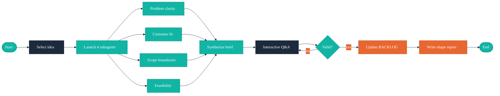

# /arc-shape — Interactive Idea Refinement

## Context Marker

Always begin your response with: **ARC-SHAPE**

## Overview

You refine a captured idea from `docs/BACKLOG.md` into a spec-ready brief. This involves parallel subagent analysis across four dimensions (problem clarity, customer fit, scope boundaries, feasibility), followed by interactive Q&A to fill gaps. The output is a shaped brief in the format defined by `references/brief-format.md`.

## Walkthrough



## Critical Constraints

- **NEVER** create a new idea — only shape existing captured ideas
- **NEVER** skip the parallel subagent analysis — all four dimensions must run
- **NEVER** promote an idea to spec-ready — that's `/arc-wave`'s job
- **ALWAYS** begin your response with `**ARC-SHAPE**`
- **ALWAYS** validate the shaped brief against `skills/arc-shape/references/brief-validation.md`
- **ALWAYS** update the BACKLOG entry in place — do not create separate files

## Process

### Step 1: Select Idea

Read `docs/BACKLOG.md` and find all ideas with status `captured`.

**If invoked with an argument** (e.g., `/arc-shape "Idea Title"`):
- Search for a matching idea by title (case-insensitive partial match)
- If found, confirm the match and proceed to Step 2
- If not found, fall through to the selection flow below

**If no argument or no match:**

Present captured ideas for selection:

```
AskUserQuestion({
  questions: [{
    question: "Which captured idea would you like to shape?",
    header: "Select",
    options: [
      { label: "{Title 1}", description: "{Priority} — {one-line summary}" },
      { label: "{Title 2}", description: "{Priority} — {one-line summary}" },
      { label: "{Title 3}", description: "{Priority} — {one-line summary}" }
    ],
    multiSelect: false
  }]
})
```

If no captured ideas exist, inform the user:
> No captured ideas found in docs/BACKLOG.md. Run `/arc-capture` first to add ideas.

### Step 2: Parallel Subagent Analysis

Launch four subagents concurrently to analyze the selected idea. Each subagent reads relevant context files and returns structured findings.

Read `skills/arc-shape/references/shaping-dimensions.md` for dimension definitions and output formats.

**Launch all four in a single message:**

```
Agent({
  description: "Problem clarity analysis",
  prompt: "Analyze this idea for problem clarity.

Idea: {title}
Summary: {one-line summary}

Read these files for context:
- docs/CUSTOMER.md (if present) — persona context
- docs/VISION.md (if present) — product scope

Answer these questions:
- Is the problem statement specific enough to act on?
- Who exactly is affected?
- What is the observable impact?
- Are we describing symptoms or root cause?

Return your findings in this format:
### Problem Clarity Assessment
**Clarity:** High | Medium | Low
**Affected persona:** {name or 'Not identified'}
**Impact:** {statement}
**Gaps identified:** {list}
**Suggested problem statement:** {1-3 sentences}"
})

Agent({
  description: "Customer fit analysis",
  prompt: "Analyze this idea for customer fit.

Idea: {title}
Summary: {one-line summary}

Read these files for context:
- docs/CUSTOMER.md (if present) — personas, JTBD, success metrics
- docs/VISION.md (if present) — target audience

Answer these questions:
- Does this align with a defined persona?
- Which JTBD does it serve?
- Is there evidence of demand?
- Would solving this move a success metric?

Return your findings in this format:
### Customer Fit Assessment
**Persona match:** {name or 'No matching persona'}
**JTBD served:** {statement or 'No matching JTBD'}
**Demand evidence:** {description or 'No evidence available'}
**Fit rating:** Strong | Moderate | Weak | No fit
**Gaps identified:** {list}
**Recommendation:** Proceed | Needs persona work | Defer"
})

Agent({
  description: "Scope boundaries analysis",
  prompt: "Analyze this idea for scope boundaries.

Idea: {title}
Summary: {one-line summary}

Read these files for context:
- docs/VISION.md (if present) — scope boundaries
- docs/ROADMAP.md (if present) — existing wave commitments

If Temper engineering artifacts exist in docs/, read them for context. If they don't exist, proceed without — Temper may not be installed:
- docs/TESTING.md (if present) — test strategy, what's hard to test (affects scope)
- docs/ARCHITECTURE.md (if present) — component boundaries for natural scope cuts

Answer these questions:
- Are constraints explicit?
- What is intentionally excluded?
- What are the dependencies?
- What is the smallest viable scope?

Return your findings in this format:
### Scope Assessment
**Scope size:** Small | Medium | Large | Too large
**Explicit constraints:** {list}
**Suggested non-goals:** {list}
**Dependencies:** {list}
**Minimum viable scope:** {1-2 sentences}
**Gaps identified:** {list}"
})

Agent({
  description: "Feasibility analysis",
  prompt: "Analyze this idea for feasibility.

Idea: {title}
Summary: {one-line summary}

Read these files for context:
- docs/ROADMAP.md (if present) — current wave load
- Project CLAUDE.md — TEMPER: sections for project context

If Temper engineering artifacts exist in docs/, read them for context. If they don't exist, proceed without — Temper may not be installed:
- docs/ARCHITECTURE.md (if present) — system boundaries, constraints, technical debt
- docs/TECH_STACK.md (if present) — current stack, framework constraints
- docs/DEPLOYMENT.md (if present) — deployment complexity, environment count
- docs/skill/temper/management-report.md (if present) — current phase and gate status (a project at "spike" has different feasibility than one at "foundation")

Answer these questions:
- Given the current project context, can this work be absorbed?
- What are the technical risks?
- Are there unknowns that need spikes?
- Does this fit existing patterns or require new ones?

Return your findings in this format:
### Feasibility Assessment
**Temper phase:** {phase or 'Not available'}
**Hard gate failures:** {list or 'None' or 'Not available'}
**Technical risk:** Low | Medium | High
**Risk factors:** {list}
**Unknowns requiring spikes:** {list}
**Pattern fit:** Existing patterns | New patterns required | Infrastructure needed
**Feasibility rating:** Ready | Ready with caveats | Needs spike | Not feasible now
**Recommendation:** Proceed | Spike first | Defer"
})
```

### Step 3: Aggregate and Synthesize

After all four subagents return:

1. **Merge gaps** from all dimensions into a deduplicated list
2. **Identify critical gaps** — any dimension rated Low/Weak/Not feasible flags for extra Q&A
3. **Pre-populate brief fields** using suggested content:
   - **Problem** ← Problem clarity's suggested problem statement
   - **Proposed Solution** ← Derive from scope assessment's minimum viable scope
   - **Success Criteria** ← Derive from customer fit's success metrics and problem's impact
   - **Constraints** ← Scope assessment's explicit constraints + feasibility's risk factors
   - **Assumptions** ← Feasibility's pattern fit + customer fit's demand evidence
   - **Open Questions** ← All unresolved gaps across dimensions

4. **Present synthesis** to the user:

```markdown
## Shaping Analysis: {Title}

### Dimension Ratings
| Dimension | Rating | Key Finding |
|-----------|--------|-------------|
| Problem Clarity | {rating} | {one-line finding} |
| Customer Fit | {rating} | {one-line finding} |
| Scope | {size} | {one-line finding} |
| Feasibility | {rating} | {one-line finding} |

### Draft Brief
{Pre-populated brief in the format from references/brief-format.md}

### Gaps Requiring Your Input
{Numbered list of gaps that need user decisions}
```

### Step 4: Interactive Q&A

Guide the user through filling identified gaps. Use AskUserQuestion with concrete options where possible.

**For each gap, ask targeted questions:**

```
AskUserQuestion({
  questions: [{
    question: "{Specific question about the gap}",
    header: "{Short label}",
    options: [
      { label: "{Option based on subagent suggestion}", description: "{rationale}" },
      { label: "{Alternative option}", description: "{rationale}" }
    ],
    multiSelect: false
  }]
})
```

**Iterate** until all gaps are resolved or explicitly deferred as open questions.

### Step 5: Validate Brief

Read `skills/arc-shape/references/brief-validation.md` and check the shaped brief against all 19 criteria.

**If all criteria pass:** Proceed to Step 6.

**If criteria fail:**
1. Present failed criteria to the user
2. Ask targeted questions to fix each gap
3. Re-validate after fixes
4. If multiple critical failures (problem unclear, no persona fit, not feasible):

```
AskUserQuestion({
  questions: [{
    question: "This idea has significant gaps that may require rethinking. How should we proceed?",
    header: "Gaps",
    options: [
      { label: "Continue shaping", description: "Work through remaining gaps — we can resolve them" },
      { label: "Return to capture", description: "Revert to captured status and rethink the idea" }
    ],
    multiSelect: false
  }]
})
```

If returning to capture, update the BACKLOG entry status back to `captured` and exit.

### Step 6: Update BACKLOG

Update the idea's section in `docs/BACKLOG.md`:

1. **Update the summary table row:** Change status from `captured` to `shaped`
2. **Replace the idea section content** with the full shaped brief:

```markdown
## {Title}

- **Status:** shaped
- **Priority:** {Priority}
- **Captured:** {original capture timestamp}
- **Shaped:** {current ISO 8601 timestamp}

{Original one-line summary}

### Problem

{Validated problem statement}

### Proposed Solution

{Solution description}

### Success Criteria

- {Criterion 1}
- {Criterion 2}
- {Criterion 3}

### Constraints

- {Constraint 1}

### Assumptions

- {Assumption 1}

### Open Questions

- {Question 1, or "None"}
```

### Step 7: Generate Shape Report

Save a shaping report to `docs/skill/arc/shape-report.md`:

```markdown
# Shape Report: {Title}

**Shaped:** {ISO 8601 timestamp}
**Idea:** {Title}
**Status:** captured → shaped

## Before (Captured Stub)
{Original one-line summary}

## Subagent Analysis Summary

| Dimension | Rating | Key Finding |
|-----------|--------|-------------|
| Problem Clarity | {rating} | {finding} |
| Customer Fit | {rating} | {finding} |
| Scope | {size} | {finding} |
| Feasibility | {rating} | {finding} |

## After (Shaped Brief)
{Full brief content}

## Gaps Resolved During Q&A
- {Gap and how it was resolved}

## Open Questions Deferred
- {Questions explicitly deferred, or "None"}
```

### Step 8: Offer Next Steps

```
AskUserQuestion({
  questions: [{
    question: "The idea has been shaped. What would you like to do next?",
    header: "Next",
    options: [
      { label: "Shape another idea", description: "Select another captured idea to refine" },
      { label: "Plan a wave", description: "Run /arc-wave to group shaped ideas into a delivery cycle" },
      { label: "Done", description: "Finish shaping" }
    ],
    multiSelect: false
  }]
})
```

**Handle selection:**
- **Shape another idea:** Loop back to Step 1
- **Plan a wave:** Inform the user to run `/arc-wave`
- **Done:** Summarize what was shaped and exit

## References

- `skills/arc-shape/references/shaping-dimensions.md` — Four analysis dimension definitions and subagent prompts
- `skills/arc-shape/references/brief-validation.md` — Readiness criteria and validation checklist
- `references/brief-format.md` — Target brief structure
- `references/idea-lifecycle.md` — Shape stage definition, transitions
- `templates/BACKLOG.tmpl.md` — BACKLOG storage format
