# /arc-ship — Ship a Validated Idea

## Context Marker

Always begin your response with: **ARC-SHIP**

## Overview

You mark spec-ready ideas as `shipped` after the SDD pipeline has successfully validated them. Before transitioning any idea, you verify that a `cw-validate` report with `**Overall**: PASS` exists in the idea's spec directory. On success, you update `docs/BACKLOG.md`, optionally update `docs/ROADMAP.md` if the wave is fully shipped, and refresh the `ARC:product-context` managed section in `CLAUDE.md`.

## Walkthrough

```mermaid
%%{init: {'theme': 'base', 'themeVariables': {'primaryColor': '#11B5A4', 'primaryTextColor': '#FFFFFF', 'primaryBorderColor': '#0D8F82', 'secondaryColor': '#E8662F', 'secondaryTextColor': '#FFFFFF', 'secondaryBorderColor': '#C7502A', 'tertiaryColor': '#1B2A3D', 'tertiaryTextColor': '#FFFFFF', 'lineColor': '#1B2A3D', 'fontFamily': 'Inter, sans-serif'}}}%%
flowchart LR
    S([Start]) --> A[Read BACKLOG]
    A --> B{Select idea}
    B --> C[Resolve spec path]
    C --> D{Spec field\npresent?}
    D -->|Yes| E[Find validation report]
    D -->|No| F[Ask user for path]
    F --> E
    E --> G{Overall PASS?}
    G -->|No| H[Report failure\nand exit]
    G -->|Yes| I[Update BACKLOG]
    I --> J[Update ROADMAP\nif wave complete]
    J --> K[Refresh CLAUDE.md\nproduct-context]
    K --> L[Confirm shipped]
    L --> X([End])

    classDef user fill:#1B2A3D,stroke:#0F1D2B,color:#FFFFFF
    classDef action fill:#11B5A4,stroke:#0D8F82,color:#FFFFFF
    classDef write fill:#E8662F,stroke:#C7502A,color:#FFFFFF
    classDef fail fill:#E8662F,stroke:#C7502A,color:#FFFFFF

    class B,D,G user
    class A,C,E,F action
    class I,J,K,L write
    class H fail
```



## Critical Constraints

- **NEVER** skip proof verification — `**Overall**: PASS` in the cw-validate report is required before any status transition
- **NEVER** modify cw-validate proof artifacts — read-only verification only
- **NEVER** accept a `*-proofs.md` file as a substitute for a validation report — strict cw-validate requirement
- **NEVER** create `CLAUDE.md` if it does not exist — skip product-context refresh silently
- **NEVER** ship an idea whose status is not `spec-ready` — validate status before proceeding
- **ALWAYS** begin your response with `**ARC-SHIP**`
- **ALWAYS** update both the BACKLOG summary table row and the idea detail section atomically (table row first, then detail section)
- **ALWAYS** use ISO 8601 timestamps for the `- **Shipped:**` field
- **ALWAYS** offer the user a path prompt when the `- **Spec:**` field is absent — never block silently

## Process

### Step 1: Read Context

Read the following files:

1. `docs/BACKLOG.md` — **Required.** If absent, inform the user: "No BACKLOG found. Run `/arc-capture` to start capturing ideas."
2. `docs/ROADMAP.md` — Optional. Read if present; used for wave rollup in Step 5.
3. `CLAUDE.md` — Optional. Read if present; used for product-context refresh in Step 6.

### Step 2: Select Idea

**If invoked with an inline argument** (e.g., `/arc-ship "Idea Title"`):

1. Search `docs/BACKLOG.md` for a `spec-ready` idea whose title contains the argument (case-insensitive partial match).
2. If exactly one match is found, present it for confirmation via `AskUserQuestion`.
3. If multiple matches are found, present them for single selection.
4. If no match is found, fall through to interactive selection.

**Interactive selection:**

Present all `spec-ready` ideas from `docs/BACKLOG.md`:

```
AskUserQuestion({
  questions: [{
    question: "Which idea are you shipping?",
    header: "Ideas",
    options: [
      { label: "{Title}", description: "{Priority} — {brief summary}" }
    ],
    multiSelect: false
  }]
})
```

If no `spec-ready` ideas exist:
> No spec-ready ideas found in docs/BACKLOG.md. Run `/arc-wave` to promote shaped ideas.

### Step 3: Resolve Spec Path

1. Read the selected idea's detail section in `docs/BACKLOG.md`.
2. Look for the `- **Spec:**` field.
3. **If the field is present** and its value is not the placeholder `(set during /cw-spec)`: use the path as-is.
4. **If the field is absent or contains the placeholder:**

```
AskUserQuestion({
  questions: [{
    question: "No spec path found for '{Title}'. Select the spec directory:",
    header: "Spec Directory",
    options: [
      { label: "{dir}", description: "docs/specs/{dir}/" }
    ],
    multiSelect: false
  }]
})
```

Populate options by globbing `docs/specs/*/`.

### Step 4: Verify Validation Report

1. Use `Glob` with pattern `{spec-dir}/*-validation-*.md` to locate the validation report.
2. If no file is found:
   > No cw-validate report found in `{spec-dir}/`. Run `/cw-validate` first.
   Exit without modifying any files.
3. If a file is found, use `Grep` to check for `**Overall**: PASS` within the report.
4. If the pattern is not found, read the `**Overall**` value and report:
   > Validation report found but status is `{status}`, not PASS. Resolve validation failures before shipping.
   Exit without modifying any files.

### Step 5: Update BACKLOG

Perform two sequential `Edit` calls — table row first, then detail section:

**5a. Update summary table row**

Find the row for the selected idea and change its status cell from `spec-ready` to `shipped`. Preserve all other columns.

**5b. Update idea detail section**

In the idea's detail section:

1. Change `- **Status:** spec-ready` to `- **Status:** shipped`
2. Add `- **Spec:** {spec-dir-path}` if not already present (or replace the placeholder value)
3. Add `- **Shipped:** {ISO 8601 timestamp}`

### Step 6: Update ROADMAP (if applicable)

If `docs/ROADMAP.md` exists:

1. Find the wave the selected idea belongs to (read the `- **Wave:**` field from the BACKLOG detail section).
2. Read the wave's "Selected Ideas" table from `docs/ROADMAP.md`.
3. Cross-reference each idea title against the BACKLOG summary table.
4. If **all** ideas in the wave now have `shipped` status, update the wave's `**Status:**` field from `Planned` or `Active` to `Completed`.
5. If the wave is still in progress, no ROADMAP change is needed.

### Step 7: Refresh ARC:product-context

If `CLAUDE.md` exists:

1. Read `skills/arc-wave/references/bootstrap-protocol.md` for the injection algorithm.
2. Recount backlog statuses from the BACKLOG summary table (captured, shaped, spec-ready, shipped counts).
3. Apply the injection algorithm to update the `**Backlog:**` line inside the `ARC:product-context` managed section.
4. Validate the injection: confirm the ARC section is not nested inside any TEMPER: or MM: block.

If `CLAUDE.md` does not exist, skip this step silently.

### Step 8: Confirm

Display a concise confirmation:

```
Shipped: {Title} — verified via {validation-report-path}.
```

## References

- `skills/arc-ship/references/ship-criteria.md` — Proof verification rules, eligible statuses, BACKLOG fields added during shipping
- `references/idea-lifecycle.md` — Shipped stage definition, entry/exit criteria
- `skills/arc-wave/references/bootstrap-protocol.md` — ARC:product-context injection algorithm
- `references/cross-plugin-contract.md` — cw-validate artifact locations and read-only access rules
