# /arc-ship — Ship a Validated Idea

## Context Marker

Always begin your response with: **ARC-SHIP**

## Overview

You mark spec-ready ideas as `shipped` after the SDD pipeline has successfully validated them. Before transitioning any idea, you verify that a `cw-validate` report with `**Overall**: PASS` exists in the idea's spec directory. On success, you append the idea to the wave archive at `docs/skill/arc/waves/NN-{slug}.md`, remove it from `docs/BACKLOG.md`, and optionally update `docs/ROADMAP.md` if the wave is fully shipped. This skill does not write to `CLAUDE.md`; run `/arc-sync` if the project's `CLAUDE.md` product-context block needs creation or refresh.

## Walkthrough

```mermaid
%%{init: {'theme': 'base', 'themeVariables': {'primaryColor': '#11B5A4', 'primaryTextColor': '#FFFFFF', 'primaryBorderColor': '#0D8F82', 'secondaryColor': '#E8662F', 'secondaryTextColor': '#FFFFFF', 'secondaryBorderColor': '#C7502A', 'tertiaryColor': '#1B2A3D', 'tertiaryTextColor': '#FFFFFF', 'lineColor': '#1B2A3D', 'fontFamily': 'Inter, sans-serif'}}}%%
flowchart LR
    S([Start]) --> A[Read BACKLOG]
    A --> B{Select ideas}
    B -->|batch| B2[For each idea]
    B -->|single| C[Resolve spec path]
    B2 --> C
    C --> D{Spec field\npresent?}
    D -->|Yes| E[Find validation report]
    D -->|No| F[Ask user for path]
    F --> E
    E --> G{Overall PASS?}
    G -->|No| H[Record failure\ncontinue]
    G -->|Yes| I[Write to\nwave archive]
    I --> I2[Remove from\nBACKLOG]
    H --> NX{More ideas?}
    I2 --> NX
    NX -->|Yes| B2
    NX -->|No| J[Update ROADMAP\nif wave complete]
    J --> L[Confirm / batch summary]
    L --> X([End])

    classDef user fill:#1B2A3D,stroke:#0F1D2B,color:#FFFFFF
    classDef action fill:#11B5A4,stroke:#0D8F82,color:#FFFFFF
    classDef write fill:#E8662F,stroke:#C7502A,color:#FFFFFF
    classDef fail fill:#E8662F,stroke:#C7502A,color:#FFFFFF

    class B,D,G user
    class A,C,E,F,B2,NX action
    class I,I2,J,L write
    class H fail
```



## Critical Constraints

- **NEVER** skip proof verification — `**Overall**: PASS` in the cw-validate report is required before any status transition
- **NEVER** modify cw-validate proof artifacts — read-only verification only
- **NEVER** accept a `*-proofs.md` file as a substitute for a validation report — strict cw-validate requirement
- **NEVER** ship an idea whose status is not `spec-ready` — validate status before proceeding
- **NEVER** abort a batch run on a single idea's failure — record the failure and continue processing remaining ideas
- **ALWAYS** begin your response with `**ARC-SHIP**`
- **ALWAYS** write to the wave archive BEFORE removing from BACKLOG — the archive must be ahead of or equal to BACKLOG state at all times
- **ALWAYS** check for duplicate `### {Title}` in the archive file before appending — skip with a warning if the idea already exists
- **ALWAYS** use ISO 8601 timestamps for the `- **Shipped:**` field
- **ALWAYS** offer the user a path prompt when the `- **Spec:**` field is absent — never block silently
- **ALWAYS** display a batch summary when more than one idea was selected: "{N} ideas shipped, {M} failed verification."

## Process

### Step 1: Read Context

Read the following files:

1. `docs/BACKLOG.md` — **Required.** If absent, inform the user: "No BACKLOG found. Run `/arc-capture` to start capturing ideas."
2. `docs/ROADMAP.md` — Optional. Read if present; used for archive path computation in Step 5 and wave rollup in Step 6.

### Step 1b: Backfill Wave 0 (Offered Once on Detection)

After reading `docs/BACKLOG.md`, scan for ideas in `shipped` status whose detail section lacks a `- **Spec:**` field (or contains only the placeholder `(set during /cw-spec)`). This catches legacy shipped items that predate the Spec field.

**If no such items exist:** skip this step entirely.

**If one or more items are found:**

1. For each unlinked shipped idea, suggest a likely spec match by comparing the idea title against spec directory names from `docs/specs/*/` (substring or word overlap).
2. Present the batch backfill offer:

```
AskUserQuestion({
  questions: [{
    question: "{N} shipped idea(s) are missing a Spec link. Run a one-time backfill now?",
    header: "Backfill Wave 0",
    options: [
      { label: "Yes — backfill now", description: "Review each shipped idea and assign its spec directory" },
      { label: "No — skip for now", description: "Continue to ship the selected idea; backfill can be run later" }
    ],
    multiSelect: false
  }]
})
```

3. **If the user selects "No — skip for now":** proceed to Step 2 immediately.
4. **If the user selects "Yes — backfill now":** for each unlinked shipped idea in sequence, present an assignment prompt:

```
AskUserQuestion({
  questions: [{
    question: "Assign a spec directory to: {Title}",
    header: "Backfill Spec",
    options: [
      { label: "{best-match-dir}", description: "docs/specs/{best-match-dir}/ — likely match" },
      { label: "{other-dir}", description: "docs/specs/{other-dir}/" },
      ...
      { label: "Skip this idea", description: "Leave the Spec field unset for now" }
    ],
    multiSelect: false
  }]
})
```

   - List the best-match directory first, followed by remaining directories alphabetically.
   - Always include "Skip this idea" as the last option.
   - For each idea where the user selects a directory (not Skip), use `Edit` to write `- **Spec:** docs/specs/{selected-dir}/` into the idea's detail section:
     - If the field is absent, insert it after the `- **Wave:**` line.
     - If the field contains the placeholder, replace the placeholder with the selected path.

5. After processing all items (or skipping), continue to Step 2.

**Constraint:** This step is offered at most once per `/arc-ship` invocation. Do not loop back to it after Step 2.

### Step 2: Select Idea

**If invoked with an inline argument** (e.g., `/arc-ship "Idea Title"`):

1. Search `docs/BACKLOG.md` for a `spec-ready` idea whose title contains the argument (case-insensitive partial match).
2. If exactly one match is found, present it for confirmation via `AskUserQuestion`.
3. If multiple matches are found, present them for single selection.
4. If no match is found, fall through to interactive selection.

**Interactive selection — batch mode detection:**

Count the `spec-ready` ideas in `docs/BACKLOG.md`. Determine whether multiple ideas share a wave by reading the `- **Wave:**` field of each spec-ready idea's detail section.

- **If only one spec-ready idea exists:** present it for confirmation and proceed as single-idea flow.
- **If multiple spec-ready ideas exist in the same wave:** offer batch mode via `multiSelect: true`.
- **If spec-ready ideas span different waves:** offer batch mode on the set with matching wave, or allow selecting any combination.

**Single-idea prompt** (one spec-ready idea, or inline argument match):

```
AskUserQuestion({
  questions: [{
    question: "Ship this idea?",
    header: "{Title}",
    options: [
      { label: "Yes — ship it", description: "{Priority} — {brief summary}" },
      { label: "No — cancel", description: "Exit without changes" }
    ],
    multiSelect: false
  }]
})
```

**Batch-mode prompt** (multiple spec-ready ideas):

```
AskUserQuestion({
  questions: [{
    question: "Select ideas to ship:",
    header: "Spec-Ready Ideas",
    options: [
      { label: "{Title}", description: "Wave {N} — {Priority}" }
    ],
    multiSelect: true
  }]
})
```

If no `spec-ready` ideas exist:
> No spec-ready ideas found in docs/BACKLOG.md. Run `/arc-wave` to promote shaped ideas.

### Step 2b: Batch Loop

For each selected idea (single or batch), execute Steps 3–5 independently:

1. Set `shipped_count = 0` and `failed_ideas = []`.
2. For each selected idea:
   a. Execute Step 3 (Resolve Spec Path).
   b. Execute Step 4 (Verify Validation Report).
   c. If Step 4 fails (no report or not PASS): record the failure message, append the idea title to `failed_ideas`, and **continue to the next idea** — do not abort the batch.
   d. If Step 4 passes: execute Step 5 (Archive and Remove from BACKLOG), increment `shipped_count`.
3. After all ideas are processed, proceed to Step 6.

**Batch ordering:** Within each idea, Step 5 writes to the archive before modifying BACKLOG (archive-first consistency). Step 6 (ROADMAP pruning) runs only after all ideas are processed, so a single batch can complete a wave in one pass without redundant ROADMAP checks per idea.

**Failure recording during batch:** When an idea fails Step 4, output the per-idea failure message inline (do not exit), e.g.:
> [FAILED] {Title}: No cw-validate report found in `{spec-dir}/`. Run `/cw-validate` first.

Then continue with the next idea in the batch.

### Step 3: Resolve Spec Path

1. Read the selected idea's detail section in `docs/BACKLOG.md`.
2. Look for the `- **Spec:**` field.
3. **If the field is present** and its value is not the placeholder `(set during /cw-spec)`: use the path as-is.
4. **If the field is absent or contains the placeholder:**

   a. Use `Glob` with pattern `docs/specs/*/` to collect available spec directories.
   b. Present them for selection:

```
AskUserQuestion({
  questions: [{
    question: "No spec path found for '{Title}'. Select the spec directory:",
    header: "Spec Directory",
    options: [
      { label: "{dir}", description: "docs/specs/{dir}/" }
    ],
    multiSelect: false
  }]
})
```

   c. After the user selects a directory, use `Edit` to write `- **Spec:** docs/specs/{selected-dir}/` into the idea's detail section in `docs/BACKLOG.md`:
      - If the `- **Spec:**` field is absent, insert it after the `- **Wave:**` line.
      - If the field contains the placeholder `(set during /cw-spec)`, replace the placeholder with the selected path.
   d. Use the selected path as the resolved spec directory for subsequent steps.

### Step 4: Verify Validation Report

1. Use `Glob` with pattern `{spec-dir}/*-validation-*.md` to locate the validation report.
2. If no file is found:
   > No cw-validate report found in `{spec-dir}/`. Run `/cw-validate` first.
   In **single-idea flow**: exit without modifying any files.
   In **batch flow**: record the failure per Step 2b and continue to the next idea.
3. If a file is found, use `Grep` to check for `**Overall**: PASS` within the report.
4. If the pattern is not found, read the `**Overall**` value and report:
   > Validation report found but status is `{status}`, not PASS. Resolve validation failures before shipping.
   In **single-idea flow**: exit without modifying any files.
   In **batch flow**: record the failure per Step 2b and continue to the next idea.

### Step 5: Archive and Remove from BACKLOG

Three sequential operations — archive append first, then BACKLOG table row removal, then BACKLOG section deletion. The archive is always written before BACKLOG is modified so the idea is never absent from both.

**5a. Compute archive path**

1. Read the idea's `- **Wave:**` field from its detail section in `docs/BACKLOG.md`.
2. Parse the wave number and name. Expected format: `Wave NN: {Name}` (e.g., `Wave 3: Polish`).
3. Derive the archive filename using the slug algorithm from `references/wave-archive.md`:
   - Zero-pad the wave number to two digits.
   - Lowercase the wave name, replace spaces with `-`, strip non-alphanumeric-hyphen characters, collapse consecutive hyphens.
   - Result: `docs/skill/arc/waves/NN-{slug}.md` (e.g., `docs/skill/arc/waves/03-polish.md`).
4. **Fallback:** If the `- **Wave:**` field is `--`, absent, or references a wave whose section does not exist in `docs/ROADMAP.md`, route to `docs/skill/arc/waves/00-uncategorized.md` and emit a warning:
   > Wave section for "{Wave}" not found in ROADMAP. Archiving to 00-uncategorized.md.

**5b. Write to wave archive**

1. If the archive file does not exist, create it with the wave heading and metadata block copied from the ROADMAP wave section:

   ```markdown
   # Wave NN: {Name}

   - **Theme:** {theme}
   - **Goal:** {goal}
   - **Target:** {target}
   - **Completed:** --
   ```

   If using the uncategorized fallback and the file does not exist, create it with the synthetic header from `references/wave-archive.md`:

   ```markdown
   # Wave 00: Uncategorized

   - **Theme:** Orphaned shipped items
   - **Goal:** N/A
   - **Target:** N/A
   - **Completed:** N/A

   ## Shipped Ideas
   ```

2. **Idempotency check:** Use `Grep` to search for `### {Title}` in the archive file. If found, skip the append and emit a warning:
   > "{Title}" already exists in {archive-path}. Skipping archive append.

3. If the archive file exists but has no `## Shipped Ideas` heading, append it before the idea subsection.

4. Append the idea as a `### {Title}` subsection under `## Shipped Ideas`. Include all brief fields from the BACKLOG detail section plus the ship metadata:

   ```markdown
   ### {Title}

   - **Status:** shipped
   - **Priority:** {priority}
   - **Captured:** {captured}
   - **Shaped:** {shaped}
   - **Shipped:** {ISO 8601 timestamp}
   - **Wave:** {wave reference}
   - **Spec:** {spec-dir-path}

   {Problem, Proposed Solution, Success Criteria, Constraints, Assumptions, Open Questions — preserve all subsections from the BACKLOG detail section}
   ```

**5c. Remove from BACKLOG summary table**

Find the row for the shipped idea in the BACKLOG summary table and delete the entire row. Do not change the status — remove the row entirely.

**5d. Delete idea detail section from BACKLOG**

Delete the idea's `## {Title}` section from `docs/BACKLOG.md` — from the `## {Title}` heading through to the line before the next `## ` heading (or end of file). This removes the idea from BACKLOG completely; its durable record is now in the wave archive.

### Step 6: Update ROADMAP (if applicable)

If `docs/ROADMAP.md` exists:

1. Find the wave the shipped idea belongs to (from the `- **Wave:**` field captured before BACKLOG removal).
2. Read the wave's "Selected Ideas" table from `docs/ROADMAP.md`.
3. Cross-reference each idea title against the wave archive file (`docs/skill/arc/waves/NN-{slug}.md`). An idea is "shipped" if it appears as a `### {Title}` subsection in the archive.
4. If **all** ideas in the wave are now archived, the wave is complete:
   - Set `- **Completed:** {ISO 8601 timestamp}` in the archive file's metadata block (if not already set).
   - Remove the wave's row from the ROADMAP summary table.
   - Delete the `## Wave NN: {Name}` section from `docs/ROADMAP.md`.
5. If the wave is still in progress, no ROADMAP change is needed.

### Step 7: Confirm

**Single-idea flow:**

```
Shipped: {Title} — verified via {validation-report-path}.
```

**Batch flow** (more than one idea was selected):

```
{shipped_count} idea(s) shipped, {len(failed_ideas)} failed verification.
```

If any ideas failed, list each failure inline:

```
[FAILED] {Title}: {reason}
```

If the wave is now fully shipped (all ideas in the wave are archived), append:

```
Wave '{wave-name}': Archived to docs/skill/arc/waves/NN-{slug}.md.
```

Otherwise:

```
Wave '{wave-name}': In Progress.
```

Run `/arc-sync` if the project's CLAUDE.md product context block needs creation or refresh.

## References

- `skills/arc-ship/references/ship-criteria.md` — Proof verification rules, eligible statuses, BACKLOG fields added during shipping
- `references/wave-archive.md` — Wave archive schema, file naming, slug derivation, idempotency rules
- `references/idea-lifecycle.md` — Shipped stage definition, entry/exit criteria
- `references/cross-plugin-contract.md` — cw-validate artifact locations and read-only access rules
