# /arc-sync — README Lifecycle Management

## Context Marker

Always begin your response with: **ARC-README**

## Overview

You keep `README.md` in sync with Arc product-direction artifacts (VISION.md, CUSTOMER.md, BACKLOG.md, ROADMAP.md). The skill operates in two modes:

- **Scaffold mode** — generates a full README from scratch for projects that don't have one, establishing `ARC:` managed section markers for future updates
- **Update mode** — selectively refreshes `ARC:` managed sections in an existing README, syncing features, roadmap, audience, and diagrams with current artifact state

Managed sections use the marker format `<!--# BEGIN ARC:{section-name} -->` / `<!--# END ARC:{section-name} -->`. Content outside managed sections is never touched.

## Critical Constraints

- **NEVER** modify content outside `ARC:` managed sections in an existing README
- **NEVER** modify `TEMPER:` or `MM:` managed sections
- **NEVER** expose internal priority metadata (P0/P1/P2/P3) in the README
- **NEVER** write to README.md without user approval via AskUserQuestion
- **NEVER** run without a substantive VISION.md (>200 non-whitespace characters)
- **ALWAYS** begin your response with `**ARC-README**`
- **ALWAYS** run trust-signal validation against the output before presenting for approval
- **ALWAYS** guarantee all evaluable trust signals pass on scaffold output
- **ALWAYS** use "Not yet defined" placeholders only when the source artifact is absent

## Process

### Step 0: Migration Sweep

Before reading context, detect and migrate legacy shipped data into the wave archive. This step runs on every `/arc-sync` invocation and is idempotent — when no migration candidates exist, it produces no writes and reports `0 migrations`.

**0a. Scan for migration candidates:**

1. Read `docs/BACKLOG.md` and collect all rows where `Status: shipped` (pattern: `**Status:** shipped` or `Status: shipped`, case-insensitive).
2. Read `docs/ROADMAP.md` and collect all wave sections where `Status: Completed` (pattern: `**Status:** Completed`, case-insensitive).
3. If neither scan finds candidates, report `0 migrations` and proceed to Step 1.

**0b. Build the migration plan:**

For each completed wave found in ROADMAP:

1. Extract the wave number `NN` and name from the `## Wave NN: {Name}` heading.
2. Derive the archive filename using the slug rules from `references/wave-archive.md`:
   - Lowercase the wave name.
   - Replace spaces with `-`.
   - Strip non-alphanumeric-hyphen characters.
   - Collapse consecutive hyphens into a single hyphen.
   - Result: `docs/skill/arc/waves/NN-{slug}.md`
3. Extract wave metadata: Theme, Goal, Target from the wave section in ROADMAP.
4. Identify shipped ideas belonging to this wave by matching the `Wave` column in the BACKLOG summary table to the wave name.

**0c. Create or update archive files:**

For each completed wave in the migration plan:

1. If `docs/skill/arc/waves/NN-{slug}.md` does not exist, create it with:
   ```markdown
   # Wave NN: {Name}

   - **Theme:** {theme}
   - **Goal:** {goal}
   - **Target:** {target}
   - **Completed:** {current ISO 8601 timestamp}

   ## Shipped Ideas
   ```
2. If the file already exists and already contains the wave heading, skip the header creation (idempotency).
3. For each shipped idea belonging to this wave:
   a. Check whether `### {Title}` already exists in the archive file. If yes, skip (idempotency).
   b. Read the idea's `## {Title}` detail section from BACKLOG.md, extracting all brief fields: Status, Priority, Captured, Shaped, Shipped, Spec, Wave, Problem, Proposed Solution, Success Criteria, Constraints, Assumptions, Open Questions.
   c. Append a `### {Title}` subsection under `## Shipped Ideas` in the archive file with the full detail per the schema in `references/wave-archive.md`.

**0d. Handle orphaned shipped items:**

After processing all completed waves, check for remaining shipped ideas in BACKLOG whose `Wave` field does not match any completed wave in ROADMAP (missing wave, no wave assignment, or wave already removed):

1. Route each orphaned shipped idea to `docs/skill/arc/waves/00-uncategorized.md`.
2. If `00-uncategorized.md` does not exist, create it with:
   ```markdown
   # Wave 00: Uncategorized

   - **Theme:** Orphaned shipped items
   - **Goal:** N/A
   - **Target:** N/A
   - **Completed:** N/A

   ## Shipped Ideas
   ```
3. Append each orphaned idea as a `### {Title}` subsection (same idempotency check as 0c.3a).
4. Report orphaned items separately: `Warning: {N} shipped idea(s) had no matching wave and were archived to 00-uncategorized.md.`

**0e. Remove migrated items from BACKLOG:**

For each shipped idea that was successfully archived (in 0c or 0d):

1. Remove the idea's row from the BACKLOG summary table.
2. Delete the idea's `## {Title}` detail section (from the `## {Title}` heading to the next `## ` heading or end of file) from BACKLOG.md.

**0f. Remove migrated waves from ROADMAP:**

For each completed wave that was successfully archived (in 0c):

1. Remove the wave's row from the ROADMAP summary table.
2. Delete the `## Wave NN: {Name}` section (from the heading to the next `## ` heading or end of file) from ROADMAP.md.

**0g. Report migration outcome:**

- If migration occurred: `Migrated {N} shipped ideas and {M} completed waves to docs/skill/arc/waves/.`
- If orphaned items were found, include the orphan warning from 0d.4.
- If no candidates: `0 migrations` (already reported in 0a.3).

**Idempotency guarantee:** Detection is based on the presence of `Status: shipped` rows in BACKLOG and `Status: Completed` waves in ROADMAP. After a successful migration, those rows and sections are removed, so a second run finds no candidates and performs no writes.

### Step 1: Read Context

Read the following files (graceful no-op if absent, except VISION.md):

1. `docs/VISION.md` — **Required.** Extract Vision Summary, Problem Statement, and value proposition.
2. `docs/CUSTOMER.md` — Persona names and roles for the audience section.
3. `docs/BACKLOG.md` — Status counts for the lifecycle diagram (captured, shaped, spec-ready). **Note:** After Step 0 (Migration Sweep), BACKLOG may contain fewer items — shipped ideas are migrated to the wave archive and removed from BACKLOG.
4. `docs/ROADMAP.md` — Wave names, themes, and status for the roadmap section. **Note:** After Step 0, completed waves are migrated to the wave archive and removed from ROADMAP.
5. `docs/skill/arc/waves/*.md` — Shipped ideas for the features list and shipped count for the lifecycle diagram. Each file contains a `## Shipped Ideas` section with `### {Title}` subsections. If the directory is absent or empty, shipped count is 0.

Read `skills/arc-sync/references/trust-signals.md` for the trust-signal framework definitions.
Read `skills/arc-sync/references/readme-mapping.md` for the artifact-to-section mapping rules.
Read `skills/arc-sync/references/readme-quality-rules.md` for quality gates.

**VISION.md gate check:**

Count non-whitespace characters in `docs/VISION.md`:
- If the file does not exist, warn and exit: "Run `/arc-capture` or create VISION.md first."
- If the file has fewer than 200 non-whitespace characters, warn and exit: "VISION.md has insufficient content ({count} non-whitespace characters, minimum 200). Add a Problem Statement and Vision Summary before running `/arc-sync`."

### Step 2: Detect Mode

Determine the operating mode based on README.md state:

| Condition | Mode |
|-----------|------|
| No `README.md` at project root | **Scaffold** — proceed to Step 3 |
| `README.md` exists with `<!--# BEGIN ARC:` markers | **Update** — proceed to Step 7 |
| `README.md` exists without `ARC:` markers | **Injection** — offer to inject managed sections |

**If scaffold mode:** Proceed to Step 3.

**If update mode:** Proceed to Step 7.

**If injection mode:** Ask the user whether they want to inject `ARC:` managed sections into their existing README:

```
AskUserQuestion({
  questions: [{
    question: "Your README.md exists but has no ARC: managed sections. Would you like to inject them?",
    header: "README Mode",
    options: [
      { label: "Inject sections", description: "Add ARC: managed sections to your existing README — existing content is preserved" },
      { label: "Cancel", description: "Leave README.md unchanged" }
    ],
    multiSelect: false
  }]
})
```

If the user selects "Cancel," exit gracefully. If "Inject sections," proceed to Step 2a.

### Step 2a: Inject Markers into Existing README

When the user approves marker injection, determine where to place each `ARC:` managed section block in the existing README.md. The goal is to add managed sections without disrupting existing content.

#### Insertion Priority

For each `ARC:` section to be injected, find the insertion point using this priority order:

1. **After the last existing `ARC:` section end marker** — If any `<!--# END ARC:... -->` markers already exist (e.g., from a partial injection), insert the new section after the last one with one blank line separator.
2. **Before Contributing or License sections** — If a `## Contributing` or `## License` heading exists, insert before the first of these with one blank line separator.
3. **At EOF** — Append to the end of the file with one blank line separator.

#### Section Ordering

When injecting all sections at once, maintain this order relative to each other. TEMPER placeholder sections are placed between ARC:roadmap and ARC:lifecycle-diagram:

1. `ARC:overview` (what + why — Arc)
2. `ARC:audience` (who it's for — Arc)
3. `ARC:features` (what's shipped — Arc)
4. `ARC:roadmap` (what's next — Arc)
5. `TEMPER:architecture` placeholder (how it works — Temper)
6. `TEMPER:getting-started` placeholder (how to use it — Temper)
7. `TEMPER:testing` placeholder (how to test — Temper)
8. `TEMPER:contributing` placeholder (how to contribute — Temper)
9. `ARC:lifecycle-diagram` (combined health — Arc)

Arc never writes content to TEMPER sections. When scaffolding, place empty marker placeholders for TEMPER sections with a comment: `<!-- Run /temper-assess to populate engineering sections -->`.

#### Injection Procedure

1. Read the existing `README.md` and identify the insertion point using the priority order above.
2. For each `ARC:` section to be injected:
   a. Generate the section content using the same extraction rules as scaffold mode (Steps 3a-3f).
   b. Wrap the content in `<!--# BEGIN ARC:{section-name} -->` / `<!--# END ARC:{section-name} -->` markers.
3. Confirm the injection plan via AskUserQuestion before writing:

```
AskUserQuestion({
  questions: [{
    question: "The following ARC: managed sections will be injected into your README.md:\n\n{list of sections with insertion positions}\n\nExisting content will not be modified. Proceed?",
    header: "Confirm Marker Injection",
    options: [
      { label: "Inject", description: "Add the listed ARC: managed sections" },
      { label: "Cancel", description: "Leave README.md unchanged" }
    ],
    multiSelect: false
  }]
})
```

4. If "Inject," write the markers using the Edit tool, inserting at the determined position.
5. If "Cancel," exit gracefully.

#### Post-Injection Validation

After injection, verify:
- No `ARC:` section is nested inside another `ARC:`, `TEMPER:`, or `MM:` section.
- All marker pairs are properly matched (every BEGIN has a corresponding END).
- Content outside the injected markers is identical to the original file.

After successful injection, proceed to Step 4 (Trust-Signal Validation) to validate the injected content.

### Step 3: Scaffold README

Generate a complete README.md with managed and non-managed sections. Follow the structure below exactly.

Read `skills/arc-sync/references/readme-mapping.md` for the artifact-to-section extraction rules. Apply the quality gates from `skills/arc-sync/references/readme-quality-rules.md` throughout.

#### 3a. Title and Description

Extract from `docs/VISION.md`:
- **Title:** Use the project name from the VISION.md `# {Project Name}` heading, or the first sentence of the Vision Summary section.
- **One-line description:** Use the first sentence of the Vision Summary.

Output format:
```markdown
# {Project Name}

{One-line description from Vision Summary}
```

#### 3b. ARC:overview Section

Extract from `docs/VISION.md`:
- Read the Problem Statement section (content under `## Problem Statement` or `## Problem`)
- Read the Value Proposition section (content under `## Value Proposition` or `## Value Prop`)
- Combine into a concise overview (2-5 sentences)

Include a traceability link to satisfy TS-7.

Output format:
```markdown
## Overview

<!--# BEGIN ARC:overview -->

{Problem statement and value proposition — 2-5 sentences derived from VISION.md}

See [VISION.md](docs/VISION.md) for full product direction.

<!--# END ARC:overview -->
```

**Constraint:** Content must include at least one sentence from the VISION.md Problem Statement verbatim (case-insensitive match) to satisfy TS-1.

#### 3c. ARC:audience Section

Extract from `docs/CUSTOMER.md` (if present):
- Read all `## {Persona Name}` headings and their role/description
- List each persona with their role

If `docs/CUSTOMER.md` is absent:
- Use placeholder text: "Not yet defined — create [CUSTOMER.md](docs/CUSTOMER.md) to define target personas."

Output format (with CUSTOMER.md):
```markdown
## Who This Is For

<!--# BEGIN ARC:audience -->

{Persona list derived from CUSTOMER.md — one line per persona with name and role}

See [CUSTOMER.md](docs/CUSTOMER.md) for detailed personas.

<!--# END ARC:audience -->
```

Output format (without CUSTOMER.md):
```markdown
## Who This Is For

<!--# BEGIN ARC:audience -->

Not yet defined — create [CUSTOMER.md](docs/CUSTOMER.md) to define target personas.

<!--# END ARC:audience -->
```

**Constraint:** When CUSTOMER.md exists, at least one persona name from a `##` heading must appear in the section content to satisfy TS-2.

#### 3d. ARC:features Section

Extract from the wave archive (`docs/skill/arc/waves/*.md`):
- Read all files in `docs/skill/arc/waves/`
- Extract each `### {Title}` subsection under `## Shipped Ideas`
- Order by wave number ascending (from the NN prefix in the filename)
- Format as bullet list: `- **{Title}** — {one-line summary}` (the one-line summary is the first non-metadata paragraph after the `### {Title}` heading)

If the archive directory is absent, empty, or no `### {Title}` subsections exist:
- Use: "No features shipped yet."

Output format (with shipped items):
```markdown
## Features

<!--# BEGIN ARC:features -->

{Bullet list of shipped idea titles from wave archive}

<!--# END ARC:features -->
```

Output format (no shipped items):
```markdown
## Features

<!--# BEGIN ARC:features -->

No features shipped yet.

<!--# END ARC:features -->
```

**Constraint:** When shipped items exist, each bullet must contain the shipped idea title as a substring (case-insensitive) to satisfy TS-3 and TS-6.

#### 3e. ARC:roadmap Section

Extract from `docs/ROADMAP.md` (if present):
- Read all wave section headings (`## {Wave Name}` or `### {Wave Name}`)
- Extract wave name, theme, and status (active/planned/completed)
- Present as a table

If `docs/ROADMAP.md` is absent:
- Use placeholder text: "Not yet defined — create [ROADMAP.md](docs/ROADMAP.md) to plan delivery waves."

Output format (with ROADMAP.md):
```markdown
## Roadmap

<!--# BEGIN ARC:roadmap -->

| Wave | Theme | Status |
|------|-------|--------|
| {Wave Name} | {Theme} | {Status} |

See [ROADMAP.md](docs/ROADMAP.md) for the full delivery plan.

<!--# END ARC:roadmap -->
```

Output format (without ROADMAP.md):
```markdown
## Roadmap

<!--# BEGIN ARC:roadmap -->

Not yet defined — create [ROADMAP.md](docs/ROADMAP.md) to plan delivery waves.

<!--# END ARC:roadmap -->
```

**Constraint:** When ROADMAP.md exists, at least one wave name from a `##` or `###` heading must appear in the section to satisfy TS-4.

#### 3f. ARC:lifecycle-diagram Section

Generate a mermaid state diagram showing the idea lifecycle with live status counts derived from BACKLOG.md and the wave archive.

**Status counting:**
1. Read `docs/BACKLOG.md` and count ideas by status:
   - `captured` — ideas with `Status: captured`
   - `shaped` — ideas with `Status: shaped`
   - `spec-ready` — ideas with `Status: spec-ready`
2. Count shipped from the wave archive (`docs/skill/arc/waves/*.md`):
   - `shipped` — count of all `### {Title}` subsections under `## Shipped Ideas` across all archive files
3. If `docs/BACKLOG.md` is absent, use 0 for captured, shaped, spec-ready.
4. If the wave archive directory is absent or empty, use 0 for shipped.

**Mermaid diagram format:**

Use Liatrio brand colors and the same theme initialization as `references/idea-lifecycle.md`:

```markdown
## Idea Lifecycle

```mermaid
%%{init: {'theme': 'base', 'themeVariables': {'primaryColor': '#11B5A4', 'primaryTextColor': '#FFFFFF', 'primaryBorderColor': '#0D8F82', 'secondaryColor': '#E8662F', 'secondaryTextColor': '#FFFFFF', 'secondaryBorderColor': '#C7502A', 'tertiaryColor': '#1B2A3D', 'tertiaryTextColor': '#FFFFFF', 'lineColor': '#1B2A3D', 'fontFamily': 'Inter, sans-serif'}}}%%
stateDiagram-v2
    direction LR

    state "Captured({captured_count})" as captured
    state "Shaped({shaped_count})" as shaped
    state "Spec-Ready({spec_ready_count})" as specready
    state "Shipped({shipped_count})" as shipped

    [*] --> captured
    captured --> shaped
    shaped --> specready
    specready --> shipped

    classDef capture fill:#1B2A3D,stroke:#0F1D2B,color:#FFFFFF
    classDef shape fill:#E8662F,stroke:#C7502A,color:#FFFFFF
    classDef ready fill:#11B5A4,stroke:#0D8F82,color:#FFFFFF
    classDef shipped fill:#0D8F82,stroke:#0A6B63,color:#FFFFFF

    class captured capture
    class shaped shape
    class specready ready
    class shipped shipped
```

<!--# BEGIN ARC:lifecycle-diagram -->



<!--# END ARC:lifecycle-diagram -->
```

Replace `{captured_count}`, `{shaped_count}`, `{spec_ready_count}` with counts from BACKLOG.md and `{shipped_count}` with the count from the wave archive.

**Constraint:** At least one status count must be non-zero to satisfy TS-5. If both BACKLOG.md and the wave archive are absent (all counts zero), the diagram is still generated but TS-5 will be marked N/A.

#### 3g. TEMPER Placeholder Sections

Place empty TEMPER marker placeholders between ARC:roadmap and ARC:lifecycle-diagram. Arc never writes content to these sections — Temper populates them via `/temper-assess`.

```markdown
## Architecture

<!--# BEGIN TEMPER:architecture -->
<!-- Run /temper-assess to populate engineering sections -->
<!--# END TEMPER:architecture -->

## Getting Started

<!--# BEGIN TEMPER:getting-started -->
<!-- Run /temper-assess to populate engineering sections -->
<!--# END TEMPER:getting-started -->

## Testing

<!--# BEGIN TEMPER:testing -->
<!-- Run /temper-assess to populate engineering sections -->
<!--# END TEMPER:testing -->

## Contributing

<!--# BEGIN TEMPER:contributing -->
<!-- Run /temper-assess to populate engineering sections -->
<!--# END TEMPER:contributing -->
```

#### 3h. Non-Managed Sections

Generate a static License placeholder section. This is NOT managed by Arc or Temper.

```markdown
## License

> Replace this section with your project's license information.
```

### Step 4: Trust-Signal Validation

Run TS-1 through TS-10 against the scaffolded README content (in memory, before writing to disk). Follow the detection steps defined in `skills/arc-sync/references/trust-signals.md`.

**Validation procedure:**

For each trust signal, determine evaluability first:

| Signal | Evaluable When |
|--------|---------------|
| TS-1: Overview | `docs/VISION.md` exists AND `ARC:overview` section exists |
| TS-2: Audience | `docs/CUSTOMER.md` exists AND `ARC:audience` section exists |
| TS-3: Features | At least one `docs/skill/arc/waves/*.md` file exists with at least one `### {Title}` subsection AND `ARC:features` section exists |
| TS-4: Roadmap | `docs/ROADMAP.md` exists AND `ARC:roadmap` section exists |
| TS-5: Lifecycle Diagram | `docs/BACKLOG.md` exists AND `ARC:lifecycle-diagram` section exists |
| TS-6: Currency | At least one `docs/skill/arc/waves/*.md` file exists with at least one `### {Title}` subsection AND `ARC:features` section exists |
| TS-7: Traceability | Any `docs/` file exists AND any `ARC:` section exists |
| TS-8: No Placeholders | Any `ARC:` section exists (per-section check against source artifact) |
| TS-9: Reader Journey | Any `TEMPER:` section exists AND Temper is installed |
| TS-10: Engineering Presence | Any `TEMPER:` section exists AND Temper is installed |

For each evaluable signal, run the detection steps from `trust-signals.md` and record PASS or FAIL with detail.

For non-evaluable signals, record N/A.

**Build the scorecard:**

```markdown
**Trust-Signal Scorecard**

| Signal | Name | Status | Detail |
|--------|------|--------|--------|
| TS-1 | Overview | PASS / FAIL / N/A | {detail} |
| TS-2 | Audience | PASS / FAIL / N/A | {detail} |
| TS-3 | Features | PASS / FAIL / N/A | {detail} |
| TS-4 | Roadmap | PASS / FAIL / N/A | {detail} |
| TS-5 | Lifecycle Diagram | PASS / FAIL / N/A | {detail} |
| TS-6 | Currency | PASS / FAIL / N/A | {detail} |
| TS-7 | Traceability | PASS / FAIL / N/A | {detail} |
| TS-8 | No Placeholders | PASS / FAIL / N/A | {detail} |
| TS-9 | Reader Journey | PASS / FAIL / N/A | {detail} |
| TS-10 | Engineering Presence | PASS / FAIL / N/A | {detail} |

**Result:** {N} of {M} evaluable signals passing
**Severity:** info | warning
```

**Scaffold guarantee:** All evaluable signals MUST pass on scaffold output (TS-9 and TS-10 are expected to be N/A on fresh scaffold if Temper is not installed). If any evaluable signal fails, fix the scaffolded content before proceeding. Do not present a failing scaffold to the user.

### Step 5: Present for Approval

Present the scaffolded README and trust-signal scorecard to the user for review.

```
AskUserQuestion({
  questions: [{
    question: "Here is the scaffolded README.md. Review the content and trust-signal scorecard below, then approve or request changes.\n\n{scaffolded_readme_content}\n\n{trust_signal_scorecard}",
    header: "README Scaffold",
    options: [
      { label: "Approve", description: "Write the scaffolded README to disk" },
      { label: "Request changes", description: "Describe what you'd like modified" }
    ],
    multiSelect: false
  }]
})
```

**If "Approve":** Proceed to Step 6.

**If "Request changes":** Ask the user what to change, apply modifications, re-run trust-signal validation (Step 4), and re-present (Step 5). Repeat until approved or the user cancels.

### Step 6: Write to Disk

Write the approved README.md to the project root:

1. Write the scaffolded content to `README.md` using the Write tool.
2. Confirm the write by reading back the file and verifying the `ARC:` markers are present.
3. Report a summary:

```
README.md scaffolded successfully.

Managed sections: {count} ARC: sections created
Total lines: {line_count}
Trust signals: {N}/{M} evaluable passing

Run /arc-sync again after shipping features or planning waves to update managed sections.
```

### Step 7: Capture Before-State

This step begins the **update mode** flow (entered from Step 2 when README.md contains `ARC:` markers).

1. Read `README.md` and identify all `<!--# BEGIN ARC:{section-name} -->` / `<!--# END ARC:{section-name} -->` marker pairs.
2. For each marker pair, extract and store the current content between markers as the **before-state**.
3. Record:
   - Which `ARC:` sections exist (e.g., `overview`, `audience`, `features`, `roadmap`, `lifecycle-diagram`)
   - Line count of each managed section
   - Total README line count
4. Verify no nesting conflicts: no `ARC:` section is nested inside another `ARC:`, `TEMPER:`, or `MM:` section.

**If nesting conflict detected:** Warn the user and exit: "Nesting conflict detected — {section} is inside {parent}. Fix the marker structure manually before running `/arc-sync`."

### Step 8: Rebuild Managed Sections

For each `ARC:` managed section found in Step 7, regenerate its content using the extraction rules from `skills/arc-sync/references/readme-mapping.md`. Apply the quality gates from `skills/arc-sync/references/readme-quality-rules.md` throughout.

**For each section, rebuild content as follows:**

#### 8a. ARC:overview

Re-extract from `docs/VISION.md`:

1. Extract content under `## Problem Statement` (or `## Problem`) — first paragraph
2. Extract content under `## Value Proposition` (or `## Value Prop`) — second paragraph
3. If `## Value Proposition` is absent, use `## Vision Summary` as the sole paragraph
4. Include traceability link: `See [VISION.md](docs/VISION.md) for full product direction.`

**Constraint:** Content must include at least one sentence from the VISION.md Problem Statement verbatim (case-insensitive match) to satisfy TS-1.

#### 8b. ARC:audience

Re-extract from `docs/CUSTOMER.md`:

1. If `docs/CUSTOMER.md` exists:
   - Collect all `## {Persona Name}` headings and their role/description
   - For each persona, extract the first JTBD statement or first sentence
   - Format as persona summaries with traceability link
2. If `docs/CUSTOMER.md` is absent:
   - Use: `Not yet defined — create [CUSTOMER.md](docs/CUSTOMER.md) to define target personas.`

**Constraint:** When CUSTOMER.md exists, at least one persona name from a `##` heading must appear in the section content to satisfy TS-2.

#### 8c. ARC:features

Rebuild from the wave archive (`docs/skill/arc/waves/*.md`):

1. Read all files in `docs/skill/arc/waves/`
2. Extract each `### {Title}` subsection under `## Shipped Ideas`
3. For each shipped idea, extract the one-line summary (the first non-metadata paragraph after the `### {Title}` heading)
4. Order by wave number ascending (from the NN prefix in the filename)
5. Format as bullet list: `- **{Title}** — {one-line summary}`
6. If the archive directory is absent, empty, or no `### {Title}` subsections exist: `No features shipped yet.`

**Constraint:** Each bullet must contain the shipped idea title as bold text (satisfies TS-3 and TS-6). The bullet count must match the total `### {Title}` count across all archive files.

#### 8d. ARC:roadmap

Rebuild from `docs/ROADMAP.md`:

1. If `docs/ROADMAP.md` exists:
   - Collect all wave section headings (`## {Wave Name}` or `### {Wave Name}`)
   - Extract wave name, status (active/planned/completed), and goal
   - Sort: active first, then planned, then completed
   - Format as table with traceability link
2. If `docs/ROADMAP.md` is absent:
   - Use: `Not yet defined — create [ROADMAP.md](docs/ROADMAP.md) to plan delivery waves.`

**Constraint:** When ROADMAP.md exists, at least one wave name from a heading must appear in the section to satisfy TS-4.

#### 8e. ARC:lifecycle-diagram

Regenerate the mermaid state diagram from BACKLOG.md and the wave archive:

1. Count ideas by status from `docs/BACKLOG.md`: `captured`, `shaped`, `spec-ready`
2. Count shipped from the wave archive (`docs/skill/arc/waves/*.md`): count all `### {Title}` subsections under `## Shipped Ideas` across all archive files
3. If BACKLOG.md is absent, use 0 for captured, shaped, spec-ready
4. If the wave archive directory is absent or empty, use 0 for shipped
5. Regenerate the mermaid diagram using the same format as Step 3f (Liatrio brand colors, `stateDiagram-v2`, `direction LR`, count-labeled nodes)

**Constraint:** At least one status count must be non-zero to satisfy TS-5.

**Rules for all sections:**

- Follow extraction rules from `skills/arc-sync/references/readme-mapping.md` exactly
- Replace content between markers only — never move marker positions
- Never modify content outside `ARC:` managed sections
- Never modify `TEMPER:` or `MM:` managed sections
- Do not expose priority metadata (P0/P1/P2/P3)

### Step 8.5: Validate TEMPER Section Presence

During update mode, check for TEMPER-managed sections in README.md. Arc never modifies TEMPER sections but validates their presence and coherence with ARC sections.

**Check for TEMPER sections:**

Search for `<!--# BEGIN TEMPER:` markers in README.md. Check for:
- `TEMPER:architecture`
- `TEMPER:getting-started`
- `TEMPER:testing`
- `TEMPER:contributing`

**If no TEMPER sections exist:**
- Recommend: "No TEMPER: sections found in README. Run `/temper-assess` to populate engineering sections."

**If TEMPER sections exist, validate reader journey coherence:**
- Does `ARC:overview` link to or flow into `TEMPER:architecture`? (is there a logical transition from "what this does" to "how it works"?)
- Does `ARC:features` flow into `TEMPER:getting-started`? (shipped features → how to use them)
- Record coherence findings for TS-9 evaluation in Step 10.

**Arc never modifies TEMPER: section content.** This step only reads and validates.

### Step 9: Scan docs/ for ARC: Diagram Markers

Scan files in `docs/` for additional `ARC:` managed diagram markers that live outside README.md:

1. Use Glob to find all `.md` files in `docs/`
2. Use Grep to search for `<!--# BEGIN ARC:` in those files
3. For each file containing `ARC:` markers:
   - Extract the marker pair and section name
   - If the section is a known diagram type (e.g., `ARC:wave-pipeline-diagram`), regenerate it with current data
   - Apply the same marker replacement protocol: replace between markers, never move positions

**Known diagram types:**

| Marker | Source | Content |
|--------|--------|---------|
| `ARC:wave-pipeline-diagram` | `docs/ROADMAP.md`, `docs/BACKLOG.md` | Pipeline diagram showing current wave ideas and their statuses |
| `ARC:lifecycle-diagram` | `docs/BACKLOG.md` | Same lifecycle diagram as README — status counts from BACKLOG |

4. Record which docs/ files were updated for the summary report.

**If no docs/ files contain ARC: markers:** Skip this step silently.

### Step 10: Trust-Signal Validation

Run TS-1 through TS-10 against the **updated** README content (in memory, before writing to disk). Follow the detection steps defined in `skills/arc-sync/references/trust-signals.md`.

**Validation procedure:**

Use the same evaluability rules and detection steps as Step 4 (scaffold mode), but with two additional checks:

1. **Regression detection:** Compare each signal's status against the before-state captured in Step 7:
   - If a signal was passing before the update and is now failing, flag it as a **regression**
   - Include the specific cause of the regression in the scorecard detail

2. **Newly evaluable signals:** If a signal was N/A before (source artifact was missing) and is now evaluable (artifact was created since last run):
   - Report it as **newly evaluable** in the scorecard
   - Note whether it passes or fails

**Build the scorecard** using the same format as Step 4, with regression and newly-evaluable annotations:

```markdown
**Trust-Signal Scorecard (Update)**

| Signal | Name | Before | After | Detail |
|--------|------|--------|-------|--------|
| TS-1 | Overview | PASS | PASS | Verbatim match confirmed |
| TS-2 | Audience | N/A | PASS | Newly evaluable — CUSTOMER.md created |
| TS-3 | Features | PASS | PASS | 3 shipped items matched |
| TS-4 | Roadmap | PASS | FAIL | REGRESSION — wave "Core Pipeline" removed from ROADMAP.md |
| ... | ... | ... | ... | ... |

**Result:** {N} of {M} evaluable signals passing
**Regressions:** {count} (signals that were passing and are now failing)
**Newly evaluable:** {count}
**Severity:** info | warning
```

**If any regressions exist:** Warn the user explicitly in the diff summary (Step 11). Do not block the update — the user decides whether to proceed.

### Step 11: Build Diff Summary

Compute and present the changes between the before-state (Step 7) and the rebuilt content (Step 8):

For each managed section:

1. Compare before-state content with rebuilt content
2. Classify the section as:
   - **Updated** — content changed
   - **Unchanged** — content is identical (no artifact drift)
   - **New** — section marker exists but had placeholder content that is now replaced with real data

Build the summary:

```markdown
**Update Summary**

| Section | Status | Lines Before | Lines After | Delta |
|---------|--------|-------------|-------------|-------|
| ARC:overview | Unchanged | 8 | 8 | 0 |
| ARC:audience | Updated | 4 | 12 | +8 |
| ARC:features | Updated | 6 | 10 | +4 |
| ARC:roadmap | Unchanged | 14 | 14 | 0 |
| ARC:lifecycle-diagram | Updated | 22 | 22 | 0 |

**Sections updated:** {count}
**Diagrams updated:** {count} (README) + {count} (docs/)
**Total line count delta:** {delta} ({before_total} → {after_total})
```

If regressions were detected in Step 10, append a warning:

```markdown
**⚠ Trust-Signal Regressions:**

- TS-4 (Roadmap): Was PASS, now FAIL — {cause}
```

### Step 12: Present for Approval

Present the diff summary and trust-signal scorecard to the user for review.

```
AskUserQuestion({
  questions: [{
    question: "Here is the update summary for README.md. Review the changes and trust-signal scorecard below, then approve or request changes.\n\n{diff_summary}\n\n{trust_signal_scorecard}",
    header: "README Update",
    options: [
      { label: "Approve", description: "Write the updated managed sections to disk" },
      { label: "Request changes", description: "Describe what you'd like modified" },
      { label: "Cancel", description: "Discard all changes — leave README.md unchanged" }
    ],
    multiSelect: false
  }]
})
```

**If "Approve":** Proceed to Step 13.

**If "Request changes":** Ask the user what to change, apply modifications, re-run trust-signal validation (Step 10), rebuild diff summary (Step 11), and re-present (Step 12). Repeat until approved or the user cancels.

**If "Cancel":** Exit gracefully: "No changes written. README.md is unchanged."

### Step 13: Write Updates and Report

Write the updated managed sections to disk and report results.

**13a. Write README.md**

For each managed section that changed:

1. Use the Edit tool to replace content between the `<!--# BEGIN ARC:{section} -->` and `<!--# END ARC:{section} -->` markers
2. Replace only the content between markers — never modify the markers themselves or content outside them

**13b. Write docs/ diagram updates**

For each docs/ file updated in Step 9:

1. Use the Edit tool to replace content between the diagram markers
2. Verify the write by reading back the file

**13c. Confirm writes**

Read back `README.md` and verify:
- All `ARC:` marker pairs are still present and properly matched
- No nesting conflicts were introduced
- Content outside `ARC:` markers is unchanged from the original file

**13d. Report summary**

```
README.md updated successfully.

Sections updated: {count} of {total} ARC: sections
Diagrams updated: {readme_diagram_count} (README) + {docs_diagram_count} (docs/)
Line count delta: {delta} ({before_total} → {after_total})
Trust signals: {N}/{M} evaluable passing
Regressions: {count}

Run /arc-sync again after shipping features or planning waves to keep managed sections current.
```

## References

- [`skills/arc-sync/references/trust-signals.md`](references/trust-signals.md) — Trust-signal definitions (TS-1 through TS-10) used for post-scaffold and post-update validation
- [`skills/arc-sync/references/readme-mapping.md`](references/readme-mapping.md) — Artifact-to-section extraction rules for all ARC: managed sections
- [`skills/arc-sync/references/readme-quality-rules.md`](references/readme-quality-rules.md) — Quality gates for line count, heading hierarchy, accessibility, and conciseness
- [`skills/arc-wave/references/bootstrap-protocol.md`](../arc-wave/references/bootstrap-protocol.md) — Marker format and coexistence rules for ARC: namespace in project files
- [`references/idea-lifecycle.md`](../../references/idea-lifecycle.md) — Idea lifecycle stages and status values referenced by ARC:features and ARC:lifecycle-diagram
- [`references/wave-archive.md`](../../references/wave-archive.md) — Wave archive schema, file naming, field reference, and lifecycle (writers: `/arc-sync`, `/arc-ship`; readers: `/arc-status`, `/arc-audit`, `/arc-sync`)
