# README Mapping

`/arc-sync` uses a deterministic mapping between Arc artifacts and `ARC:` managed README sections. This document defines which artifact feeds each section, what content to extract, how to format it for the README, and what to do when a source artifact is absent or incomplete.

Both scaffold mode and update mode follow these rules identically.

---

## Section-to-Artifact Map

| ARC Section | Source Artifact | Extraction Target | Output Format |
|-------------|----------------|-------------------|---------------|
| `ARC:overview` | `docs/VISION.md` | Problem Statement, Value Proposition | Prose paragraphs |
| `ARC:audience` | `docs/CUSTOMER.md` | `##` persona headings, JTBD summaries | Subsection per persona |
| `ARC:features` | `docs/BACKLOG.md` | Ideas with `Status: shipped` | Bullet list |
| `ARC:roadmap` | `docs/ROADMAP.md` | Wave sections (active and planned) | Table |
| `ARC:lifecycle-diagram` | `docs/BACKLOG.md` | Status counts across all ideas | Mermaid state diagram |

---

## Marker Format

All managed sections use paired HTML comment markers with a `#` prefix:

```html
<!--# BEGIN ARC:{section-name} -->
{managed content — replaced on each update}
<!--# END ARC:{section-name} -->
```

**Conventions:**

- Section names are lowercase kebab-case within the `ARC:` namespace
- Content between markers is fully managed — replaced on every `/arc-sync` invocation
- Markers themselves are never moved once placed; only the content between them changes
- `/arc-sync` never modifies content outside `ARC:` markers
- `/arc-sync` never modifies `TEMPER:` or `MM:` managed sections

---

## Extraction Rules

### ARC:overview

**Source:** `docs/VISION.md`

**Extraction steps:**

1. Read `docs/VISION.md`
2. Extract the content under `## Problem Statement` (or `## Problem`) — this becomes the first paragraph
3. Extract the content under `## Value Proposition` — this becomes the second paragraph
4. If `## Value Proposition` is absent, use the content under `## Vision Summary` as the sole paragraph

**Output format:**

```markdown
## Overview

<!--# BEGIN ARC:overview -->

{Problem statement paragraph — 2-3 sentences from VISION.md Problem Statement section.}

{Value proposition paragraph — 1-2 sentences from VISION.md Value Proposition section.}

See [VISION.md](docs/VISION.md) for full product direction.

<!--# END ARC:overview -->
```

**Rules:**

- Preserve the original prose from VISION.md; do not rephrase or summarize
- Include a traceability link to `docs/VISION.md` (satisfies TS-7)
- Output must contain at least 2 non-blank content lines (satisfies TS-1)
- At least one sentence from the Problem Statement must appear verbatim (satisfies TS-1)

---

### ARC:audience

**Source:** `docs/CUSTOMER.md`

**Extraction steps:**

1. Read `docs/CUSTOMER.md`
2. Collect all `## {Persona Name}` headings — these are the persona names
3. For each persona, extract the first JTBD statement (pattern: `When {situation}, I want {motivation}, so I can {outcome}`) or, if no JTBD exists, extract the first sentence from the persona's section
4. If the persona section contains role/context metadata (e.g., `**Role:**`, `**Context:**`), extract the role

**Output format:**

```markdown
## Who This Is For

<!--# BEGIN ARC:audience -->

**{Persona Name}** — {role or first sentence summary}
> {JTBD statement, if available}

**{Persona Name}** — {role or first sentence summary}
> {JTBD statement, if available}

See [CUSTOMER.md](docs/CUSTOMER.md) for detailed personas.

<!--# END ARC:audience -->
```

**Rules:**

- List the primary persona first (the first `##` heading in CUSTOMER.md)
- Include at least one persona name that matches a `##` heading in CUSTOMER.md (satisfies TS-2)
- Include a traceability link to `docs/CUSTOMER.md` (satisfies TS-7)
- Do not expose internal persona metadata beyond name, role, and JTBD summary

---

### ARC:features

**Source:** `docs/BACKLOG.md`

**Extraction steps:**

1. Read `docs/BACKLOG.md`
2. Find all idea sections (`## {Title}`) where the status field contains `shipped` (pattern: `**Status:** shipped` or `Status: shipped`, case-insensitive)
3. For each shipped idea, extract the title from the `## {Title}` heading
4. For each shipped idea, extract the one-line summary (the first non-metadata, non-blank line after the status/priority/timestamp fields)

**Output format:**

```markdown
## Features

<!--# BEGIN ARC:features -->

- **{Shipped Idea Title}** — {one-line summary}
- **{Shipped Idea Title}** — {one-line summary}

See [BACKLOG.md](docs/BACKLOG.md) for the full product backlog.

<!--# END ARC:features -->
```

**Rules:**

- List items in the order they appear in BACKLOG.md
- Each bullet must contain the idea title as bold text (satisfies TS-3 via case-insensitive substring match)
- The bullet count must match the shipped idea count in BACKLOG.md (satisfies TS-6)
- Do not expose priority metadata (P0/P1/P2/P3) in the README — the spec explicitly prohibits this
- Include a traceability link to `docs/BACKLOG.md` (satisfies TS-7)
- If no ideas have `Status: shipped`, output: `No features shipped yet.`

---

### ARC:roadmap

**Source:** `docs/ROADMAP.md`

**Extraction steps:**

1. Read `docs/ROADMAP.md`
2. Collect all wave sections: headings matching `## {Wave Name}` or `### {Wave Name}` that contain a wave-like name (e.g., `Wave 1`, `Wave 2 — Theme`)
3. For each wave, extract:
   - **Name:** The heading text
   - **Theme:** The wave theme (from the heading suffix after `—` or from a `Theme:` field)
   - **Status:** One of `planned`, `active`, or `completed` (from a `Status:` field or table row)
4. Sort waves: active first, then planned, then completed

**Output format:**

```markdown
## Roadmap

<!--# BEGIN ARC:roadmap -->

| Wave | Theme | Status |
|------|-------|--------|
| {Wave Name} | {theme} | {status} |
| {Wave Name} | {theme} | {status} |

See [ROADMAP.md](docs/ROADMAP.md) for the full delivery plan.

<!--# END ARC:roadmap -->
```

**Rules:**

- The table must contain at least one wave name that matches a wave section heading in ROADMAP.md (satisfies TS-4)
- Include a traceability link to `docs/ROADMAP.md` (satisfies TS-7)
- Active waves appear first in the table for at-a-glance pipeline status

---

### ARC:lifecycle-diagram

**Source:** `docs/BACKLOG.md`

**Extraction steps:**

1. Read `docs/BACKLOG.md`
2. Count all ideas by status: `captured`, `shaped`, `spec-ready`, `shipped`
3. Build a mermaid state diagram with status counts as node labels

**Output format:**

```markdown
## Idea Lifecycle

```mermaid
%%{init: {'theme': 'base', 'themeVariables': {'primaryColor': '#11B5A4', 'primaryTextColor': '#FFFFFF', 'primaryBorderColor': '#0D8F82', 'secondaryColor': '#E8662F', 'secondaryTextColor': '#FFFFFF', 'secondaryBorderColor': '#C7502A', 'tertiaryColor': '#1B2A3D', 'tertiaryTextColor': '#FFFFFF', 'lineColor': '#1B2A3D', 'fontFamily': 'Inter, sans-serif'}}}%%
stateDiagram-v2
    direction LR

    state "Captured({N})" as captured
    state "Shaped({N})" as shaped
    state "Spec-Ready({N})" as specready
    state "Shipped({N})" as shipped

    [*] --> captured
    captured --> shaped
    shaped --> specready
    specready --> shipped

    classDef capture fill:#1B2A3D,stroke:#0F1D2B,color:#FFFFFF
    classDef shape fill:#E8662F,stroke:#C7502A,color:#FFFFFF
    classDef ready fill:#11B5A4,stroke:#0D8F82,color:#FFFFFF
    classDef shipped fill:#0D8F82,stroke:#0A6B63,color:#FFFFFF

    class captured capture
    class shaped shape
    class specready ready
    class shipped shipped
```

<!--# BEGIN ARC:lifecycle-diagram -->



See [BACKLOG.md](docs/BACKLOG.md) for individual idea details.

<!--# END ARC:lifecycle-diagram -->
```

**Rules:**

- Node labels must include numeric counts in the format `{Status}({N})` (satisfies TS-5)
- At least one count must be greater than zero for TS-5 to pass
- Use Liatrio brand colors matching existing Arc conventions
- Include a traceability link to `docs/BACKLOG.md` (satisfies TS-7)
- Diagram structure matches `references/idea-lifecycle.md` but uses count-labeled nodes instead of transition labels

---

## Fallback Behavior

When a source artifact is absent or has insufficient content, `/arc-sync` uses fallback rules to produce valid output without false trust-signal failures.

### Artifact Absent

The source file does not exist at the expected path.

| ARC Section | Fallback Content |
|-------------|-----------------|
| `ARC:overview` | **Do not scaffold or update.** VISION.md is a prerequisite; `/arc-sync` exits with a warning if absent. |
| `ARC:audience` | `Not yet defined — create [CUSTOMER.md](docs/CUSTOMER.md) to define target personas.` |
| `ARC:features` | `No features shipped yet.` |
| `ARC:roadmap` | `Not yet defined — create [ROADMAP.md](docs/ROADMAP.md) to plan delivery waves.` |
| `ARC:lifecycle-diagram` | Diagram with all counts set to `0`. TS-5 will fail (expected — no backlog data exists). |

**Trust-signal impact:** Sections using fallback placeholders are excluded from TS-2/TS-3/TS-4 evaluation (source artifact missing means not evaluable). TS-8 passes because placeholders are permitted when the source artifact is absent.

### Artifact Is a Stub

The source file exists but contains fewer than 200 non-whitespace characters.

| ARC Section | Fallback Content |
|-------------|-----------------|
| `ARC:overview` | **Do not scaffold or update.** VISION.md with <200 non-whitespace chars is treated the same as absent. |
| `ARC:audience` | Same as absent — use placeholder text. |
| `ARC:features` | Same as absent — `No features shipped yet.` (a stub BACKLOG has no shipped items). |
| `ARC:roadmap` | Same as absent — use placeholder text. |
| `ARC:lifecycle-diagram` | Same as absent — diagram with all counts at `0`. |

**Stub threshold:** 200 non-whitespace characters. This matches the evaluability threshold defined in `trust-signals.md`.

**Trust-signal impact:** TS-1 through TS-7 are evaluable for stub artifacts (and may fail). TS-8 passes because placeholder text is permitted for stubs.

---

## Insertion Priority

When injecting `ARC:` managed sections into an existing README.md that has no markers, `/arc-sync` uses the following insertion priority to determine where to place the marker block.

### Priority Order

1. **After the last existing `ARC:` section end marker** — If any `<!--# END ARC:... -->` markers already exist, insert the new section after the last one (with one blank line separator)
2. **Before Contributing or License sections** — If a `## Contributing` or `## License` heading exists, insert before the first of these (with one blank line separator)
3. **At EOF** — Append to the end of the file with one blank line separator

### Section Ordering

When scaffolding all sections at once (scaffold mode), use this ordering in the README:

1. Title and description (not managed — extracted from VISION.md first sentence)
2. `ARC:overview`
3. `ARC:audience`
4. `ARC:features`
5. `ARC:roadmap`
6. `ARC:lifecycle-diagram`
7. Non-managed sections (Install, Contributing, License)

### Validation

After insertion, verify:
- No `ARC:` section is nested inside another `ARC:` section
- No `ARC:` section is nested inside a `TEMPER:` or `MM:` section
- Marker pairs are properly matched (every BEGIN has a corresponding END)

---

## Cross-References

- `skills/arc-sync/references/trust-signals.md` — Signal definitions that validate the output of these mapping rules
- `skills/arc-sync/references/readme-quality-rules.md` — Quality gates for README length, structure, and readability
- `skills/arc-wave/references/bootstrap-protocol.md` — Marker format and coexistence rules (ARC: namespace in CLAUDE.md)
- `references/idea-lifecycle.md` — Status values used by ARC:features and ARC:lifecycle-diagram extraction
- `templates/VISION.tmpl.md` — VISION.md structure that ARC:overview extraction depends on
- `templates/CUSTOMER.tmpl.md` — CUSTOMER.md structure that ARC:audience extraction depends on
- `templates/BACKLOG.tmpl.md` — BACKLOG.md structure that ARC:features and ARC:lifecycle-diagram extraction depend on
- `templates/ROADMAP.tmpl.md` — ROADMAP.md structure that ARC:roadmap extraction depends on
