# /arc-wave — Delivery Cycle Management

## Context Marker

Always begin your response with: **ARC-WAVE**

## Overview

You organize spec-ready ideas into themed delivery waves. This involves selecting shaped ideas from the BACKLOG, creating a wave in the ROADMAP, injecting the `ARC:product-context` managed section into the project CLAUDE.md, and generating a wave report with handoff instructions for `/cw-spec`. When all ideas in a wave are shipped via `/arc-ship`, the wave is archived to `docs/skill/arc/waves/` and removed from ROADMAP.

## Walkthrough

```mermaid
%%{init: {'theme': 'base', 'themeVariables': {'primaryColor': '#11B5A4', 'primaryTextColor': '#FFFFFF', 'primaryBorderColor': '#0D8F82', 'secondaryColor': '#E8662F', 'secondaryTextColor': '#FFFFFF', 'secondaryBorderColor': '#C7502A', 'tertiaryColor': '#1B2A3D', 'tertiaryTextColor': '#FFFFFF', 'lineColor': '#1B2A3D', 'fontFamily': 'Inter, sans-serif'}}}%%
flowchart LR
    S([Start]) --> A[Read context]
    A --> B[Assess readiness]
    B --> C[Assess wave scope]
    C --> D{Select shaped ideas}
    D --> E[Gather theme]
    E --> F[Ensure ROADMAP exists]
    F --> G[Update ROADMAP]
    G --> H[Update BACKLOG]
    H --> I[Ensure VISION + CUSTOMER]
    I --> J[Inject product context]
    J --> K[Write wave report]
    K --> L[Offer next steps]
    L --> X([End])

    classDef user fill:#1B2A3D,stroke:#0F1D2B,color:#FFFFFF
    classDef action fill:#11B5A4,stroke:#0D8F82,color:#FFFFFF
    classDef write fill:#E8662F,stroke:#C7502A,color:#FFFFFF

    class D,E user
    class A,B,C,F,I,L action
    class G,H,J,K write
```



## Critical Constraints

- **NEVER** shape or refine ideas — only select already-shaped ideas
- **NEVER** modify TEMPER: or MM: managed sections in CLAUDE.md
- **NEVER** nest ARC: markers inside other namespace blocks
- **NEVER** create CLAUDE.md if it doesn't exist — warn the user instead
- **ALWAYS** begin your response with `**ARC-WAVE**`
- **ALWAYS** respect Temper phase constraints when `docs/management-report.md` is present
- **ALWAYS** generate a wave report after wave creation

## Process

### Step 1: Read Context

Read the following files (graceful no-op if any are absent):

1. `docs/BACKLOG.md` — **Required.** If absent, inform the user to run `/arc-capture` first.
2. `docs/skill/temper/management-report.md` — Temper feedback loop. Extract:
   - Current Temper phase (Spike → Maturity)
   - Hard gate failures (if any)
   - Coverage matrix summary
3. `docs/VISION.md` — Vision summary for the managed section
4. `docs/CUSTOMER.md` — Primary persona names for the managed section
5. `docs/ROADMAP.md` — Existing waves and current state

Read `references/wave-planning.md` for wave sizing guidance based on Temper phase.

### Step 1.5: Engineering Readiness Assessment

Before composing the wave, assess engineering readiness. All reads are conditional — if Temper is not installed, skip this step entirely.

**Read these Temper artifacts if they exist:**

| Artifact | Purpose |
|----------|---------|
| `docs/skill/temper/management-report.md` | Phase and gate status |
| `docs/ARCHITECTURE.md` | System constraints and technical debt |
| `docs/TESTING.md` | Test coverage and strategy |
| `docs/DEPLOYMENT.md` | Deployment complexity |

**Add to the wave report (Step 10):**

```markdown
## Engineering Readiness

- **Temper Phase:** {phase, or "Not available — Temper not configured"}
- **Gate Status:** {summary, e.g., "5/7 passing", or "Not available"}
- **Failing Gates:** {list with brief descriptions}
- **Delivery Risk:** {Low/Medium/High based on phase + gates + wave scope}
- **Recommendation:** {e.g., "Consider addressing Gate D before shipping this wave"}
```

**Decision rules:**
- If hard gates are failing, warn the user and suggest including a stabilization idea in the wave
- Validate wave scope against phase: spike=1, poc=1-2, vertical-slice=2-3, foundation+=3-5

### Step 2: Assess Wave Scope

**If management report is present:**

Apply phase-based constraints from `references/wave-planning.md`:

| Phase | Recommended Size | Action |
|-------|-----------------|--------|
| Spike | 1 idea | Warn if user selects more |
| PoC | 1-2 ideas | Warn if user selects more |
| Vertical Slice | 2-3 ideas | Suggest range |
| Foundation+ | 3-5 ideas | Full flexibility |

If hard gate failures exist:
- Recommend including stabilization work
- Reduce feature scope by 1-2 ideas
- Flag in the wave report

Present the assessment:

```markdown
### Wave Scope Assessment

**Temper Phase:** {phase}
**Recommended wave size:** {N} ideas
**Hard gate failures:** {list or "None"}
**Constraint:** {how this affects wave scope}
```

**If management report is absent:**

```markdown
### Wave Scope Assessment

**Temper Phase:** Not available (no management report found)
**Recommended wave size:** 3-5 ideas (Foundation default)
**Note:** Wave planned without Temper phase constraints.
```

### Step 3: Select Ideas for Wave

Present all `shaped` ideas from `docs/BACKLOG.md` for selection:

```
AskUserQuestion({
  questions: [{
    question: "Which shaped ideas should be included in this wave? (Recommended: {N} based on phase constraints)",
    header: "Ideas",
    options: [
      { label: "{Title 1}", description: "{Priority} — {brief problem summary}" },
      { label: "{Title 2}", description: "{Priority} — {brief problem summary}" },
      { label: "{Title 3}", description: "{Priority} — {brief problem summary}" }
    ],
    multiSelect: true
  }]
})
```

If no shaped ideas exist, inform the user:
> No shaped ideas found in docs/BACKLOG.md. Run `/arc-shape` first to refine captured ideas.

If the user selects more ideas than recommended for the phase, warn:

```
AskUserQuestion({
  questions: [{
    question: "You selected {N} ideas but the current phase ({phase}) recommends {M}. Proceed with {N}?",
    header: "Scope",
    options: [
      { label: "Proceed", description: "Accept the larger wave — I'll manage the scope" },
      { label: "Reduce", description: "Let me deselect some ideas" }
    ],
    multiSelect: false
  }]
})
```

### Step 4: Gather Wave Details

Ask only for the wave name/theme. The wave's `target` (time estimate) is intentionally not collected here — treat `target` as unset (empty string or missing key) for downstream Steps 6, 10, and 11. Do not reintroduce the Target question earlier in the flow or behind any flag/branch.

```
AskUserQuestion({
  questions: [
    {
      question: "What is the wave name/theme? (e.g., 'Core Capture Flow', 'Shaping Pipeline')",
      header: "Theme",
      options: [
        { label: "Provide theme", description: "Type a descriptive wave name in the text field" }
      ],
      multiSelect: false
    }
  ]
})
```

### Step 5: Ensure ROADMAP Exists

Check for `docs/ROADMAP.md`:

1. **If it exists:** Read current content, find the insertion point for the new wave
2. **If it does not exist:**
   - Read `templates/ROADMAP.tmpl.md` for the Vertical Slice phase format
   - Create `docs/ROADMAP.md` with the overview and the new wave as the current wave

### Step 6: Update ROADMAP

Append the new wave to `docs/ROADMAP.md`:

```markdown
## Wave {N}: {Wave Name}

**Theme:** {wave theme}
**Goal:** {one-sentence goal derived from selected ideas}
**Target:** {timeframe}
**Status:** Planned

### Selected Ideas

| Title | Priority | Brief Summary |
|-------|----------|---------------|
| [{Title}](docs/BACKLOG.md#{anchor}) | {Priority} | {one-line summary} |

### Dependencies

- {Dependencies between selected ideas, or "None identified"}
```

**Rendering the `**Target:**` line in the detailed wave entry:**

- **When `target` is set:** render the line verbatim as `**Target:** {timeframe}` using the captured value (e.g., `**Target:** 2 weeks`).
- **When `target` is unset** (empty string or missing — the default after Step 4): render the exact literal line `**Target:** TBD (use /arc-wave to add)`. Do not omit the line, leave it blank, or substitute a different hint string.

Update the wave summary table if one exists. If this is the first wave, create the summary table.

**Rendering the summary table `Target` column cell for the new wave row:**

- **When `target` is set:** render the cell as the captured `{timeframe}` value.
- **When `target` is unset:** render the cell as the short literal `TBD`. Do not include the parenthetical `(use /arc-wave to add)` hint in the table cell — table cells must stay concise. The full `TBD (use /arc-wave to add)` placeholder form appears only in the detailed wave entry (above) and in the Step 10 wave report header.

Do not rewrite or reformat `Target:` values in any prior wave entries already present in `docs/ROADMAP.md` — the placeholder applies only to the newly appended wave.

### Step 7: Update BACKLOG

For each selected idea in `docs/BACKLOG.md`:

1. **Update summary table row:** Change status to `spec-ready`, set wave column to wave name
2. **Update idea section:** Add wave assignment and spec lines:
   ```markdown
   - **Wave:** Wave {N} — {Wave Name}
   - **Spec:** (set during /cw-spec)
   ```
   > The `/cw-spec` command will update the **Spec:** field with the actual spec directory path (e.g., `docs/specs/04-spec-core-capture`) when creating the spec.
3. Change status from `shaped` to `spec-ready`

### Step 8: Ensure VISION and CUSTOMER Exist

Check for `docs/VISION.md` and `docs/CUSTOMER.md`:

**If absent:**
- Create from templates at stub level (Spike phase)
- Add a note: `> This document was auto-created by /arc-wave. Fill in product-specific details.`

### Step 9: Inject ARC:product-context into CLAUDE.md

Read `skills/arc-wave/references/bootstrap-protocol.md` for the full injection protocol.

**9a. Read CLAUDE.md**

If CLAUDE.md does not exist in the project root:
- Warn: "No CLAUDE.md found. Run `/temper-assess` to bootstrap the project, then re-run `/arc-wave` to inject product context."
- Skip injection and proceed to Step 10

**9b. Check for existing ARC:product-context section**

Search for `<!--# BEGIN ARC:product-context -->`:
- **If found:** Replace content between markers with updated values
- **If not found:** Insert at the appropriate position per the insertion priority:
  1. Before the first `<!--# BEGIN TEMPER:... -->` marker (ARC provides product context that TEMPER builds upon)
  2. Before any Snyk-related section
  3. At EOF

**9c. Build managed section content**

```markdown
<!--# BEGIN ARC:product-context -->
## Product Context

- **Vision:** {first sentence of docs/VISION.md summary, or "Not yet defined"}
- **Phase:** {Temper phase from management-report, or omit this line if unavailable}
- **Current Wave:** {wave name just created}
- **Primary Personas:** {persona names from docs/CUSTOMER.md, or "Not yet defined"}
- **Backlog:** {N} captured, {N} shaped, {N} spec-ready, {N} shipped
<!--# END ARC:product-context -->
```

**9d. Validate injection**

After writing, verify:
- The ARC section is not nested inside any TEMPER: or MM: block
- No TEMPER: or MM: markers are inside the ARC block
- The file is valid markdown

### Step 10: Generate Wave Report

Read `skills/arc-wave/references/wave-report-template.md` for the report format.

Save to `docs/skill/arc/wave-report.md`:

```markdown
# Wave Report: {Wave Name}

**Created:** {ISO 8601 timestamp}
**Theme:** {wave theme}
**Target:** {timeframe}

## Wave Goal

{Goal paragraph connecting wave to product vision}

## Selected Ideas

| # | Title | Priority | Summary |
|---|-------|----------|---------|
| 1 | [{Title}](docs/BACKLOG.md#{anchor}) | {Priority} | {summary} |

## Dependencies and Blockers

- {Dependencies or "None identified"}

## Temper Context

**Phase:** {phase or "Not available"}
**Hard gate failures:** {list or "None" or "Not available"}
**Scope constraint:** {constraint or "No constraints applied"}

## Handoff Instructions

For each spec-ready idea, run `/cw-spec` with the idea's brief as input:

| Idea | Status | Next Action |
|------|--------|-------------|
| {Title} | spec-ready | `/cw-spec` — {brief summary} |

## Backlog Status

| Status | Count |
|--------|-------|
| Captured | {N} |
| Shaped | {N} |
| Spec-Ready | {N} |
| Shipped | {N} |
| **Total** | **{N}** |
```

### Step 11: Offer Next Steps

```
AskUserQuestion({
  questions: [{
    question: "Wave '{Wave Name}' is ready. What would you like to do next?",
    header: "Next",
    options: [
      { label: "Hand off to /cw-spec", description: "Start the SDD pipeline for the first spec-ready idea" },
      { label: "Update README", description: "Run /arc-sync to sync the README with the new wave" },
      { label: "Plan another wave", description: "Create another wave for remaining shaped ideas" },
      { label: "Done", description: "Finish wave planning" }
    ],
    multiSelect: false
  }]
})
```

**Handle selection:**
- **Hand off to /cw-spec:** Present the handoff brief for the first spec-ready idea and suggest the user invoke `/cw-spec` with it
- **Update README:** Inform the user to run `/arc-sync` to update the project README with the new wave context, roadmap changes, and backlog status
- **Plan another wave:** Loop back to Step 1
- **Done:** Summarize what was created and exit

## References

- `skills/arc-wave/references/wave-report-template.md` — Wave report format
- `skills/arc-wave/references/bootstrap-protocol.md` — ARC: namespace injection rules
- `references/wave-planning.md` — Wave sizing, precedence, theme grouping
- `references/wave-archive.md` — Wave archive schema, file naming, and completion lifecycle
- `references/idea-lifecycle.md` — Spec-Ready stage definition
- `references/brief-format.md` — Brief format for handoff instructions
- `templates/ROADMAP.tmpl.md` — ROADMAP template for creating initial roadmap
- `templates/VISION.tmpl.md` — VISION template for stub creation
- `templates/CUSTOMER.tmpl.md` — CUSTOMER template for stub creation
